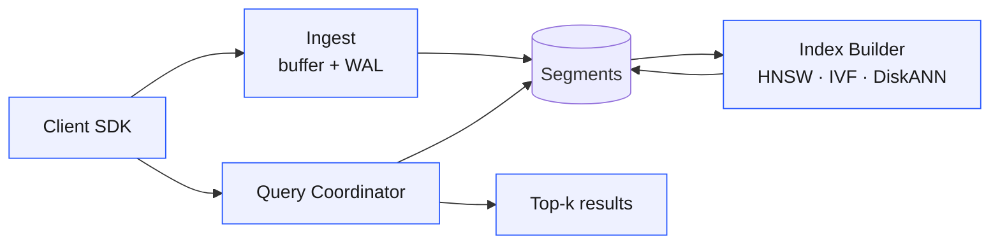

# Graphviz Diagrams Implementation Plan

> **For agentic workers:** REQUIRED SUB-SKILL: Use superpowers:subagent-driven-development (recommended) or superpowers:executing-plans to implement this plan task-by-task. Steps use checkbox (`- [ ]`) syntax for tracking.

**Goal:** Replace the Mermaid frontmatter pipeline with build-time Graphviz rendering. Authors write minimal DOT in fenced ` ```dot ` blocks; the build wraps with brand defaults and inlines SVG into `dist/index.html`.

**Architecture:** Pure-Node WASM (`@hpcc-js/wasm-graphviz`) renders DOT to SVG during `npm run build`. Same shape as the existing `vega` flow: extract fence → process → emit HTML → no client runtime. The `mermaid` pipeline (extract, render, CDN injection, runtime script) is removed; the two existing mermaid diagrams in `vectordb-101` get rewritten in DOT.

**Tech Stack:** Node ≥ 18 (ESM), `@hpcc-js/wasm-graphviz`, `node:test`, existing `marked` markdown pipeline.

**Spec:** [docs/superpowers/specs/2026-05-03-graphviz-diagrams-design.md](../specs/2026-05-03-graphviz-diagrams-design.md)

**Order rationale:** Build the dot pipeline alongside the existing mermaid pipeline first (safe), migrate the two vectordb-101 diagrams to dot (now nothing uses mermaid), then delete the mermaid pipeline. The tree stays green at every commit.

---

## Task 1: Add `@hpcc-js/wasm-graphviz` dependency and smoke-test it

**Files:**
- Modify: `package.json`

- [ ] **Step 1: Install the dependency**

Run:
```bash
npm install @hpcc-js/wasm-graphviz
```

Expected: `package.json` and `package-lock.json` (created if absent) updated; the package and its dep `@hpcc-js/wasm-base` land under `node_modules/`.

- [ ] **Step 2: Smoke-test the API in a one-off Node REPL command**

Run:
```bash
node --input-type=module -e "import('@hpcc-js/wasm-graphviz').then(async ({ Graphviz }) => { const g = await Graphviz.load(); const svg = g.dot('digraph G { A -> B }'); console.log(svg.slice(0, 80)); console.log('OK length=' + svg.length); })"
```

Expected stdout starts with `<?xml version="1.0"` or `<svg ` and ends with `OK length=<some-number>`. If this fails, do not proceed — the rest of the plan assumes this API works.

- [ ] **Step 3: Commit**

```bash
git add package.json package-lock.json
git commit -m "feat(build): add @hpcc-js/wasm-graphviz dependency"
```

---

## Task 2: `extractDot` — pull DOT fences from a slide chunk

**Files:**
- Modify: `bin/build.js` (add new function above `renderSlide`, near the existing `extractMermaid` at line 192)
- Modify: `test/build.test.js` (add tests near the existing `extractMermaid` tests around line 656)

This function mirrors `extractMermaid`: loop `extractFencedBlock(body, 'dot')` until none remain, return `{ blocks, body }`. Throw on empty block, like the mermaid version does.

- [ ] **Step 1: Write the failing tests**

Append to `test/build.test.js`. Note the current import line at the top of the file collects all build exports — add `extractDot` to that list.

```js
test('extractDot: returns no blocks and original body when no fence', () => {
  const chunk = '# Title\n\nSome prose.';
  assert.deepEqual(extractDot(chunk), { blocks: [], body: chunk });
});

test('extractDot: strips a single dot fence and returns its body', () => {
  const chunk =
    '# Arch\n\n' +
    '```dot\n' +
    'A -> B\n' +
    '```\n' +
    '\nFollowing prose.';
  const r = extractDot(chunk);
  assert.deepEqual(r.blocks, ['A -> B']);
  assert.doesNotMatch(r.body, /```dot/);
  assert.match(r.body, /Following prose\./);
});

test('extractDot: collects multiple dot fences from one slide', () => {
  const chunk =
    '# Two diagrams\n\n' +
    '```dot\n' +
    'A -> B\n' +
    '```\n' +
    '\nMiddle text.\n\n' +
    '```dot\n' +
    'X -> Y\n' +
    '```\n';
  const r = extractDot(chunk);
  assert.deepEqual(r.blocks, ['A -> B', 'X -> Y']);
  assert.doesNotMatch(r.body, /```dot/);
  assert.match(r.body, /Middle text\./);
});

test('extractDot: ignores ```dot when nested inside another fence', () => {
  const chunk =
    '````md\n' +
    '```dot\n' +
    'inner -> stuff\n' +
    '```\n' +
    '````\n';
  const r = extractDot(chunk);
  assert.deepEqual(r.blocks, []);
});

test('extractDot: throws when a dot block is empty', () => {
  assert.throws(
    () => extractDot('```dot\n```'),
    /empty dot block/,
  );
});
```

- [ ] **Step 2: Run tests to verify they fail**

Run:
```bash
npm test -- --test-name-pattern='extractDot'
```

Expected: all 5 tests fail with `extractDot is not defined` (or similar import error).

- [ ] **Step 3: Implement `extractDot`**

In `bin/build.js`, immediately after `extractMermaid` (around line 204), add:

```js
export function extractDot(chunk) {
  const blocks = [];
  let body = chunk;
  while (true) {
    const found = extractFencedBlock(body, 'dot');
    if (!found) break;
    const def = found.body.trim();
    if (!def) throw new Error('extractDot: empty dot block');
    blocks.push(def);
    body = found.remaining;
  }
  return { blocks, body };
}
```

- [ ] **Step 4: Run tests to verify they pass**

Run:
```bash
npm test -- --test-name-pattern='extractDot'
```

Expected: all 5 tests pass. Then run the full suite to confirm nothing else broke:

```bash
npm test
```

Expected: full suite passes (mermaid tests still pass — we haven't removed anything yet).

- [ ] **Step 5: Commit**

```bash
git add bin/build.js test/build.test.js
git commit -m "feat(build): extractDot pulls fenced dot blocks from slide chunks"
```

---

## Task 3: `DOT_DEFAULTS` constant and `renderDot` function

**Files:**
- Modify: `bin/build.js` (add constant and function above `renderSlide`)
- Modify: `test/build.test.js` (add tests after the new `extractDot` tests)

`renderDot` takes the array of DOT body strings, the slide slug, and a loaded Graphviz instance. For each block: wrap in `digraph G { ${DOT_DEFAULTS} ${body} }`, render to SVG, strip the root `<svg>` element's `width` and `height` attributes (so CSS controls sizing), wrap in `<figure class="dot" id="diagram-<slug>[-N]">…</figure>`. Return joined HTML.

- [ ] **Step 1: Write the failing tests**

Add to `test/build.test.js`. Add `DOT_DEFAULTS` and `renderDot` to the import list at the top.

```js
test('DOT_DEFAULTS: contains the brand-themed graph/node/edge attributes', () => {
  assert.match(DOT_DEFAULTS, /rankdir=LR/);
  assert.match(DOT_DEFAULTS, /fontname="Inter"/);
  assert.match(DOT_DEFAULTS, /#175fff/);
  assert.match(DOT_DEFAULTS, /#061982/);
  assert.match(DOT_DEFAULTS, /#e6f0ff/);
});

test('renderDot: returns empty string for empty array', async () => {
  const { Graphviz } = await import('@hpcc-js/wasm-graphviz');
  const g = await Graphviz.load();
  assert.equal(await renderDot([], 'slug', g), '');
});

test('renderDot: emits a figure.dot with default id and inline svg', async () => {
  const { Graphviz } = await import('@hpcc-js/wasm-graphviz');
  const g = await Graphviz.load();
  const html = await renderDot(['A -> B'], 'my-slide', g);
  assert.match(html, /<figure class="dot" id="diagram-my-slide">/);
  assert.match(html, /<svg /);
  assert.match(html, /viewBox="/);
  assert.match(html, /<\/svg>\s*<\/figure>/);
});

test('renderDot: strips width and height attributes from the root svg', async () => {
  const { Graphviz } = await import('@hpcc-js/wasm-graphviz');
  const g = await Graphviz.load();
  const html = await renderDot(['A -> B'], 'slug', g);
  const svgOpen = html.match(/<svg [^>]*>/)[0];
  assert.doesNotMatch(svgOpen, /\swidth="/);
  assert.doesNotMatch(svgOpen, /\sheight="/);
});

test('renderDot: multiple diagrams get suffixed default ids', async () => {
  const { Graphviz } = await import('@hpcc-js/wasm-graphviz');
  const g = await Graphviz.load();
  const html = await renderDot(['A -> B', 'X -> Y'], 'slug', g);
  assert.match(html, /id="diagram-slug-1"/);
  assert.match(html, /id="diagram-slug-2"/);
});

test('renderDot: injects DOT_DEFAULTS into the rendered svg (Inter font appears)', async () => {
  const { Graphviz } = await import('@hpcc-js/wasm-graphviz');
  const g = await Graphviz.load();
  const html = await renderDot(['A -> B'], 'slug', g);
  assert.match(html, /Inter/);
});
```

- [ ] **Step 2: Run tests to verify they fail**

Run:
```bash
npm test -- --test-name-pattern='DOT_DEFAULTS|renderDot'
```

Expected: all 6 tests fail (`DOT_DEFAULTS is not defined`, `renderDot is not defined`).

- [ ] **Step 3: Implement `DOT_DEFAULTS` and `renderDot`**

In `bin/build.js`, immediately after `extractDot` (which Task 2 added after `extractMermaid`), add:

```js
export const DOT_DEFAULTS = `
  graph [rankdir=LR fontname="Inter" bgcolor="transparent" pad=0.3 nodesep=0.5 ranksep=0.7]
  node  [fontname="Inter" shape=box style="rounded,filled" fillcolor="#e6f0ff" color="#175fff" fontcolor="#061982" penwidth=1.5 margin="0.25,0.15"]
  edge  [fontname="Inter" color="#061982" penwidth=1.5 arrowsize=0.8]
`;

function stripSvgRootSize(svg) {
  return svg.replace(/<svg\b[^>]*>/, (open) =>
    open.replace(/\s(width|height)="[^"]*"/g, '')
  );
}

export async function renderDot(blocks, slug, graphviz) {
  if (!blocks || blocks.length === 0) return '';
  return blocks.map((body, i) => {
    const id = blocks.length === 1 ? `diagram-${slug}` : `diagram-${slug}-${i + 1}`;
    const source = `digraph G {\n${DOT_DEFAULTS}\n${body}\n}`;
    const svg = stripSvgRootSize(graphviz.dot(source));
    return `<figure class="dot" id="${escapeHtml(id)}">${svg}</figure>`;
  }).join('\n');
}
```

Note `renderDot` is `async` purely to match how it's called downstream (it does no awaits internally — `graphviz.dot` is sync once `Graphviz.load()` has resolved). Keeping it async future-proofs against any later need without churning callers.

- [ ] **Step 4: Run tests to verify they pass**

Run:
```bash
npm test -- --test-name-pattern='DOT_DEFAULTS|renderDot'
```

Expected: all 6 tests pass. Then full suite:

```bash
npm test
```

Expected: full suite passes.

- [ ] **Step 5: Commit**

```bash
git add bin/build.js test/build.test.js
git commit -m "feat(build): renderDot wraps body in digraph + brand defaults"
```

---

## Task 4: Wire `dot` rendering into `buildDeck` and `renderSlide`

**Files:**
- Modify: `bin/build.js` (`buildDeck` ~line 303, `renderSlide` ~line 287)
- Modify: `templates/deck.html` (placeholder injection)
- Modify: `test/build.test.js` (integration tests)

Mermaid stays in place during this task — we add the dot pipeline alongside it. After this task, both `mermaid` and `dot` blocks render. Removal of mermaid happens in Task 7.

- [ ] **Step 1: Write the failing integration tests**

Append to `test/build.test.js`:

```js
test('buildDeck: integration — dot diagram is rendered as inline svg', async () => {
  const root = mkdtempSync(join(tmpdir(), 'dot-build-'));
  try {
    const talkDir = join(root, 'talk');
    mkdirSync(talkDir, { recursive: true });
    writeFileSync(join(talkDir, 'slides.md'),
      '# Architecture\n\n' +
      '```dot\n' +
      'A -> B\n' +
      '```\n'
    );
    const out = await buildDeck(talkDir);
    const html = readFileSync(out, 'utf8');
    assert.match(html, /<figure class="dot" id="diagram-architecture">/);
    assert.match(html, /<svg /);
    assert.match(html, /viewBox="/);
  } finally {
    rmSync(root, { recursive: true, force: true });
  }
});

test('buildDeck: integration — Graphviz is not loaded when no dot blocks present', async () => {
  const root = mkdtempSync(join(tmpdir(), 'dot-empty-'));
  try {
    const talkDir = join(root, 'talk');
    mkdirSync(talkDir, { recursive: true });
    writeFileSync(join(talkDir, 'slides.md'), '# Plain\n\nJust prose.');
    const out = await buildDeck(talkDir);
    const html = readFileSync(out, 'utf8');
    assert.doesNotMatch(html, /class="dot"/);
  } finally {
    rmSync(root, { recursive: true, force: true });
  }
});
```

If `mkdirSync` and `rmSync` aren't already imported at the top of `test/build.test.js`, add them. Check the existing mermaid integration tests (around line 752) for the import pattern they use.

- [ ] **Step 2: Run tests to verify they fail**

Run:
```bash
npm test -- --test-name-pattern='dot diagram is rendered|Graphviz is not loaded'
```

Expected: both fail (the `figure.dot` element doesn't exist yet because `buildDeck` doesn't extract or render dot blocks).

- [ ] **Step 3: Wire `extractDot` into `buildDeck`**

In `bin/build.js`, modify `buildDeck`. The current `prepared` block (lines 311–318) extracts authors, vega, mermaid. Add dot extraction:

Replace:
```js
  const prepared = rawChunks.map(chunk => {
    const a = extractAuthors(chunk);
    const v = extractVega(a.body);
    const m = extractMermaid(v.body);
    copyAuthorPhotos(a.authors, talkDir, distDir);
    embedVegaSpecs(v.charts, talkDir);
    return { chunk: m.body, authors: a.authors, charts: v.charts, diagrams: m.diagrams };
  });
```

With:
```js
  const prepared = rawChunks.map(chunk => {
    const a = extractAuthors(chunk);
    const v = extractVega(a.body);
    const m = extractMermaid(v.body);
    const d = extractDot(m.body);
    copyAuthorPhotos(a.authors, talkDir, distDir);
    embedVegaSpecs(v.charts, talkDir);
    return { chunk: d.body, authors: a.authors, charts: v.charts, diagrams: m.diagrams, dotBlocks: d.blocks };
  });
```

- [ ] **Step 4: Conditionally load Graphviz and render dot HTML in `buildDeck`**

Add a top-level import near the top of `bin/build.js` (after the `marked` import):

```js
import { Graphviz } from '@hpcc-js/wasm-graphviz';
```

Change `buildDeck`'s signature to async: `export async function buildDeck(talkDir) {`.

In `buildDeck`, after the existing `titles` block and before `sections`, add the dot rendering pass. We compute slugs the same way `titles` already does (via re-parsing chunks) and pass each slide's pre-rendered dot HTML into `renderSlide`. `renderSlide` itself stays synchronous.

Add immediately after the existing `titles` declaration:

```js
  const slugs = prepared.map(({ chunk }) => {
    const html = marked.parse(parseAttrs(chunk).body);
    return slugify(extractTitle(html) || '');
  });
  const hasDot = prepared.some(p => p.dotBlocks.length > 0);
  const graphviz = hasDot ? await Graphviz.load() : null;
  const dotHtmls = await Promise.all(prepared.map((p, i) =>
    renderDot(p.dotBlocks, slugs[i], graphviz)
  ));
```

Then change the `sections` map to pass `dot: dotHtmls[i]` and drop the per-slide async since `renderSlide` stays sync:

Replace:
```js
  const sections = prepared.map(({ chunk, authors, charts, diagrams }, i) =>
    renderSlide({
      chunk,
      index: i + 1,
      total,
      currentTitle: i === 0 ? BRAND_FOOTER : titles[i],
      nextTitle: titles[i + 1] || '',
      authors,
      charts,
      diagrams,
    })
  );
```

With:
```js
  const sections = prepared.map(({ chunk, authors, charts, diagrams }, i) =>
    renderSlide({
      chunk,
      index: i + 1,
      total,
      currentTitle: i === 0 ? BRAND_FOOTER : titles[i],
      nextTitle: titles[i + 1] || '',
      authors,
      charts,
      diagrams,
      dot: dotHtmls[i],
    })
  );
```

Finally, update the CLI block at the bottom of `bin/build.js` to await `buildDeck`:

Replace:
```js
  const out = buildDeck(resolve(talkDir));
```

With:
```js
  const out = await buildDeck(resolve(talkDir));
```

Top-level `await` works in ESM, so no other changes needed.

- [ ] **Step 5: Add the `dot` parameter to `renderSlide`**

`renderSlide` stays synchronous — it just receives the rendered dot HTML as an additional input. Modify the signature to add `dot = ''`, and append `${dot}` into the returned `<section>` template.

Replace:
```js
export function renderSlide({ chunk, index, total, currentTitle = '', nextTitle = '', authors = [], charts = [], diagrams = [] }) {
  const { classes, body } = parseAttrs(chunk);
  const html = marked.parse(body);
  const slug = slugify(extractTitle(html) || '');
  const classList = ['slide', ...classes].join(' ');
  const noChrome = classes.includes('no-chrome');
  const chrome = noChrome
    ? ''
    : `<aside class="chrome logo"><svg><use href='#logo'/></svg></aside><aside class="chrome"><span class="page">${index} / ${total}</span>${SPARK_INLINE}</aside>`;
  const footer = `<footer class="footer"><span class="footer-left">${escapeHtml(currentTitle)}</span><span class="footer-right">${escapeHtml(nextTitle)}</span></footer>`;
  const speakers = renderAuthors(authors);
  const vega = renderVega(charts, slug);
  const mermaid = renderMermaid(diagrams, slug);
  return `<section id="${index}-${slug}" class="${classList}" data-index="${index}">\n${html}\n${speakers}\n${vega}\n${mermaid}\n${chrome}\n${footer}\n</section>`;
}
```

With:
```js
export function renderSlide({ chunk, index, total, currentTitle = '', nextTitle = '', authors = [], charts = [], diagrams = [], dot = '' }) {
  const { classes, body } = parseAttrs(chunk);
  const html = marked.parse(body);
  const slug = slugify(extractTitle(html) || '');
  const classList = ['slide', ...classes].join(' ');
  const noChrome = classes.includes('no-chrome');
  const chrome = noChrome
    ? ''
    : `<aside class="chrome logo"><svg><use href='#logo'/></svg></aside><aside class="chrome"><span class="page">${index} / ${total}</span>${SPARK_INLINE}</aside>`;
  const footer = `<footer class="footer"><span class="footer-left">${escapeHtml(currentTitle)}</span><span class="footer-right">${escapeHtml(nextTitle)}</span></footer>`;
  const speakers = renderAuthors(authors);
  const vega = renderVega(charts, slug);
  const mermaid = renderMermaid(diagrams, slug);
  return `<section id="${index}-${slug}" class="${classList}" data-index="${index}">\n${html}\n${speakers}\n${vega}\n${mermaid}\n${dot}\n${chrome}\n${footer}\n</section>`;
}
```

No existing tests need to change — `renderSlide`'s signature is additive and remains sync.

- [ ] **Step 6: Update the integration test for `buildDeck`'s new async signature**

`buildDeck` is now async. Existing integration tests that call `buildDeck(...)` synchronously will need `await`. Search:
```bash
grep -n "buildDeck(" test/build.test.js
```

For every direct call (excluding the import line), prepend `await`. Make the surrounding `test('…', () => { … })` use `async () => { … }`. Example:
- Before: `const out = buildDeck(talkDir);`
- After: `const out = await buildDeck(talkDir);`

(Some existing integration tests for vega/authors/mermaid already do this. Check the file's prior pattern and match it.)

- [ ] **Step 7: Run the full test suite**

```bash
npm test
```

Expected: all tests pass — the new dot integration tests pass, and the now-async `renderSlide` tests pass with their added `await`s.

- [ ] **Step 8: Build the example deck end-to-end as a real-world check**

```bash
node bin/build.js talks/2026-05-example
```

Expected: `built /…/talks/2026-05-example/dist/index.html`. No exception. (The example deck has no dot blocks — this just confirms we didn't break the no-diagram path.)

- [ ] **Step 9: Commit**

```bash
git add bin/build.js test/build.test.js
git commit -m "feat(build): wire dot blocks through buildDeck and renderSlide"
```

---

## Task 5: CSS for `.dot` figure

**Files:**
- Modify: `css/deck.css` (append near the table styles added recently)

- [ ] **Step 1: Add the rules**

Append to `css/deck.css`, after the existing `.slide table code` rule block:

```css
.slide .dot {
  margin: var(--zilliz-s-3) auto;
  display: flex;
  justify-content: center;
}
.slide .dot svg {
  max-width: 100%;
  max-height: 60vh;
  height: auto;
  width: auto;
}
```

- [ ] **Step 2: Commit**

```bash
git add css/deck.css
git commit -m "feat(css): style .dot figure to scale within the slide canvas"
```

---

## Task 6: Migrate `vectordb-101` slides 18 and 25 from mermaid to dot

**Files:**
- Modify: `talks/vectordb-101/slides.md` (lines 199–210 and 292–305)

- [ ] **Step 1: Rewrite slide 18 (architecture flowchart)**

Replace lines 199–210 (the `flowchart LR` mermaid block):

```

```

With:

````
```dot
A [label="Client SDK"]
I [label="Ingest\nbuffer + WAL"]
S [label="Segments" shape=cylinder]
B [label="Index Builder\nHNSW · IVF · DiskANN"]
Q [label="Query Coordinator"]
R [label="Top-k results"]
A -> I -> S
S -> B -> S
A -> Q -> S
Q -> R
```
````

DOT uses `\n` (literal backslash-n) inside double-quoted labels for line breaks. The cylinder shape replaces mermaid's `S[(Segments)]`.

- [ ] **Step 2: Rewrite slide 25 (RAG architecture)**

Replace lines 292–305 (the `flowchart LR` mermaid block) with:

````
```dot
Q [label="User query"]
E [label="Embed"]
S [label="Search vector DB"]
K [label="Top-k chunks"]
P [label="Prompt assembly"]
L [label="LLM" fillcolor="#fbe6ff" color="#c84cff"]
A [label="Answer"]
Q -> E -> S -> K -> P -> L -> A
Q -> P
```
````

The LLM node gets per-node `fillcolor` and `color` overrides so it stays visually distinct from the brand-blue boxes (mirrors the original mermaid `classDef llm` styling using brand-berry tokens).

- [ ] **Step 3: Build and visually verify slide 18**

```bash
node bin/build.js talks/vectordb-101
cd talks/vectordb-101/dist && python3 -m http.server 8765 &
SERVER_PID=$!
sleep 1
```

Then in another terminal or via Playwright MCP, navigate to `http://localhost:8765/index.html#18` and screenshot. Expected: a left-to-right flowchart with all node labels fully visible (no clipping like the original mermaid), brand-blue rounded boxes, navy edges, "Segments" rendered as a cylinder.

After verification:

```bash
kill $SERVER_PID
```

- [ ] **Step 4: Visually verify slide 25**

Navigate to `http://localhost:8765/index.html#25`. Expected: LR flow with the LLM node highlighted in berry/purple, the rest in brand blue.

- [ ] **Step 5: Run the test suite**

```bash
npm test
```

Expected: all tests pass. (No tests change here — just confirming the migration didn't break anything.)

- [ ] **Step 6: Commit**

```bash
git add talks/vectordb-101/slides.md
git commit -m "feat(vectordb-101): migrate diagrams from mermaid to dot"
```

---

## Task 7: Remove the mermaid pipeline

**Files:**
- Modify: `bin/build.js` (delete `extractMermaid`, `renderMermaid`, mermaid wiring in `buildDeck` and `renderSlide`, mermaidScripts injection)
- Modify: `templates/deck.html` (delete `{{mermaidScripts}}` placeholder line)
- Modify: `test/build.test.js` (delete mermaid tests, remove imports)
- Delete: `script/mermaid.js`

The two diagrams that used mermaid are now dot (Task 6), so nothing in the codebase depends on the mermaid pipeline. This task removes it cleanly.

- [ ] **Step 1: Delete `extractMermaid` and `renderMermaid` from `bin/build.js`**

Remove the entire function body for `extractMermaid` (around lines 192–204) and `renderMermaid` (around lines 279–285). Both are exported, so the export goes too.

- [ ] **Step 2: Remove mermaid from `buildDeck`**

In the `prepared` map, remove the `extractMermaid` call and the `diagrams` field on the returned object:

Before (the version produced after Task 4):
```js
  const prepared = rawChunks.map(chunk => {
    const a = extractAuthors(chunk);
    const v = extractVega(a.body);
    const m = extractMermaid(v.body);
    const d = extractDot(m.body);
    copyAuthorPhotos(a.authors, talkDir, distDir);
    embedVegaSpecs(v.charts, talkDir);
    return { chunk: d.body, authors: a.authors, charts: v.charts, diagrams: m.diagrams, dotBlocks: d.blocks };
  });
```

After:
```js
  const prepared = rawChunks.map(chunk => {
    const a = extractAuthors(chunk);
    const v = extractVega(a.body);
    const d = extractDot(v.body);
    copyAuthorPhotos(a.authors, talkDir, distDir);
    embedVegaSpecs(v.charts, talkDir);
    return { chunk: d.body, authors: a.authors, charts: v.charts, dotBlocks: d.blocks };
  });
```

Update the `sections` map's destructure and `renderSlide` call to drop `diagrams`:

Before:
```js
  const sections = await Promise.all(prepared.map(({ chunk, authors, charts, diagrams, dotBlocks }, i) =>
    renderSlide({
      ...
      diagrams,
      dotBlocks,
      graphviz,
    })
  ));
```

After:
```js
  const sections = await Promise.all(prepared.map(({ chunk, authors, charts, dotBlocks }, i) =>
    renderSlide({
      chunk,
      index: i + 1,
      total,
      currentTitle: i === 0 ? BRAND_FOOTER : titles[i],
      nextTitle: titles[i + 1] || '',
      authors,
      charts,
      dotBlocks,
      graphviz,
    })
  ));
```

- [ ] **Step 3: Remove the `mermaidScripts` injection block from `buildDeck`**

Delete:
```js
  const hasDiagrams = prepared.some(p => p.diagrams.length > 0);
  const mermaidScripts = hasDiagrams
    ? '<script src="https://cdn.jsdelivr.net/npm/mermaid@10/dist/mermaid.min.js"></script>\n'
    + '  <script src="../../../script/mermaid.js"></script>'
    : '';
```

And remove the `.replace('{{mermaidScripts}}', mermaidScripts)` line from the template substitution chain.

- [ ] **Step 4: Remove mermaid from `renderSlide`**

Strip `diagrams = []` from the destructure, remove the `const mermaid = renderMermaid(diagrams, slug);` line, and remove `${mermaid}\n` from the template literal that builds the `<section>`.

- [ ] **Step 5: Delete `{{mermaidScripts}}` from the HTML template**

In `templates/deck.html`, delete line 21:
```
  {{mermaidScripts}}
```

- [ ] **Step 6: Delete `script/mermaid.js`**

```bash
git rm script/mermaid.js
```

- [ ] **Step 7: Delete mermaid tests from `test/build.test.js`**

Remove all 8 mermaid tests (the block roughly spanning lines 656–787 in the pre-Task-2 file; line numbers will have shifted, so search for `mermaid` to find them). Also remove `extractMermaid, renderMermaid` from the import line at the top of the file.

- [ ] **Step 8: Run the test suite**

```bash
npm test
```

Expected: full suite passes. No test references mermaid; the build pipeline runs without it.

- [ ] **Step 9: Build vectordb-101 to confirm end-to-end**

```bash
node bin/build.js talks/vectordb-101
```

Expected: build succeeds. Inspect the output:

```bash
grep -c "class=\"dot\"" talks/vectordb-101/dist/index.html
grep -c "mermaid" talks/vectordb-101/dist/index.html
```

Expected: `2` (two dot figures), `0` (zero mermaid references).

- [ ] **Step 10: Commit**

```bash
git add bin/build.js templates/deck.html test/build.test.js script/mermaid.js
git commit -m "refactor(build): remove mermaid pipeline (replaced by dot)"
```

---

## Task 8: Update README and CLAUDE.md

**Files:**
- Modify: `README.md` (sections referencing Mermaid)
- Modify: `CLAUDE.md` (sections referencing mermaid)

- [ ] **Step 1: Update README.md `## Diagrams (Mermaid)` section**

The current section spans roughly lines 107–123. Replace the heading and body with:

````markdown
## Diagrams (Graphviz)

Any slide can declare one or more Graphviz diagrams via a fenced ` ```dot ` block. The body is the digraph body — no `digraph { }` envelope needed; the build wraps it and injects brand-themed defaults (Inter font, brand-blue rounded boxes, navy edges, `rankdir=LR`).

```dot
A [label="Client"]
B [label="Ingest"]
C [label="Segment store" shape=cylinder]
A -> B -> C
```

Each diagram is rendered to SVG at build time using [`@hpcc-js/wasm-graphviz`](https://www.npmjs.com/package/@hpcc-js/wasm-graphviz) and inlined into `dist/index.html` — no client-side runtime, no CDN. Multiple ` ```dot ` blocks on the same slide work — they get suffixed ids (`diagram-<slug>-1`, `-2`, …).

To override the default `rankdir=LR`, write a `rankdir=TB` line in the body (graph attributes inside the body override the wrapper defaults). To restyle a single node, set per-node attributes (`label`, `shape`, `fillcolor`, `color`, etc.) the same way.

For the build to render text in the brand font, **Inter must be installed system-wide on the build machine**. Without it, Graphviz silently falls back to its default font.
````

- [ ] **Step 2: Update README.md `script/` line**

Find the line near the bottom of the README that lists `script/` contents (around line 144):
```
- `script/` — runtime: `deck.js` (scale, navigation, deeplinks), `vega.js` (chart embedding), `mermaid.js` (diagram rendering)
```

Replace with:
```
- `script/` — runtime: `deck.js` (scale, navigation, deeplinks), `vega.js` (chart embedding)
```

(Diagrams no longer have a runtime — they're inlined SVG.)

- [ ] **Step 3: Update CLAUDE.md "Mermaid frontmatter" paragraph**

The paragraph starts with `**Mermaid frontmatter** —` (around line 26). Replace the entire paragraph with:

```markdown
**Dot frontmatter** — a fenced ` ```dot ` block renders one or more Graphviz diagrams on the slide. Like `mermaid` was, the fence body is freeform (it's the digraph body — no `digraph { }` envelope; the build wraps it). Multiple ` ```dot ` blocks per slide are supported (`extractDot` loops `extractFencedBlock` until none remain). Each diagram becomes a `<figure class="dot" id="diagram-<slug>">` (suffixed `-2/-3/...` for multiples) containing inline SVG rendered at build time via [`@hpcc-js/wasm-graphviz`](https://www.npmjs.com/package/@hpcc-js/wasm-graphviz). The build wraps each body in `digraph G { ${DOT_DEFAULTS} ${body} }` where `DOT_DEFAULTS` injects the brand-themed graph/node/edge attributes (Inter font, brand-blue rounded boxes, navy edges, `rankdir=LR`); authors override per-diagram by writing graph attributes inside the body. Brand colors are duplicated as hex literals in `DOT_DEFAULTS` because DOT can't read CSS variables at render time — same precedent as vega specs that inline brand colors. Inter must be installed system-wide on the build machine for the SVG to render text in the brand font; Graphviz uses the OS font stack to resolve `fontname`. Graphviz WASM is loaded only when at least one slide has a dot block — chart-free decks pay nothing.
```

- [ ] **Step 4: Update CLAUDE.md "shared kv-list parser" paragraph**

The paragraph immediately following (around line 28) currently says "Mermaid skips it because the body is freeform text". Update the reference:

Before:
```
The shared kv-list parser is `parseKvList` in [bin/build.js](bin/build.js) — both `parseAuthors` and `parseVega` validate on top of it. Mermaid skips it because the body is freeform text, not kv pairs. Add new fenced frontmatter blocks the same way: ...
```

After:
```
The shared kv-list parser is `parseKvList` in [bin/build.js](bin/build.js) — both `parseAuthors` and `parseVega` validate on top of it. `dot` skips it because the body is freeform DOT, not kv pairs. Add new fenced frontmatter blocks the same way: ...
```

- [ ] **Step 5: Update CLAUDE.md vectordb-101 description**

The paragraph at the bottom of the "Slide authoring" section (around line 56) mentions "two `mermaid` diagrams (slides 18 and 25)". Update to:

Before:
```
The [talks/vectordb-101/](talks/vectordb-101/) deck additionally exercises three interactive Vega specs and two `mermaid` diagrams (slides 18 and 25).
```

After:
```
The [talks/vectordb-101/](talks/vectordb-101/) deck additionally exercises three interactive Vega specs and two `dot` diagrams (slides 18 and 25).
```

- [ ] **Step 6: Commit**

```bash
git add README.md CLAUDE.md
git commit -m "docs: update README and CLAUDE.md for dot-replaces-mermaid"
```

---

## Final verification

- [ ] **Step 1: Full test suite**

```bash
npm test
```

Expected: all tests pass.

- [ ] **Step 2: Build both example decks**

```bash
node bin/build.js talks/2026-05-example
node bin/build.js talks/vectordb-101
```

Expected: both succeed.

- [ ] **Step 3: Bundle vectordb-101**

```bash
node bin/bundle.js talks/vectordb-101
```

Expected: succeeds. The bundle inlines all assets — the SVGs were already inline.

- [ ] **Step 4: Confirm no mermaid references remain in the codebase**

```bash
grep -rn "mermaid" --include="*.js" --include="*.md" --include="*.html" --include="*.css" .
```

Expected output: empty (no matches outside `node_modules` and `dist/`).
