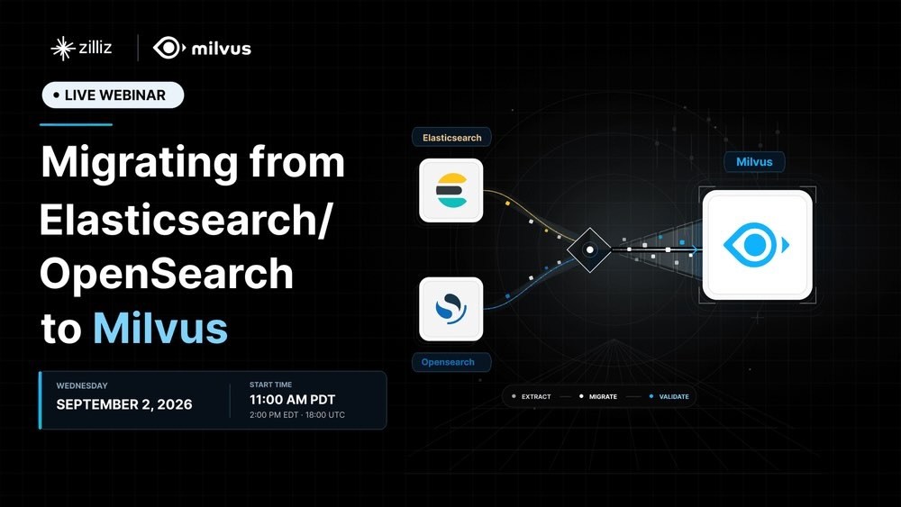

```deck
- agenda: false
```

{.title .no-chrome}


# Closing the Search Gap <br>with <span class="hero-text bright">Milvus 3.0</span>

## Faster, cheaper and easier hybrid semantic / full-text search

## Aug 19 · 2026

```authors
- name: Simon Hearne
  position: Solutions Architect
  company: Zilliz
  photo: https://avatars.githubusercontent.com/u/496189?v=4
```

---

# The search gap

Semantic search and full-text search grew up in different engines. This meant compromising somewhere, until now. Milvus is **one engine that is genuinely good at both**:

<div class="card-grid arch-grid">
<div class="card fragment">
<p class="arch-eyebrow"><span class="pill berry">two engines</span></p>
<div class="arch-flow">
<div class="arch-node app">application</div>
<div class="arch-fork">
<span class="arch-drop"><span class="pill navy">exact</span></span>
<span class="arch-drop"><span class="pill gradient">semantic</span></span>
</div>
<div class="arch-engines">
<div class="arch-node engine">Elasticsearch<small>BM25 · text score</small></div>
<div class="arch-node engine">vector DB<small>ANN · vector score</small></div>
</div>
<p class="arch-sync">sync writes ↔ reconcile scores</p>
</div>
<p class="arch-verdict">Two clusters, two scoring models, <strong>two write paths</strong> and complex fusion logic.</p>
</div>
<div class="card fragment">
<p class="arch-eyebrow"><span class="pill berry">just use elasticsearch</span></p>
<div class="arch-flow">
<div class="arch-node app">application</div>
<div class="arch-fork">
<span class="arch-drop"><span class="pill navy">exact</span><span class="pill gradient">semantic</span></span>
</div>
<div class="arch-engines">
<div class="arch-node engine">Elasticsearch<small>BM25 + <code>dense_vector</code> kNN</small></div>
</div>
<p class="arch-sync">one engine · vectors bolted on</p>
</div>
<p class="arch-verdict">RAM-bound HNSW, re-shard to grow. <strong>Orfium</strong> capped at <strong>~500K</strong> references; <strong>Rexera</strong> cut cost <strong>50%</strong> on the way out.</p>
</div>
<div class="card is-win fragment">
<p class="arch-eyebrow"><span class="pill gradient">milvus 3.0</span></p>
<div class="arch-flow">
<div class="arch-node app">application</div>
<div class="arch-fork">
<span class="arch-drop"><span class="pill navy">exact</span><span class="pill gradient">semantic</span></span>
</div>
<div class="arch-engines">
<div class="arch-node engine">Milvus<small>BM25 + vectors · one ranked result</small></div>
</div>
<p class="arch-sync is-good">one call · nothing to reconcile</p>
</div>
<p class="arch-verdict">One schema, one query, one cluster. Hybrid ranking runs <strong>inside the kernel</strong>, not in your app tier.</p>
</div>
</div>

---

# Who hits this gap

BM25 + Vector search is greater than the sum of its parts.

<div class="card-grid cols-2">
<div class="card fragment">
<p class="case-eyebrows"><span class="feature-cat">RAG / AI agents</span></p>
<div class="q-row"><span class="pill navy">exact</span><span class="q-text"><code>create_index()</code> · <code>v2.6.4</code> · config flags</span></div>
<div class="q-row"><span class="pill gradient">semantic</span><span class="q-text"><em>"how do I make ingestion faster?"</em></span></div>
</div>
<div class="card fragment">
<p class="case-eyebrows"><span class="feature-cat">Legal &amp; compliance</span></p>
<div class="q-row"><span class="pill navy">exact</span><span class="q-text"><code>§230(c)(1)</code> - document-specific</span></div>
<div class="q-row"><span class="pill gradient">semantic</span><span class="q-text"><em>"documents about indemnification"</em></span></div>
</div>
<div class="card fragment">
<p class="case-eyebrows"><span class="feature-cat">Observability</span></p>
<div class="q-row"><span class="pill navy">exact</span><span class="q-text"><code>connection reset by peer</code>, verbatim</span></div>
<div class="q-row"><span class="pill gradient">semantic</span><span class="q-text"><em>"incidents like this one"</em></span></div>
</div>
<div class="card fragment">
<p class="case-eyebrows"><span class="feature-cat">E-commerce</span></p>
<div class="q-row"><span class="pill navy">exact</span><span class="q-text"><code>SKU34632A</code> · brand names</span></div>
<div class="q-row"><span class="pill gradient">semantic</span><span class="q-text"><em>"comfy red shoes for work in an office"</em></span></div>
</div>
</div>

---

{.auto-reveal delay=500 start=immediate}

# A decade dedicated to retrieval

<div class="timeline">
<div class="tl-item fragment"><span class="tl-year">2017</span><span class="tl-label">Zilliz founded by ex-Oracle Cloud DB engineer</span></div>
<div class="tl-item fragment"><span class="tl-year">2019</span><span class="tl-label">Milvus open-sourced by Zilliz</span></div>
<div class="tl-item fragment"><span class="tl-year">2021</span><span class="tl-label">Milvus 1.0 graduates the LF AI &amp; Data Foundation</span></div>
<div class="tl-item fragment"><span class="tl-year">2022</span><span class="tl-label">Milvus 2.0: cloud-native re-architecture</span></div>
<div class="tl-item fragment"><span class="tl-year">2025</span><span class="tl-label">Milvus 2.5: full-text search native support</span></div>
<div class="tl-item fragment is-now"><span class="tl-year">2026</span><span class="tl-label">Milvus 3.0: the search gap closes</span></div>
</div>
<br><br>
<div class="stat-grid">
<div class="stat-card"><span class="stat-label">GitHub stars</span><span class="stat-value">45k+</span><p class="stat-note">github.com/milvus-io/milvus</p></div>
<div class="stat-card"><span class="stat-label">Docker pulls</span><span class="stat-value">100M+</span><p class="stat-note">deployments in the wild</p></div>
<div class="stat-card"><span class="stat-label">Enterprise users</span><span class="stat-value">10,000+</span><p class="stat-note">running Milvus in production</p></div>
</div>

 {.fragment}

---

{.auto-reveal delay=500 start=immediate}

# Running in production today

Teams that collapsed a two-engine stack onto Milvus:

<div class="card-grid">
<div class="card fragment">
<p class="case-eyebrows"><span class="case-journey"><span class="pill berry">OpenSearch</span><span class="case-arrow">→</span><span class="pill gradient">Zilliz Cloud</span></span></p>
<p class="case-name">123RF<span class="pill ghost">image search</span></p>
<p class="case-proof"><strong>200M+</strong> stock-asset vectors: infra cost cut <strong>>50%</strong>, latency halved to <strong>sub-50ms</strong></p>
</div>
<div class="card fragment">
<p class="case-eyebrows"><span class="case-journey"><span class="pill berry">OpenSearch</span><span class="case-arrow">→</span><span class="pill gradient">Zilliz Cloud</span></span></p>
<p class="case-name">Plaud<span class="pill ghost">agent memory</span></p>
<p class="case-proof"><strong>10B+</strong> agent-memory chunks per region at <strong>&lt;200ms</strong> average recall, across <strong>2M+</strong> devices</p>
</div>
<div class="card fragment">
<p class="case-eyebrows"><span class="case-journey"><span class="pill berry">Elasticsearch</span><span class="case-arrow">→</span><span class="pill gradient">Zilliz Cloud</span></span></p>
<p class="case-name">Rexera<span class="pill ghost">RAG + agents</span></p>
<p class="case-proof">Hybrid search: retrieval accuracy <strong>+40%</strong>, cost <strong>−50%</strong> vs Elasticsearch</p>
</div>
<div class="card fragment">
<p class="case-eyebrows"><span class="case-journey"><span class="pill berry">Elasticsearch</span><span class="case-arrow">→</span><span class="pill gradient">Zilliz Cloud</span></span></p>
<p class="case-name">Orfium<span class="pill ghost">audio matching</span></p>
<p class="case-proof"><strong>~250M</strong> audio vectors; the old ES setup maxed out at <strong>~500K</strong> references</p>
</div>
<div class="card fragment">
<p class="case-eyebrows"><span class="case-journey"><span class="pill berry">Elasticsearch</span><span class="case-arrow">→</span><span class="pill gradient">Milvus</span></span></p>
<p class="case-name">OpusSearch<span class="pill ghost">hybrid search</span></p>
<p class="case-proof">One deployment for semantic + BM25 exact match across <strong>170M+</strong> videos</p>
</div>
<div class="card fragment">
<p class="case-eyebrows"><span class="case-journey"><span class="pill berry">Elasticsearch</span><span class="case-arrow">→</span><span class="pill gradient">Zilliz Cloud</span></span></p>
<p class="case-name">OpenArt<span class="pill ghost">multimodal search</span></p>
<p class="case-proof"><strong>456M</strong> vectors moved with no re-embedding: P99 <strong>25s → 300ms</strong>, compute cost <strong>−85%</strong></p>
</div>
</div>

---

# Key search features in Milvus

<div class="card-grid feature-grid cols-4">
<div class="card fragment">
<p class="case-eyebrows"><span class="feature-cat">Full-text</span></p>
<ul class="feature-list">
<li>BM25 scoring <span class="eyebrow-ver">2.5+</span></li>
<li>Analyzers &amp; synonyms <span class="eyebrow-ver">2.5+</span></li>
<li>Custom dictionaries <span class="eyebrow-new">3.0</span></li>
<li>Multilingual auto-detect <span class="eyebrow-ver">2.5+</span></li>
<li>Highlighting <span class="eyebrow-ver">2.6+</span></li>
<li>Phrase matching <span class="eyebrow-ver">2.6+</span></li>
</ul>
</div>
<div class="card fragment">
<p class="case-eyebrows"><span class="feature-cat">Search</span></p>
<ul class="feature-list">
<li>Hybrid + RRF <span class="eyebrow-ver">2.4+</span></li>
<li>Grouping <span class="eyebrow-new">3.0</span></li>
<li>Aggregations <span class="eyebrow-new">3.0</span></li>
<li>Relevance shaping <span class="eyebrow-ver">2.6+</span></li>
<li>Geo filtering <span class="eyebrow-ver">2.6+</span></li>
<li>TIMESTAMPTZ dates <span class="eyebrow-ver">2.6+</span></li>
</ul>
</div>
<div class="card fragment">
<p class="case-eyebrows"><span class="feature-cat">Efficiency</span></p>
<ul class="feature-list">
<li>RaBitQ 1-bit quant. <span class="eyebrow-ver">2.6+</span></li>
<li>SQ8 refinement <span class="eyebrow-ver">2.6+</span></li>
<li>SINDI sparse retrieval <span class="eyebrow-new">3.0</span></li>
<li>3× smaller BM25 index <span class="eyebrow-new">3.0</span></li>
<li>Loon storage engine <span class="eyebrow-new">3.0</span></li>
</ul>
</div>
<div class="card fragment">
<p class="case-eyebrows"><span class="feature-cat">Schema</span></p>
<ul class="feature-list">
<li>Nullable scalars <span class="eyebrow-ver">2.5+</span></li>
<li>Nullable vectors <span class="eyebrow-ver">2.6+</span></li>
<li>Dynamic fields <span class="eyebrow-ver">2.2</span></li>
<li>JSON path indexes <span class="eyebrow-ver">2.5+</span></li>
<li>JSON shredding <span class="eyebrow-ver">2.6+</span></li>
</ul>
</div>
</div>

---

# Schema flexibility

Elasticsearch's structural advantage was letting documents be messy. Milvus 3.0 closes that gap too:

<div class="card-grid">
<div class="card fragment">
<p class="case-eyebrows"><span class="feature-cat">missing data</span></p>
<p class="case-name">Nullable fields</p>
<p class="case-proof">Scalars <strong>and vectors</strong> can be null: no sentinel values skewing filters, no dummy embeddings poisoning distance math, no splitting collections when some docs lack an image</p>
<p class="case-proof es-compare"><strong>vs ES</strong>: documents omit fields freely, and that blocked migrations of sparse real-world data. It now moves over as-is</p>
</div>
<div class="card fragment">
<p class="case-eyebrows"><span class="feature-cat">rich metadata</span></p>
<p class="case-name">JSON shredding + indexing</p>
<p class="case-proof">Nested JSON shreds into typed columns with path indexes: filters on <code>meta["brand"]</code> run at columnar speed, not per-row blob parsing</p>
<p class="case-proof es-compare"><strong>vs ES</strong>: dynamic mapping indexes every key, but risks mapping explosion, reindex req'd to change a type. Milvus keeps the schema stable</p>
</div>
<div class="card fragment">
<p class="case-eyebrows"><span class="feature-cat">evolving payloads</span></p>
<p class="case-name">Dynamic schema</p>
<p class="case-proof">Insert fields you never declared: they land in a hidden JSON field, still filterable and indexable. Payloads evolve with zero migrations, zero downtime</p>
<p class="case-proof es-compare"><strong>vs ES</strong>: schemaless writes are supported in ES but <em>mappings</em> are required to make fields searchable. Milvus improves on this</p>
</div>
</div>

---

# Faster, cheaper, easier

Cloud-native high performance architecture for ANN, benefits BM25:

<div class="card-grid">
<div class="card fragment">
<p class="case-eyebrows"><span class="feature-cat">Faster</span></p>
<p class="case-name">Kernel-side execution</p>
<p class="case-proof">Search, filter, group and aggregate run <strong>inside the vector kernel</strong>: no shipping candidates to the app tier for post-processing</p>
</div>
<div class="card fragment">
<p class="case-eyebrows"><span class="feature-cat">Cheaper</span></p>
<p class="case-name">10× lower memory</p>
<p class="case-proof"><strong>RaBitQ</strong> 1-bit primary index + <strong>SQ8</strong> refinement, at equal recall. Smaller BM25 indices. No Java overhead. No replica requirement. Tiered-storage optional.</p>
</div>
<div class="card fragment">
<p class="case-eyebrows"><span class="feature-cat">Easier</span></p>
<p class="case-name">One engine</p>
<p class="case-proof">One schema, hybrid search in <strong>a single call</strong>: no sync, no score reconciliation. All core features in F/OSS license.</p>
</div>
</div>

---

# The test lab: a fair comparison

- Milvus 3.0 standalone vs Elasticsearch 9.4 on Docker, both capped at **8 GB / 4 CPU**
- Same **~100k** Amazon-review docs, loaded byte-identically from one Parquet
- Same **1024-d COSINE FP32** vectors: no re-embedding, the same floats both sides
- Same BM25 analyzer chain (`standard` + english stem/stop)
- The demo app's Introduction tab verifies all of this live against the running containers
- Open source for community validation

---

{.no-title .no-chrome .clicky-footer}

# Live demo

```iframe
- url: http://localhost:8080
  nav: passthrough
  zoom: 2
  still: live_demo_static.png
```

```iframe-fallback
## Live demo

Both engines from the last slide, queries & results evaluated side-by-side:

- **Keyword**: BM25, phrase matching, highlighting
- **Hybrid**: dense + sparse in one Milvus call vs. two ES queries reconciled by hand
- **Grouping**: `group_by` completeness against `collapse`
- **Schema**: nullable vectors, JSON shredding, dynamic fields

Run the live demo yourself: [github.com/simonhearne/milvus_es_lab](https://github.com/simonhearne/milvus_es_lab)
```

---

# What's next

If you rely on these in Elasticsearch, they're on the way:

<div class="card-grid cols-2">
  <div class="card fragment">
    <p class="case-eyebrows"><span class="pill berry">fuzziness</span><span class="case-arrow">→</span><span class="pill gradient">coming</span></p>
    <p class="case-name">Typo-tolerant search</p>
    <p class="case-proof">Fast, fuzzy BM25 matching with prefix pruning, so typos still find the right results</p>
  </div>
  <div class="card fragment">
    <p class="case-eyebrows"><span class="pill berry">phrase_prefix</span><span class="case-arrow">→</span><span class="pill gradient">coming</span></p>
    <p class="case-name">Search-as-you-type</p>
    <p class="case-proof">Phrase-prefix matching for typeahead and autocomplete</p>
  </div>
  <div class="card fragment">
    <p class="case-eyebrows"><span class="pill berry">rescore</span><span class="case-arrow">→</span><span class="pill gradient">coming</span></p>
    <p class="case-name">Multi-stage reranking</p>
    <p class="case-proof">Shape relevance in stages, beyond <code>function_score</code></p>
  </div>
  <div class="card fragment">
    <p class="case-eyebrows"><span class="pill berry">bloom</span><span class="case-arrow">→</span><span class="pill gradient">coming</span></p>
    <p class="case-name">Filters at scale</p>
    <p class="case-proof">Bloom-filter support and per-element array matching replace giant OR-chains</p>
  </div>
</div>

<blockquote class="fragment bottom"><span class="label">Safe harbour</span><p>These are forward-looking features, not currently available.</p></blockquote>
<!-- <p class="case-note fragment">Forward-looking; features and timing may change.</p> -->

---

{.big-code}

# Run it yourself

<p class="repo-cta"><a href="https://github.com/simonhearne/milvus_es_lab">github.com/simonhearne/milvus_es_lab</a></p>

```bash
docker compose up -d
python data/fetch.py # one Parquet, ~370 MB
docker compose exec demo python data/load_milvus.py
docker compose exec demo python data/load_es.py
docker compose exec demo python data/load_multilingual.py
```

*Requires Docker with ≧16 GB RAM*

Everything I showed you is reproducible on your laptop.

---

{.small-title}

# Next up!

Join me in two weeks to walk through the migration process to Milvus 3.0.

[zilliz.com/event/migrating-from-elasticsearch-opensearch-to-milvus](https://zilliz.com/event/migrating-from-elasticsearch-opensearch-to-milvus)



You could be running a proof of concept in under an hour!

---

{.title .no-chrome}


# Thank you!

## Questions?

## simon @ zilliz.com

```authors
- name: Simon Hearne
  position: Solutions Architect
  company: Zilliz
  photo: https://avatars.githubusercontent.com/u/496189?v=4
```
