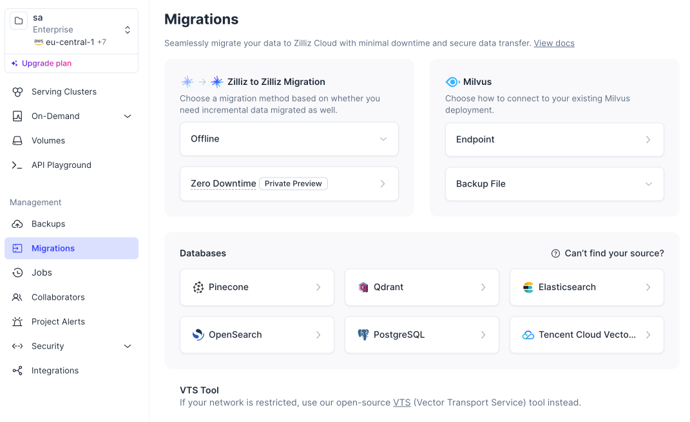

```deck
- agenda: false
```

{.title .no-chrome}


# Migrating to <span class="hero-text bright">Milvus</span>

## Tooling, deployment choices and lessons from real migrations

## Sep 2 · 2026

```authors
- name: Simon Hearne
  position: Solutions Architect
  company: Zilliz
  photo: https://avatars.githubusercontent.com/u/496189?v=4
```

---

# Last time: closing the search gap

Milvus 3.0 brought full-text retrieval, sorting, aggregation and faceting into one engine, and we put it head to head with Elasticsearch on live queries.

<br>
<div class="card-grid cols-2 recap">
<div class="card">
<p class="case-eyebrows"><span class="pill navy">lab</span> <span class="feature-cat">Run the comparison yourself</span></p>
<p class="case-proof">Docker Compose, one dataset, side-by-side queries against Elasticsearch and Milvus.</p>
<p class="case-proof"><a href="https://github.com/simonhearne/milvus_es_lab">github.com/simonhearne/milvus_es_lab</a></p>
</div>
<div class="card">
<p class="case-eyebrows"><span class="pill gradient">recording</span> <span class="feature-cat">Watch the previous webinar</span></p>
<p class="case-proof">The full walkthrough of what Milvus 3.0 added and how the two engines compared.</p>
<p class="case-proof"><a href="https://youtu.be/XxcA1NSQnCo">youtu.be/XxcA1NSQnCo</a></p>
</div>
</div>

<blockquote class="bottom fragment"><span class="label">Today</span><p>From <strong>comparison</strong> to <strong>migration</strong>: tooling, deployment choices and lessons from real migrations.</p></blockquote>

---

{.auto-reveal delay=1000 start=immediate}

# What we'll cover today

<div class="card-grid cols-2">
<div class="card fragment">
<p class="case-eyebrows"><span class="feature-cat">The migration path</span></p>
<p class="case-proof">The major stages and decisions in an Elasticsearch / OpenSearch migration to Milvus or Zilliz Cloud</p>
</div>
<div class="card fragment">
<p class="case-eyebrows"><span class="feature-cat">Tooling + real walkthrough</span></p>
<p class="case-proof">VTS (open source) and Zilliz Migration Service (managed), then a real migration workflow end to end</p>
</div>
<div class="card fragment">
<p class="case-eyebrows"><span class="feature-cat">Licensing &amp; commercial tradeoffs</span></p>
<p class="case-proof">Licensing models and the commercial considerations behind Elastic Cloud (ESS), OpenSearch and Zilliz Cloud</p>
</div>
<div class="card fragment">
<p class="case-eyebrows"><span class="feature-cat">Deployment choices</span></p>
<p class="case-proof">Open-source Milvus, Zilliz Cloud and Zilliz BYOC across operating model, control and security</p>
</div>
<div class="card fragment">
<p class="case-eyebrows"><span class="feature-cat">Customer migration stories</span></p>
<p class="case-proof">Why real teams moved, how they approached it, and what they learned along the way</p>
</div>
<div class="card is-win fragment">
<p class="case-eyebrows"><span class="feature-cat">Live AMA</span></p>
<p class="case-proof">Around 20 minutes for your migration, architecture and evaluation questions</p>
</div>
</div>

---

# Why migrate?

<br>
<div class="card-grid why-migrate">
<div class="card">
<p class="case-name">Vector search is a plugin</p>
<ul class="case-proof">
<li><strong>One HNSW graph per segment</strong>: query cost grows with every merge</li>
<li><strong>Hybrid search is stitched in your code</strong>: Rexera gained 40% accuracy in one engine</li>
<li><strong>Hard ceilings</strong>: Orfium maxed out near 500K references, now holds 250M+ vectors</li>
</ul>
<p class="seen-in">Seen at Orfium, Rexera, OpusSearch</p>
</div>
<div class="card fragment">
<p class="case-name">Read &amp; write fight for resource</p>
<ul class="case-proof">
<li><strong>Indexing takes nodes down</strong>: 123RF's daily ingest dropped OpenSearch nodes</li>
<li><strong>Latency swings under load</strong>: Jobright's P95 was 200 to 500ms, now under 50ms</li>
<li><strong>Writes wait on graph rebuilds</strong>: HelloBike saw ~100x faster writes after migrating</li>
</ul>
<p class="seen-in">Seen at 123RF, Jobright, HelloBike</p>
</div>
<div class="card fragment">
<p class="case-name">Cost scales with data, not value</p>
<ul class="case-proof">
<li><strong>RAM-constrained</strong>: UNIwise went from hundreds of GB to under 32GB</li>
<li><strong>Compute and storage grow together</strong>: sized for peak, paid for around the clock</li>
<li><strong>The bill</strong>: halving cost post-migration is common</li>
</ul>
<p class="seen-in">Seen at 123RF, Rexera, UNIwise</p>
</div>
</div>

<p class="why-migrate-close fragment">None of these are tuning problems. They are architecture problems.</p>

---

# The migration path

Every Elasticsearch / OpenSearch migration passes through the same stages:

<div class="path">
<svg class="path-diagram" viewBox="0 20 1220 210" role="img" aria-label="Migration path: assess, map, move, validate, cut over">
<defs>
<marker id="mp-arrow" viewBox="0 0 10 10" refX="9" refY="5" markerWidth="6" markerHeight="6" orient="auto-start-reverse"><path d="M0 0 L10 5 L0 10 z" fill="context-stroke"/></marker>
</defs>
<g class="nodes">
<rect class="node" x="10" y="40" width="200" height="96" rx="16"/><text class="nlabel" x="110" y="80" text-anchor="middle">Assess</text><text class="nsub" x="110" y="112" text-anchor="middle">workload &amp; indices</text>
<rect class="node" x="250" y="40" width="200" height="96" rx="16"/><text class="nlabel" x="350" y="80" text-anchor="middle">Map</text><text class="nsub" x="350" y="112" text-anchor="middle">schema &amp; analyzers</text>
<rect class="node" x="490" y="40" width="200" height="96" rx="16"/><text class="nlabel" x="590" y="80" text-anchor="middle">Move</text><text class="nsub" x="590" y="112" text-anchor="middle">data</text>
<rect class="node" x="730" y="40" width="200" height="96" rx="16"/><text class="nlabel" x="830" y="80" text-anchor="middle">Validate</text><text class="nsub" x="830" y="112" text-anchor="middle">parity &amp; recall</text>
<rect class="node" x="970" y="40" width="200" height="96" rx="16"/><text class="nlabel" x="1070" y="80" text-anchor="middle">Cut over</text><text class="nsub" x="1070" y="112" text-anchor="middle">backfill / dual-write</text>
<path class="edge" d="M214 88 H244"/>
<path class="edge" d="M454 88 H484"/>
<path class="edge" d="M694 88 H724"/>
<path class="edge" d="M934 88 H964"/>
</g>
<g class="step step-1 is-edge fragment" data-fragment-index="1"><rect class="hl" x="10" y="40" width="200" height="96" rx="16"/><text class="hlabel" x="110" y="80" text-anchor="middle">Assess</text><text class="hsub" x="110" y="112" text-anchor="middle">workload &amp; indices</text></g>
<g class="step step-2 fragment" data-fragment-index="2"><rect class="hl" x="250" y="40" width="200" height="96" rx="16"/><text class="hlabel" x="350" y="80" text-anchor="middle">Map</text><text class="hsub" x="350" y="112" text-anchor="middle">schema &amp; analyzers</text></g>
<g class="step step-3 fragment" data-fragment-index="3"><rect class="hl" x="490" y="40" width="200" height="96" rx="16"/><text class="hlabel" x="590" y="80" text-anchor="middle">Move</text><text class="hsub" x="590" y="112" text-anchor="middle">data</text></g>
<g class="step step-4 fragment" data-fragment-index="4"><rect class="hl" x="730" y="40" width="200" height="96" rx="16"/><text class="hlabel" x="830" y="80" text-anchor="middle">Validate</text><text class="hsub" x="830" y="112" text-anchor="middle">parity &amp; recall</text></g>
<g class="step step-5 is-edge fragment" data-fragment-index="5"><rect class="hl" x="970" y="40" width="200" height="96" rx="16"/><text class="hlabel" x="1070" y="80" text-anchor="middle">Cut over</text><text class="hsub" x="1070" y="112" text-anchor="middle">backfill / dual-write</text></g>
<g class="focus fragment" data-fragment-index="2"><path class="bracket" d="M250 162 V176 H930 V162"/><text class="flabel" x="590" y="210" text-anchor="middle">what we cover today</text></g>
</svg>
<ul class="path-list">
<li class="fragment" data-fragment-index="1"><strong>Assess</strong>: which indices, which query patterns, what actually needs to move</li>
<li class="fragment" data-fragment-index="2"><strong>Map</strong>: mappings to collections, analyzers to Milvus analyzers, scores to scores</li>
<li class="fragment" data-fragment-index="3"><strong>Move</strong>: bulk transfer plus change capture, without re-embedding</li>
<li class="fragment" data-fragment-index="4"><strong>Validate</strong>: side-by-side results before anything is switched</li>
<li class="fragment" data-fragment-index="5"><strong>Cut over</strong>: staged, reversible, boring by design</li>
</ul>
</div>

---

{.small-title}

# Migration tooling

<div class="card-grid cols-2">
<div class="card is-win">
<p class="case-eyebrows"><span class="pill navy">open source</span></p>
<p class="case-name">VTS</p>
<p class="case-proof">Open-source migration tool: streams data from Elasticsearch / OpenSearch into Milvus. Run it yourself, inspect every step</p>

<br>
<a href="https://github.com/zilliztech/vts">zilliztech/vts</a>
</div>
<div class="card fragment">
<p class="case-eyebrows"><span class="pill gradient">managed</span></p>
<p class="case-name">Zilliz Migration Service</p>
<p class="case-proof">Managed service built on VTS: source into Milvus or Zilliz Cloud with the operational heavy lifting handled for you</p>

<a href="https://docs.zilliz.com/docs/migrate-from-external-sources">documentation</a>
</div>
</div>

---

# The lab: three migrations, one dataset

Same **~100k** Amazon product documents, loaded from one Parquet: **2×1024-d COSINE FP32** vectors, no re-embedding, same BM25 analyzer chain.

<div class="card-grid" style="margin-bottom: 32px;">
<div class="card fragment">
<p class="case-eyebrows"><span class="case-journey"><span class="pill berry">Elasticsearch 9.5.2</span><span class="case-arrow">→</span><span class="pill gradient">Milvus 3.0</span></span></p>
<p class="case-name">VTS<span class="pill ghost">local</span></p>
<p class="case-proof">Docker to Docker on the laptop. Open-source <strong>VTS</strong>, every step inspectable</p>
</div>
<div class="card fragment">
<p class="case-eyebrows"><span class="case-journey"><span class="pill berry">Elastic Cloud 9.5.2</span><span class="case-arrow">→</span><span class="pill gradient">Zilliz Cloud</span></span></p>
<p class="case-name">VTS<span class="pill ghost">cloud</span></p>
<p class="case-proof">Managed to managed, both in AWS <span style="white-space:nowrap">eu-west-1</span>. The <strong>same VTS job</strong> pointed at two cloud endpoints</p>
</div>
<div class="card is-win fragment">
<p class="case-eyebrows"><span class="case-journey"><span class="pill berry">OpenSearch 3.7.0</span><span class="case-arrow">→</span><span class="pill gradient">Zilliz Cloud</span></span></p>
<p class="case-name">ZMS<span class="pill ghost">managed</span></p>
<p class="case-proof">AWS OpenSearch Service into a <strong>second</strong> Zilliz Cloud cluster via <strong>Zilliz Migration Service</strong>, from the console</p>
</div>
</div>

---

# Where everything runs

<div class="card-grid" style="margin-bottom: 32px;">
<div class="card">
<p class="case-eyebrows"><span class="pill berry">local · docker</span></p>
<p class="case-name">Elasticsearch 9.5.2</p>
<p class="case-proof">Single node, <strong>8 GB / 4 CPU</strong>, 4 GB JVM heap. <strong>1 primary / 0 replica</strong></p>
</div>
<div class="card fragment">
<p class="case-eyebrows"><span class="pill gradient">local · docker</span></p>
<p class="case-name">Milvus 3.0</p>
<p class="case-proof">Standalone with etcd + MinIO, <strong>8 GB / 4 CPU</strong>, <strong>1 replica</strong></p>
</div>
<div class="card fragment">
<p class="case-eyebrows"><span class="pill berry">aws eu-west-1</span></p>
<p class="case-name">Elastic Cloud 9.5.2</p>
<p class="case-proof"><strong>2 × c6gd</strong> data nodes, 4 GB each. <strong>1 primary / 1 replica</strong></p>
</div>
<div class="card fragment">
<p class="case-eyebrows"><span class="pill berry">aws eu-west-1</span></p>
<p class="case-name">AWS OpenSearch 3.7.0</p>
<p class="case-proof"><strong>2 × c8g.large.search</strong> data nodes, 4GB each with 120 GB gp3. <strong>5 primary / 1 replica</strong></p>
</div>
<div class="card fragment">
<p class="case-eyebrows"><span class="pill gradient">aws eu-west-1</span></p>
<p class="case-name">Zilliz Cloud<span class="pill ghost">VTS target</span></p>
<p class="case-proof"><strong>1 CU</strong>, performance-optimized</p>
</div>
<div class="card fragment">
<p class="case-eyebrows"><span class="pill gradient">aws eu-west-1</span></p>
<p class="case-name">Zilliz Cloud<span class="pill ghost">ZMS target</span></p>
<p class="case-proof"><strong>1 CU</strong>, performance-optimized. A second, separate cluster</p>
</div>
</div>

Every cloud service in AWS eu-west-1 to control for network latency. The client for every figure is one laptop: Apple M5, Docker Desktop with all 10 cores, on home fibre internet in London (**1 Gbps down / 100 Mbps up**). {.fragment}

---

# Cloud lab costs per day

<div class="stat-grid">
<div class="stat-card">
<span class="stat-label">Elastic Cloud</span>
<span class="stat-value">$14.74<span class="stat-note"> / day</span></span>
<p class="stat-note">Cloud Standard: $9.93 for two c6gd data nodes, $2.48 Kibana node, $1.24 mandatory master, ~$1 data transfer, $0.09 storage. No auto scale-down, no suspend option.</p>
<span>Source: <a href="https://cloud.elastic.co/pricing">cloud.elastic.co/pricing</a></span>
</div>
<div class="stat-card fragment">
<span class="stat-label">AWS OpenSearch Service</span>
<span class="stat-value">$7.88<span class="stat-note"> / day</span></span>
<p class="stat-note">$6.82 for two c8g.large.search nodes, $1.06 for 120 GB gp3 each, no dedicated master. No auto scale-down, no suspend option.</p>
<br><span>Source: <a href="https://calculator.aws/">calculator.aws</a></span>
</div>
<div class="stat-card fragment">
<span class="stat-label">Zilliz Cloud</span>
<span class="stat-value">$4.69<span class="stat-note"> / day</span></span>
<p class="stat-note">Dedicated Standard: $4.68 compute, $0.01 storage including backups. Auto-scales storage and throughput both ways, can <strong>suspend to zero</strong> compute when not in use.</p>
<span>Source: <a href="https://zilliz.com/pricing/pricing-guide">zilliz.com/pricing/pricing-guide</a></span>
</div>
</div>

All AWS eu-west-1, equivalent hardware specifications, lowest commercial tier. List price per 24h of runtime. {.fragment}

---

{.no-title .no-chrome .clicky-footer}

# Live walkthrough

<!-- TODO: point at the real walkthrough demo + replace the still image -->

```iframe
- url: http://localhost:8090
  nav: passthrough
  zoom: 2
  still: live_demo_static.png
  fallback-offset: 210px
```

```iframe-fallback
## Live walkthrough: three real migrations

Elasticsearch / OpenSearch to Milvus migration workflows, end to end:
- We saw live walkthroughs and benchmarks of:
  - Elasticsearch local -> Milvus Local (VTS)
  - Elastic Cloud -> Zilliz Cloud (VTS)
  - OpenSearch Service -> Zilliz Cloud (ZMS)
```

---

{.small-title}

# How I run the migration

Schema first. The target collection exists before VTS is asked to move a row, so every field and index is explicit up-front.

<div class="card-grid" style="margin-bottom: 24px;">
<div class="card">
<p class="case-eyebrows"><span class="pill navy">1 · before the job</span></p>
<p class="case-name">Decide the schema</p>
<p class="case-proof">Build the empty collection first: fields, analyzer, BM25 function and indexes, then load it. Indexes are enabled on vector fields and common filter fields.</p>
</div>
<div class="card">
<p class="case-eyebrows"><span class="pill navy">2 · one JSON document</span></p>
<p class="case-name">Submit the job</p>
<p class="case-proof">Source <code>Elasticsearch</code> scrolls the index 500 docs at a time, sink <code>Milvus</code> inserts in batches of 500. Posted to the VTS REST API, polled until <code>SinkWriteCount</code> reaches <strong>97,894</strong>, then flush. The cloud leg is the same job with two endpoints swapped</p>
</div>
<div class="card">
<p class="case-eyebrows"><span class="pill gradient">3 · by name, then by target type</span></p>
<p class="case-name">How VTS maps fields</p>
<p class="case-proof">Every projected source column needs a Milvus field of the <strong>same name</strong>; the sink reads the collection schema first and converts each value to the declared type. Two explicit mappings: <code>array_column</code> (ES has no array type) and <code>pk = parent_asin</code>. Computed fields like <code>text_sparse</code> are not sent</p>
</div>
</div>

**ZMS simplifies**: the wizard reads the existing index and creates the target collection. Its analyzer step takes our filter chain and the `text_sparse` name, so BM25 is still declared before rows land. Indexes come afterwards (you can always add indexes to existing fields). {.fragment}

---

{.small-title .schema-map}

# Mapping the schema

Every field type an index needs has a home in Milvus. Most of the mapping is mechanical: the analyzer chain and the vector index are the two decisions that actually matter.

| Need | Elasticsearch / OpenSearch | Milvus | Notes |
|---|---|---|---|
| Primary key | `_id`, implicit string | `VARCHAR` or `INT64` with `is_primary`, `auto_id` optional | Keep the source `_id`: it is the join key for validation |
| Numbers, booleans | `long` `integer` `double` `float` `boolean` | `INT64` `INT32` `INT16` `INT8` `DOUBLE` `FLOAT` `BOOL` | `nullable` and `default_value` per field |
| Exact-match strings | `keyword` | `VARCHAR` + `INVERTED` or `BITMAP` index | Filters, sort, group by |
| Full-text, BM25 | `text` + analyzer | `VARCHAR` `enable_analyzer` → BM25 `Function` → `SPARSE_FLOAT_VECTOR` | Same tokenizer and filter chain, declared per field |
| Term, phrase match | `term` `match_phrase` | `enable_match` → `TEXT_MATCH`, `PHRASE_MATCH` in the filter | A boolean pre-filter, not a scorer |
| Dense vectors | `dense_vector` / `knn_vector`; HNSW with `bbq`, `int8`, faiss `compression_level` | `FLOAT_VECTOR` (`FLOAT16` `BFLOAT16` `INT8` `BINARY`); `HNSW` `IVF_RABITQ` `DISKANN` `AUTOINDEX` | Several vector fields per collection, hybrid search across them |
| Learned sparse | `sparse_vector` / `rank_features` (ELSER, neural-sparse) | `SPARSE_FLOAT_VECTOR` + `SPARSE_INVERTED_INDEX`, metric `IP` | The same field type BM25 writes into |
| Arrays | any field, multi-valued | `ARRAY<type>` with `max_capacity` | `array_contains`, `array_length` in filters |
| Objects, nested | `object` `nested` `flattened` | `JSON` + JSON path index; dynamic fields for unmapped keys | Nested docs flatten, or become a second collection |
| Dates | `date` | `TIMESTAMPTZ`, or `INT64` epoch | Range filter and sort either way |
| Geo | `geo_point` `geo_shape` | `GEOMETRY`, WKT in, `ST_*` predicates in filters | Supports distance, bounding polygons etc. |

---

{.small-title}

# While that runs: the six-phase strategy

<div class="two-col phases">
<div>
<svg class="phase-diagram" viewBox="0 20 1160 450" role="img" aria-label="Six-phase migration: steady state, backfill, dual ingest, dual run, cut over, decommission">
<defs>
<marker id="ph-arrow" viewBox="0 0 10 10" refX="9" refY="5" markerWidth="6" markerHeight="6" orient="auto-start-reverse"><path d="M0 0 L10 5 L0 10 z" fill="context-stroke"/></marker>
</defs>
<g class="phase phase-1" data-fragment-index="1">
<path class="edge edge-updates" d="M232 275 H364"/><text class="elabel elabel-updates" x="298" y="262" text-anchor="middle">updates</text>
<path class="edge to-old" d="M612 258 L734 206"/><text class="elabel" x="662" y="216" text-anchor="middle">index</text>
<path class="edge" d="M612 98 L522 226" marker-start="url(#ph-arrow)"/><text class="elabel" x="556" y="162" text-anchor="end">embed query</text>
<path class="edge to-old edge-q-old" d="M712 98 L798 138"/><text class="elabel" x="770" y="108" text-anchor="start">search</text>
</g>
<g class="phase phase-2 fragment" data-fragment-index="2">
<rect class="node node-new" x="740" y="370" width="320" height="90" rx="16"/>
<text class="nlabel nlabel-new" x="900" y="408" text-anchor="middle">New search</text>
<text class="nsub nsub-new" x="900" y="440" text-anchor="middle">Milvus / Zilliz Cloud</text>
<path class="edge dashed to-old" d="M125 322 V412 Q125 432 145 432 H734"/><text class="elabel" x="430" y="420" text-anchor="middle">2b · reindex from the source (re-embed)</text>
<path class="edge dashed to-old" d="M900 232 V364"/><text class="elabel" x="884" y="292" text-anchor="end">2a · migrate</text><text class="elabel" x="884" y="318" text-anchor="end">VTS / ZMS</text>
</g>
<g class="phase phase-3 fragment" data-fragment-index="3">
<path class="edge" d="M612 292 L734 378"/><text class="elabel" x="692" y="350" text-anchor="start">3 · dual ingest</text>
</g>
<g class="phase phase-4 fragment" data-fragment-index="4">
<path class="edge dashed edge-q-new" d="M762 86 H1078 Q1094 86 1094 102 V374 Q1094 390 1078 390 H1066"/><text class="elabel" x="985" y="118" text-anchor="middle">4 · dual run</text>
<text class="elabel muted" x="1082" y="308" text-anchor="end">compare</text>
</g>
<g class="phase phase-5 fragment" data-fragment-index="5">
<path class="edge" d="M762 58 H1104 Q1124 58 1124 78 V418 Q1124 438 1104 438 H1066"/><text class="elabel" x="940" y="46" text-anchor="middle">5 · cut over</text>
<text class="elabel muted" x="736" y="144" text-anchor="end">rollback</text>
</g>
<g class="phase phase-6 fragment" data-fragment-index="6">
<rect class="tag" x="826" y="125" width="148" height="32" rx="16"/><text class="tlabel" x="900" y="147" text-anchor="middle">6 · retired</text>
</g>
<g class="nodes">
<rect class="node" x="20" y="230" width="210" height="90" rx="16"/><text class="nlabel" x="125" y="268" text-anchor="middle">System of</text><text class="nlabel" x="125" y="300" text-anchor="middle">record</text>
<rect class="node" x="370" y="230" width="240" height="90" rx="16"/><text class="nlabel" x="490" y="268" text-anchor="middle">Embedding</text><text class="nlabel" x="490" y="300" text-anchor="middle">service</text>
<rect class="node" x="560" y="30" width="200" height="66" rx="33"/><text class="nlabel" x="660" y="72" text-anchor="middle">Queries</text>
<rect class="node node-old" x="740" y="140" width="320" height="90" rx="16"/><text class="nlabel" x="900" y="178" text-anchor="middle">Current search</text><text class="nsub" x="900" y="210" text-anchor="middle">Elasticsearch / OpenSearch</text>
</g>
</svg>
</div>
<div>
<ol class="phase-list small">
<li class="" data-fragment-index="1"><strong>Steady state</strong>: updates flow source → embedding → search; queries embed, then search</li>
<li class="fragment" data-fragment-index="2"><strong>Backfill</strong>: stand up the new system, then <strong>reindex from the source</strong> (clean slate, re-embed) or <strong>migrate the index</strong> (keeps vectors, no re-embedding)</li>
<li class="fragment" data-fragment-index="3"><strong>Dual ingest</strong>: write to both stacks so the new index keeps pace with production</li>
<li class="fragment" data-fragment-index="4"><strong>Dual run</strong>: every query hits both engines; serve from the old one, compare results, recall and latency from the new</li>
<li class="fragment" data-fragment-index="5"><strong>Cut over</strong>: route live traffic to the new system; the old stack stays warm as rollback</li>
<li class="fragment" data-fragment-index="6"><strong>Decommission</strong>: retire the old cluster once confidence and the contract agree</li>
</ol>
</div>
</div>

---

{.small-title}

# While that runs: how the numbers are made

<div class="card-grid cols-2">
<div class="card fragment">
<p class="case-eyebrows"><span class="feature-cat">Ground truth</span></p>
<p class="case-proof">Exact, not sampled: brute-force top-100 over all <strong>97,894</strong> normalized vectors for <strong>200</strong> fixed queries drawn from the corpus. Text and image spaces scored separately, each against its own truth</p>
</div>
<div class="card fragment">
<p class="case-eyebrows"><span class="feature-cat">Filter specificity</span></p>
<p class="case-proof">Filtered benches use <code>20 ≤ price ≤ 60</code>: <strong>27,300</strong> rows, <strong>27.9%</strong> of the corpus. Ground truth is recomputed over only those rows, and the bench filter is the same constant by construction</p>
</div>
<div class="card fragment">
<p class="case-eyebrows"><span class="feature-cat">Latency &amp; throughput</span></p>
<p class="case-proof">One discarded warm-up, then every query timed <strong>sequentially</strong>: no queueing noise in p50 / p95. QPS is a separate phase with a bounded pool of 8. All client-observed</p>
</div>
<div class="card fragment">
<p class="case-eyebrows"><span class="feature-cat">Recall &amp; BM25 parity</span></p>
<p class="case-proof"><strong>recall@10</strong> is the overlap with the exact top-10. BM25 has no ground truth, so a fixed 20-query set is scored as <strong>overlap@10</strong> against the ES-local baseline</p>
</div>
</div>

<blockquote class="fragment bottom"><span class="label">Honesty rules</span><p>Benches never run concurrently across systems. Latency and QPS are client-observed from my laptop and are illustrative; recall, filtered recall and BM25 overlap are the architectural numbers. For hardware-scale claims, see published <a href="https://zilliz.com/vdbbench-leaderboard?dataset=vectorSearch">VDBBench studies</a>.</p></blockquote>

---

# Licensing and commercial tradeoffs

<div class="card-grid licensing">
<div class="card">
<p class="case-eyebrows"><span class="pill berry">open source</span></p>
<p class="case-name">OpenSearch</p>
<ul class="case-proof">
<li><strong>Apache 2.0</strong>: forked from Elasticsearch 7.10.2 in 2021, Linux Foundation since 2024</li>
<li>Security, alerting, ML and k-NN all ship in the one licence, no paid tier</li>
</ul>
</div>
<div class="card fragment">
<p class="case-eyebrows"><span class="pill berry">source available</span></p>
<p class="case-name">Elasticsearch</p>
<ul class="case-proof">
<li>Left Apache 2.0 in 7.11 for <strong>SSPL + Elastic License 2.0</strong>; AGPLv3 added in 8.16 as a third option</li>
<li>Free tier covers vector search, bbq_hnsw and core security; <strong>RRF, bbq_disk, semantic_text and inference service</strong> require Enterprise license</li>
</ul>
</div>
<div class="card fragment">
<p class="case-eyebrows"><span class="pill gradient">open source</span></p>
<p class="case-name">Milvus</p>
<ul class="case-proof">
<li><strong>Apache 2.0</strong> since 2019; LF AI &amp; Data graduated project, vendor-neutral governance</li>
<li>No paid tier: every feature is in the open build with one codebase for lite, standalone &amp; distributed</li>
</ul>
</div>
<div class="card fragment">
<p class="case-eyebrows"><span class="pill berry">aws managed</span></p>
<p class="case-name">Amazon OpenSearch Service</p>
<ul class="case-proof">
<li>Infrastructure pricing: <strong>instance-hour</strong> (EC2+66%) plus EBS storage</li>
<li>No feature tiers: every plugin is included in the instance price</li>
</ul>
</div>
<div class="card fragment">
<p class="case-eyebrows"><span class="pill berry">elastic managed</span></p>
<p class="case-name">Elastic Cloud (ESS)</p>
<ul class="case-proof">
<li>Infrastructure pricing: <strong>GB-hour</strong> by hardware profile, plus data transfer and snapshot storage</li>
<li>Subscription tier (Standard, Gold, Platinum, Enterprise) chosen per deployment and gates features and SLA</li>
</ul>
</div>
<div class="card fragment">
<p class="case-eyebrows"><span class="pill gradient">zilliz managed</span></p>
<p class="case-name">Zilliz Cloud</p>
<ul class="case-proof">
<li>Infrastructure pricing: <strong>CU-hour</strong> by performance profile; plus data transfer and storage</li>
<li><strong>Same Milvus API</strong> - open source and cloud stay interchangeable; BYOC and marketplace billing on AWS, GCP and Azure</li>
</ul>
</div>
</div>

---

# Deployment choices

<div class="card-grid deploy">
<div class="card deploy-card sky">
<div class="deploy-head">
<p class="deploy-eyebrow">Self-managed software</p>
<p class="deploy-name">Milvus</p>
<p class="deploy-tag">The most popular open source vectorDB</p>
</div>
<dl class="deploy-rows">
<dt>Operations</dt><dd>You deploy, upgrade, scale and monitor it</dd>
<dt>Control</dt><dd>Total: any infrastructure, any config, source access</dd>
<dt>Security</dt><dd>Your responsibility, end to end</dd>
</dl>
<p class="deploy-runs">Milvus Lite <span>·</span> Docker <span>·</span> Kubernetes</p>
</div>
<div class="card deploy-card navy">
<div class="deploy-head">
<p class="deploy-eyebrow">Fully managed service</p>
<p class="deploy-name">Zilliz Cloud</p>
<p class="deploy-tag">Milvus as a service, tuned and scaled for you</p>
</div>
<dl class="deploy-rows">
<dt>Operations</dt><dd>Zilliz runs it: upgrades, scaling, backups, SLA</dd>
<dt>Control</dt><dd>Cluster sizing and config; infrastructure abstracted</dd>
<dt>Security</dt><dd>SOC 2, ISO 27001, HIPAA; RBAC and Private Link</dd>
</dl>
<p class="deploy-runs">AWS <span>·</span> Google Cloud <span>·</span> Azure</p>
</div>
<div class="card deploy-card purple">
<div class="deploy-head">
<p class="deploy-eyebrow">Bring your own cloud</p>
<p class="deploy-name">Zilliz Cloud BYOC</p>
<p class="deploy-tag">Managed control plane, deployed in your VPC</p>
</div>
<dl class="deploy-rows">
<dt>Operations</dt><dd>Zilliz operates the data plane inside your account</dd>
<dt>Control</dt><dd>Your account, your network, your keys</dd>
<dt>Security</dt><dd>Data never leaves your cloud boundary</dd>
</dl>
<p class="deploy-runs">AWS <span>·</span> Google Cloud <span>·</span> Azure</p>
</div>
</div>

<div class="card deploy-banner fragment">

<p>Migrate once: one Milvus API & SDK across all three with seamless migration</p>
</div>

---

{.hero .no-chrome}

# You're in good company

---

{.deep-dive}

# 123RF: image search at 200M+

<p class="case-eyebrows"><span class="case-journey"><span class="pill berry">OpenSearch</span><span class="case-arrow">→</span><span class="pill gradient">Zilliz Cloud</span></span><span class="pill ghost">text-to-image and reverse image search</span><span class="case-source">Source: <a href="https://zilliz.com/customers/123rf">zilliz.com/customers/123rf</a></span></p>

<div class="stat-grid fragment">
<div class="stat-card">
<span class="stat-label">Query latency</span>
<span class="stat-value">30ms - 50ms</span>
<p class="stat-note">Average, down from ~100ms</p>
</div>
<div class="stat-card">
<span class="stat-label">Search infra cost</span>
<span class="stat-value">Halved</span>
<p class="stat-note">vs. unstable OpenSearch environment</p>
</div>
<div class="stat-card">
<span class="stat-label">Library</span>
<span class="stat-value">200M+</span>
<p class="stat-note">Image vectors, growing daily</p>
</div>
<div class="stat-card">
<span class="stat-label">Bulk indexing</span>
<span class="stat-value">Hours</span>
<p class="stat-note">10M+ per job, no query impact</p>
</div>
</div>

<div class="card-grid">
<div class="card fragment">
<p class="case-eyebrows"><span class="pill berry">why they moved</span></p>
<ul class="case-proof">
<li>Latency and throughput <strong>unpredictable</strong> under real production traffic</li>
<li>Daily ingest of new assets <strong>dropped nodes</strong>, so DevOps was firefighting the cluster</li>
</ul>
</div>
<div class="card fragment">
<p class="case-eyebrows"><span class="pill gradient">what they built</span></p>
<ul class="case-proof">
<li><strong>CLIP</strong> embeddings, iterated across two model versions; any model, not a vendor's</li>
<li>Cluster scaled <strong>up and down</strong> on expected load; a custom <strong>Boost Ranker</strong> carries the business ranking rules</li>
</ul>
</div>
<div class="card fragment">
<p class="case-eyebrows"><span class="pill navy">what they learned</span></p>
<ul class="case-proof">
<li>Evaluated Pinecone and Weaviate too: some <strong>cost more</strong> than the problem they were solving</li>
<li>Image search first, then <strong>video and audio</strong> follow on the same platform</li>
</ul>
</div>
</div>
<br>
<blockquote class="case-quote fragment">“Moving to Zilliz Cloud didn't just cut our infrastructure costs dramatically; it gave our engineering team the confidence that search will scale with our business instead of holding it back.” <cite>Su-Meng Yong, Engineering Team Lead, 123RF</cite></blockquote>

---

{.deep-dive}

# Plaud: agent memory at 10B+

<p class="case-eyebrows"><span class="case-journey"><span class="pill berry">OpenSearch</span><span class="case-arrow">→</span><span class="pill gradient">Zilliz Cloud</span></span><span class="pill ghost">agentic RAG and memory for 2M+ devices in 170+ countries</span><span class="case-source">Source: <a href="https://zilliz.com/customers/plaud">zilliz.com/customers/plaud</a></span></p>

<div class="stat-grid fragment">
<div class="stat-card">
<span class="stat-label">Scale</span>
<span class="stat-value">10B+</span>
<p class="stat-note">Embeddings per region, and growing</p>
</div>
<div class="stat-card">
<span class="stat-label">Latency</span>
<span class="stat-value">&lt;200ms</span>
<p class="stat-note">Average, &lt;800ms at P99</p>
</div>
<div class="stat-card">
<span class="stat-label">Backfill</span>
<span class="stat-value">Days</span>
<p class="stat-note">Billion-scale with no query impact</p>
</div>
<div class="stat-card">
<span class="stat-label">Downtime</span>
<span class="stat-value">Zero</span>
<p class="stat-note">Incl. new fields &amp; indexes and upgrades</p>
</div>
</div>

<div class="card-grid">
<div class="card fragment">
<p class="case-eyebrows"><span class="pill berry">why they moved</span></p>
<ul class="case-proof">
<li><strong>Performance and cost</strong> unacceptable at billion-scale semantic and hybrid workloads</li>
<li>Consumer memory is <strong>mostly cold</strong>: ignored for months, then needed instantly, so it has to be cheap to keep</li>
</ul>
</div>
<div class="card fragment">
<p class="case-eyebrows"><span class="pill gradient">what they built</span></p>
<ul class="case-proof">
<li><strong>Hybrid search</strong> with decay ranking and document-type weighting; Plaud keeps the fusion and ranking logic</li>
<li>Multi-region clusters with <strong>custom encryption keys</strong>, read/write isolation and hot/cold tiering</li>
</ul>
</div>
<div class="card fragment">
<p class="case-eyebrows"><span class="pill navy">what they learned</span></p>
<ul class="case-proof">
<li>Migrate <strong>once</strong>: choose infra for <strong>end-state scale</strong></li>
<li>Benchmark <strong>scalar filtering and vector search together</strong>; that combination is the real test</li>
</ul>
</div>
</div>
<br>
<blockquote class="case-quote fragment">“Zilliz Cloud gives us a solid foundation we can trust for agentic memory retrieval at a massive scale, so our team can put its energy into product innovation and user experience, not the plumbing beneath it.” <cite>Charles Liu, Co-founder &amp; CTO, Plaud</cite></blockquote>

---

{.hero .no-chrome}

# Live AMA: bring your migration questions.

---

{.title .no-chrome}


# Thank you!

## Questions?

## simon @ zilliz.com

```authors
- name: Simon Hearne
  position: Solutions Architect
  company: Zilliz
  photo: https://avatars.githubusercontent.com/u/496189?v=4
```
