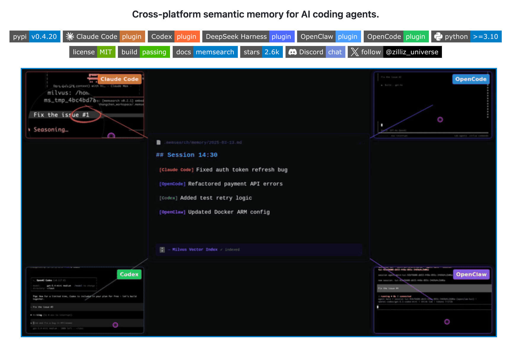
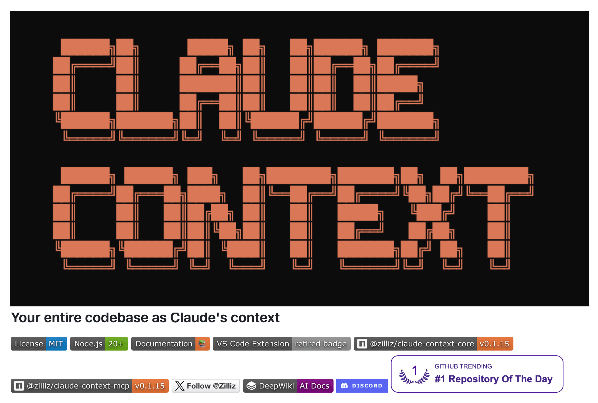

```deck
- agenda: false
```

{.title .no-chrome}


# The RAG Cost Curve
## When to reach for an index
## Haystack EU · September 2026

```authors
- name: Simon Hearne
  position: solutions architect
  company: Zilliz
  photo: https://github.com/simonhearne.png
```

---

{.no-chrome .center .bg}


<h1 style="font-size: 144px;font-weight: 600;line-height: 1.05;max-width: 80%;text-shadow: 0 0 10px black;margin-bottom: 25%;">RAG is Dead?</a>

---

# Where the answer is obvious

<div class="card-grid domain-cards">
<div class="card">
<p class="feature-cat">No text to grep</p>
<p class="case-name">Images, music, molecules</p>
<p class="case-proof">Pathology, chemistry, media archives. The vector <i>is</i> the query.</p>
</div>
<div class="card">
<p class="feature-cat">Query volume</p>
<p class="case-name">Support &amp; helpdesk</p>
<p class="case-proof">Thousands of questions a day against one corpus. Break-even arrives before lunch.</p>
</div>
<div class="card">
<p class="feature-cat">Similarity over exactness</p>
<p class="case-name">Fraud investigations</p>
<p class="case-proof">Identifying clusters of fraudulent activity and classifying new cases.</p>
</div>
<div class="card">
<p class="feature-cat">Corpus size</p>
<p class="case-name">Legal &amp; e-discovery</p>
<p class="case-proof">Millions of documents, where missing one is a legal problem.</p>
</div>
<div class="card">
<p class="feature-cat">Churn</p>
<p class="case-name">E-commerce catalogues</p>
<p class="case-proof">Prices and stock move hourly. Churn voids the cache long before it troubles the index.</p>
</div>
<div class="card">
<p class="feature-cat">Speed at scale</p>
<p class="case-name">Matching &amp; recommenders</p>
<p class="case-proof">Finding matches in a billion-scale corpus, in near real time.</p>
</div>
</div>

<!-- notes
Two clicks. The first row is the three corners this talk actually measured:
contamination, the context window, and query volume. Name them as callbacks,
not as new claims, because the room has already seen the numbers behind each
one on the previous slide.

The second row generalises past what was measured, and say so. Legal and
e-discovery is the corpus-size argument at a scale nothing here ran at.
E-commerce is the churn result pointed at a catalogue rather than a codebase,
and churn was computed in ws5.py rather than run as a workload, so do not
oversell it if challenged. The last card is the only one that leaves text
behind entirely: there is no lexical baseline to compare against, so the
break-even question never arises.

Then ask the room: what else? This is the slide to take answers on, and the
good ones are usually a variant of row one, somebody's private corpus that
the model has never seen. If nobody bites, move to the repo slide.
-->

---

{.center}

## Three things my abstract promised

<div class="card-grid promise-cards">
<div class="card fragment" data-fragment-index="1">
<p class="promise-verdict"><span class="fragment is-reframed" data-fragment-index="2">Reframed</span></p>
<div class="promise-body">
<p class="promise-claim">16x to 32x compressed vector index costs single-digit recall loss</p>
<p class="promise-n">01</p>
</div>
</div>
<div class="card fragment" data-fragment-index="1">
<p class="promise-verdict"><span class="fragment is-held" data-fragment-index="2">Held</span></p>
<div class="promise-body">
<p class="promise-claim">Recall is a proxy, I'll show where it breaks</p>
<p class="promise-n">02</p>
</div>
</div>
<div class="card fragment" data-fragment-index="1">
<p class="promise-verdict"><span class="fragment is-reframed" data-fragment-index="2">Reframed</span></p>
<div class="promise-body">
<p class="promise-claim">Break-even against live search lands in tens-to-hundreds of queries per day</p>
<p class="promise-n">03</p>
<!-- <p><span class="stamp-sub fragment" data-fragment-index="2">with one asterisk: the floor is a deployment choice</span></p> -->
</div>
</div>
</div>
<br>
<p class="fragment"><span class="big pill gradient">All open source &amp; reproducible</span></p>

---

# My intuition

At ~100 queries per day, indexed code search is cheaper than agentic.

```vega
- spec: charts/cost-curve.vg.json
  renderer: svg
  actions: false
  signal-stage: [1,2]
```

---

# Defining break-even

Simple maths!

<div class="breakeven-def">

<div class="equation">
<span class="be-symbol">Q*</span>
<span class="equals">=</span>
<div class="fraction">
<div class="num">fixed daily cost of the index</div>
<div class="bar"></div>
<div class="den">$ per query live &minus; $ per query indexed</div>
</div>
<span class="be-unit">queries per day</span>
</div>

<div class="card-grid be-terms">
<div class="card fragment">
<p class="pill ghost">fixed daily</p>
<p>What the index costs on a day you ask it nothing: the instance divided by 30.4, the embedding run amortised over a year, re-embedding for churn.</p>
</div>
<div class="card fragment">
<p class="pill ghost">saving per query</p>
<p>Billed dollars, live minus indexed. Invoiced amounts off a real account, not token estimates off a price list.</p>
</div>
<div class="card fragment is-gate">
<p class="pill ghost">at matched quality</p>
<p>The subtraction is only legal when both arms answer as well as each other. A cheaper wrong answer is not a saving.</p>
</div>
</div>

</div>

<!-- notes
This is the definition the whole talk is scored against, so it is worth being
slow here. Q* is exactly what data/ws5/break_even.csv computes in its
break_even_qpd column: fixed_daily / saving_per_query, where fixed_daily is
infra_month / 30.4375 plus embed_once / 365 plus churn_day. Nothing on this
slide is a measured value, so there is no src comment to chase; every measured
number that fills this formula in arrives in section five.

Three things to land, in the order the fragments come.

Fixed daily is the term people forget. An index bills whether or not anyone
queries it, and the denominator of 30.4 is a month of days, not a rounding. The
embedding run is the smallest term in the whole expression and it amortises to
nothing; the instance is the term that decides everything. That is the setup
for the deployment question in section five, so do not spend the punchline
here.

Saving per query is a subtraction, which means it can go negative. When it
does, Q* is infinite and no volume rescues the index. That case is real and it
shows up on fastapi.

Matched quality is the hinge, and it is why the next section is about recall
and quality rather than about money. Costs are only comparable between arms
that answer equally well, so quality has to be measured before cost means
anything. If someone asks how quality gets matched: a judge over 450 NQ-Open
questions, pre-registered, and that is the next section.

The closing line pre-empts the question the intuition chart invites, which is
"so what is the number". There is no single number. Q* is a function of the
corpus and the deployment, and the talk's job is to show its shape.
-->

---

{.small-title}

# Where the cost comes from

Four ways for an agent to answer the same question, the search itself is not expensive.

<svg class="cost-anatomy" viewBox="0 0 1400 378" role="img" aria-label="One pipeline, four ways to feed it. A question goes into a model and the model returns an answer. Four stations sit below the model. Parametric has no retrieval at all and pays only for the answer it writes. Agentic loops three to four times through a grep, read and glob tool, each turn cheap on its own but re-sending the whole transcript. Indexed takes one or two fat payloads of chunks from a vector search, and carries a navy band across the foot of its own box marking the charge it incurs per day whether or not anything is asked. Stuffed sends the whole corpus through a prompt cache once, in full, and reads from it cheaply after that. Every per-query charge is marked with a purple coin; the one per-day charge is the navy band inside the index's box.">
<defs>
<marker id="ca-arrow" viewBox="0 0 10 10" refX="9" refY="5" markerWidth="18" markerHeight="18" markerUnits="userSpaceOnUse" orient="auto-start-reverse"><path d="M0 0 L10 5 L0 10 z" fill="context-stroke"/></marker>
<marker id="ca-arrow-fat" viewBox="0 0 10 10" refX="0" refY="5" markerWidth="26" markerHeight="28" markerUnits="userSpaceOnUse" orient="auto-start-reverse"><path d="M0 0 L10 5 L0 10 z" fill="context-stroke"/></marker>
<marker id="ca-arrow-huge" viewBox="0 0 10 10" refX="0" refY="5" markerWidth="30" markerHeight="32" markerUnits="userSpaceOnUse" orient="auto-start-reverse"><path d="M0 0 L10 5 L0 10 z" fill="context-stroke"/></marker>
<linearGradient id="ca-grad" x1="0" y1="0" x2="1" y2="1"><stop offset="0%" stop-color="#175fff"/><stop offset="50%" stop-color="#7f47ff"/><stop offset="100%" stop-color="#c84cff"/></linearGradient>
</defs>

<g class="nodes">
<rect class="node" x="20" y="32" width="190" height="68" rx="34"/><text class="nlabel" x="115" y="74" text-anchor="middle">question</text>
<path class="edge" d="M210 66 H494"/>
<rect class="node node-model" x="500" y="10" width="400" height="112" rx="10"/>
<text class="mlabel" x="700" y="58" text-anchor="middle">MODEL</text>
<text class="nsub nsub-source" x="700" y="94" text-anchor="middle">input + output tokens</text>
<path class="edge" d="M900 66 H1184"/>
<rect class="node" x="1190" y="32" width="190" height="68" rx="34"/><text class="nlabel" x="1285" y="74" text-anchor="middle">answer</text>
</g>

<g class="stage stage-1 fragment" data-fragment-index="1">
<rect class="node node-none" x="40" y="230" width="300" height="72" rx="10"/>
<text class="nlabel nlabel-none" x="190" y="274" text-anchor="middle">no retrieval</text>
<circle class="coin" cx="1045" cy="66" r="18"/><text class="coin-mark" x="1045" y="74" text-anchor="middle">$</text>
<text class="elabel" x="1045" y="106" text-anchor="middle">per query</text>
<rect class="tag tag-ghost" x="95" y="336" width="190" height="38" rx="19"/><text class="tlabel tlabel-ghost" x="190" y="362" text-anchor="middle">parametric</text>
</g>

<g class="stage stage-2 fragment" data-fragment-index="2">
<path class="edge call" d="M560 122 V206 H470 V224"/>
<path class="edge flow flow-thin" d="M590 230 V182 H620 V126"/>
<text class="elabel" x="470" y="188" text-anchor="middle">&times; 3 to 4 turns</text>
<rect class="node" x="380" y="230" width="300" height="72" rx="10"/>
<text class="nlabel" x="530" y="274" text-anchor="middle">grep / read / glob</text>
<circle class="coin" cx="590" cy="210" r="18"/><text class="coin-mark" x="590" y="218" text-anchor="middle">$</text>
<text class="elabel" x="616" y="216" text-anchor="start">per query</text>
<rect class="tag tag-navy" x="435" y="336" width="190" height="38" rx="19"/><text class="tlabel tlabel-navy" x="530" y="362" text-anchor="middle">agentic</text>
</g>

<g class="stage stage-3 fragment" data-fragment-index="3">
<path class="edge call" d="M790 122 V206 H810 V224"/>
<path class="edge flow flow-fat" d="M930 230 V196 H830 V152"/>
<text class="elabel" x="760" y="188" text-anchor="end">&times; 1 to 2</text>
<rect class="node" x="720" y="230" width="300" height="88" rx="10"/>
<text class="nlabel" x="870" y="260" text-anchor="middle">vector search</text>
<text class="nsub muted" x="870" y="285" text-anchor="middle">embed once, negligible</text>
<path class="plinth" d="M721.25 292 H1018.75 V308 A8.75 8.75 0 0 1 1010 316.75 H730 A8.75 8.75 0 0 1 721.25 308 Z"/>
<text class="plabel" x="870" y="310" text-anchor="middle">$ per day, query or not</text>
<rect class="node node-edge" x="720" y="230" width="300" height="88" rx="10"/>
<circle class="coin" cx="930" cy="210" r="18"/><text class="coin-mark" x="930" y="218" text-anchor="middle">$</text>
<text class="elabel" x="956" y="216" text-anchor="start">per query</text>
<rect class="tag tag-gradient" x="775" y="336" width="190" height="38" rx="19"/><text class="tlabel tlabel-gradient" x="870" y="362" text-anchor="middle">indexed</text>
</g>

<g class="stage stage-4 fragment" data-fragment-index="4">
<path class="edge flow flow-huge plain" d="M1210 230 V172 H1170"/>
<path class="edge flow flow-huge" d="M990 172 H880 V156"/>
<rect class="node node-cache" x="990" y="146" width="170" height="52" rx="10"/>
<text class="nsub" x="1075" y="179" text-anchor="middle">prompt cache</text>
<text class="elabel" x="1236" y="178" text-anchor="start">&times; 1</text>
<rect class="node" x="1060" y="230" width="300" height="72" rx="10"/>
<text class="nlabel" x="1210" y="274" text-anchor="middle">the whole corpus</text>
<circle class="coin" cx="1210" cy="210" r="18"/><text class="coin-mark" x="1210" y="218" text-anchor="middle">$</text>
<text class="elabel" x="1236" y="216" text-anchor="start">per query</text>
<rect class="tag tag-berry" x="1115" y="336" width="190" height="38" rx="19"/><text class="tlabel tlabel-berry" x="1210" y="362" text-anchor="middle">stuffed</text>
</g>
</svg>

<div class="cost-notes">
<p class="fragment" data-fragment-index="1">No search, no payload. You pay for the answer, and nothing else.</p>
<p class="fragment" data-fragment-index="2">Small results each time. But the whole transcript goes back every turn.</p>
<p class="fragment" data-fragment-index="3">One fat payload of chunks, and a box that bills daily whether you ask or not.</p>
<p class="fragment" data-fragment-index="4">The corpus is written to cache once, in full. Reads after that are cheap.</p>
</div>

<p class="closing-line is-emphatic fragment" data-fragment-index="5">Only the index has a fixed cost, everything else is per query or per embedding. The same logic applies for code search and agentic memory.</p>

<!-- notes
Nothing on this slide is a measured value. It is the anatomy the formula above
needs, and the numbers that fill it in arrive in sections two and five. If the
room pushes for figures early, they are in ws6a/summary.csv and ws6c/summary.csv
per query, and ws5/break_even.csv for the daily floor.

One click per arm, and the shape is the argument.

Parametric is the control. No repository access at all, so there is no payload
and no search. The only thing billed is the answer the model writes. It is the
cheapest arm on this slide and it is also the one that gets the answer wrong
most often, which is the whole reason the rest of the slide exists.

Agentic is a loop. Grep, read, glob, three or four turns on a median question.
Each individual tool result is small, and that is the trap: the cost is not the
result, it is that the entire transcript so far goes back into the model on
every single turn. Turns are the bill, not bytes off disk.

Indexed inverts that. One or two turns, each carrying a much fatter payload,
because a chunk of retrieved source is a lot of tokens compared to a grep hit.
Per query these two land close to each other, which is the result section two
spends its time on. The important part is the second coin, in navy. The index
also charges you for existing. A box, every day, whether or not anybody asks it
anything. That is the numerator of Q*, and it is the only per-day charge
anywhere on this slide.

Stuffed is the honest extreme. Put the whole corpus in the prompt, let the cache
do the work. The cache read really is cheap, the saving is large and real, but
somebody paid to write the corpus into that cache in full, and the write scales
with the corpus while none of the other three do. That is why it is the arm
that falls off the chart later.

Then the closing line. Two terms, one per day and one per query, which is
exactly the formula on the previous slide. Land it and move on.
-->

---
{.section}

# ANN 201

---

{.no-chrome .dark .no-title .center}

# The big idea

<style>
  .big-idea { display: flex; align-items: center; justify-content: center; gap: 3vw; margin: 10vh 0; font-size: 32px; }
  .big-idea .bi-cell { display: flex; flex-direction: column; align-items: center; }
  .big-idea .bi-num { font-size: 3.4em; font-weight: 800; line-height: 1; }
  .big-idea .bi-lab { font-family: var(--zilliz-font-mono, monospace); font-size: 0.85em; opacity: 0.65; margin-top: 0.6em; }
  .big-idea .give .bi-num { color: #94a3b8; }
  .big-idea .get .bi-num { color: var(--zilliz-blue, #175fff); }
  .big-idea .bi-arrow { font-size: 2.6em; opacity: 0.4; }
  .big-idea-foot { text-align: center; font-size: 1.3em; }
</style>

<div class="big-idea">
  <div class="bi-cell get"><span class="bi-num">>100x</span><span class="bi-lab">faster, cheaper search</span></div>
  <div class="bi-arrow">↔</div>
  <div class="bi-cell give"><span class="bi-num">&lt;0.10</span><span class="bi-lab">recall you give up</span></div>
</div>

---

{.index-heuristics}

# ANN: more than HNSW

Choose IVF for the best balance of performance and cost.

<p class="rate-key"><span>🚀</span>higher QPS <em>·</em> <span>⚡️</span>lower latency <em>·</em> <span>💰</span>more expensive to serve <em>·</em> <span>⏳</span>slower to build</p>

| Index | OSS since | Lives in | QPS | Latency | Cost | Build | Tune with |
|---|---|---|---|---|---|---|---|
| **HNSW** | 2016 | RAM | <span class="rate">🚀🚀🚀🚀🚀</span> | <span class="rate">⚡️⚡️⚡️⚡️⚡️</span> | <span class="rate">💰💰💰💰💰</span> | <span class="rate">⏳⏳⏳⏳<i>⏳</i></span> | `ef` at query time |
| **ScaNN** | 2020 | RAM | <span class="rate">🚀🚀🚀🚀<i>🚀</i></span> | <span class="rate">⚡️⚡️⚡️⚡️<i>⚡️</i></span> | <span class="rate">💰💰💰<i>💰💰</i></span> | <span class="rate">⏳⏳<i>⏳⏳⏳</i></span> | `nprobe` plus reorder depth |
| **IVF** | 2017 | RAM or disk | <span class="rate">🚀🚀🚀<i>🚀🚀</i></span> | <span class="rate">⚡️⚡️⚡️<i>⚡️⚡️</i></span> | <span class="rate">💰💰💰<i>💰💰</i></span> | <span class="rate">⏳<i>⏳⏳⏳⏳</i></span> | `nprobe` cells per query |
| **DiskANN** | 2020 | SSD, some RAM | <span class="rate">🚀🚀<i>🚀🚀🚀</i></span> | <span class="rate">⚡️⚡️<i>⚡️⚡️⚡️</i></span> | <span class="rate">💰💰<i>💰💰💰</i></span> | <span class="rate">⏳⏳⏳⏳⏳</span> | beam width |
| **AISAQ** | 2025 | SSD, flat RAM | <span class="rate">🚀<i>🚀🚀🚀🚀</i></span> | <span class="rate">⚡️<i>⚡️⚡️⚡️⚡️</i></span> | <span class="rate">💰<i>💰💰💰💰</i></span> | <span class="rate">⏳⏳⏳⏳⏳</span> | beam width |

<!-- notes
TALK TRACK (~60s)
The three graph-and-partition animations that used to live here are backup
slides now; pull one up if the room wants the mechanism.

The pips are a heuristic, not a benchmark. Say that out loud once, then do
not defend them number by number.

The year column is first open-source availability, not paper date: HNSW in
nmslib April 2016, IVF in Faiss February 2017 (the idea is older, the usable
implementation is not), ScaNN June 2020, DiskANN June 2020, AiSAQ January
2025. If pressed: ScaNN and DiskANN were serving Google and Bing traffic for
years before the code went out, so these are release dates, not invention
dates.

Top of the table is the fast, expensive end. HNSW is a navigable graph held
entirely in RAM: highest QPS, lowest latency, no training step, and you pay
for all of it in memory. ScaNN is IVF's shape with a score-aware quantiser
on top, which buys back top-k accuracy at heavy compression. IVF partitions
the space and searches only the nearest cells: cheap to build, one honest
dial, and the one that pairs most naturally with the quantisation coming up
next.

The bottom two are what you reach for when RAM runs out. DiskANN keeps the
graph and full vectors on SSD with a compressed summary in memory: billions
of vectors on GBs of RAM, paid for in random reads. AISAQ pushes the
compressed codes to storage too, so RAM stops growing with the corpus at
all, and you pay yet more I/O per query.

Throughput, latency and cost all move together, and that is the point.
Downward through the table is a memory budget: each row buys RAM back and
settles up in latency and throughput. That is the only thing anyone needs to
carry out of this slide, because the rest of the talk is about the other two
levers, smaller numbers and fewer of them.

Build time is the column that does not follow, and it is worth one sentence:
IVF is the cheapest thing here to build and sits in the middle of the table,
while HNSW is expensive to build at the top and DiskANN more expensive still
at the bottom. Build cost is paid once and serving cost is paid forever, so
it should not drive the choice, but it does decide how much a re-index hurts
when you change embedding model.

If asked for the caveats the prose version used to carry: IVF and ScaNN both
need a training pass and both sag at cluster boundaries. If asked to defend a
pip, do not: say it is a starting point, not a benchmark, and offer the
backup animations instead.
-->
---

# ANN Benefits

```vega
- spec: ../../visualisations/ann-vs-exact.json
  renderer: svg
  signal-stage: [1, 2, 3]
  fragment-index: 0
  actions: false
```

---

{.chart-animate .small-title}

# Who doesn't love a trade-off triangle

ANN algorithms all trade perfection for reduced latency and cost.

```vega
- spec: ../../visualisations/trade-off-triangle.json
  renderer: svg
  signal-stage: [1,2]
  actions: false
  fit: contain
```

---

# The size problem

No matter what algorithm you use, embeddings are big. In RAM or on disk, size matters.

<svg class="size-diagram" viewBox="0 0 1400 400" role="img" aria-label="Four-step build of the embedding footprint: one chunk becomes a 3072-dimension vector, every dimension is a four-byte float32 so one vector costs 12.3 kilobytes, one hundred million chunks make 1.23 terabytes, and holding that costs about six thousand one hundred dollars a month in RAM or one hundred and eighty four dollars a month on premium SSD">
<defs>
<marker id="sz-arrow" viewBox="0 0 10 10" refX="9" refY="5" markerWidth="6" markerHeight="6" orient="auto-start-reverse"><path d="M0 0 L10 5 L0 10 z" fill="context-stroke"/></marker>
<pattern id="sz-cells" width="28" height="66" patternUnits="userSpaceOnUse" patternTransform="translate(0 100)"><rect class="cell" x="4" y="8" width="20" height="50" rx="3"/></pattern>
<pattern id="sz-block" width="28" height="21" patternUnits="userSpaceOnUse" patternTransform="translate(0 46)"><rect class="cell" x="4" y="4" width="20" height="13" rx="2"/></pattern>
</defs>
<g class="rail"><path d="M224 366 H1060"/></g>
<g class="stage stage-1 fragment" data-fragment-index="1">
<path class="edge" d="M172 133 H218"/>
<text class="elabel muted" x="448" y="40" text-anchor="middle">text-embedding-3-large</text>
<text class="nlabel" x="448" y="84" text-anchor="middle">3072 dimensions</text>
<rect class="node strip" x="224" y="100" width="448" height="66" rx="6"/>
<rect class="tag" x="300" y="344" width="200" height="44" rx="22"/><text class="tlabel" x="400" y="374" text-anchor="middle">3072 numbers</text>
</g>
<g class="stage stage-2 fragment" data-fragment-index="2">
<rect class="cell-focus" x="564" y="100" width="20" height="66" rx="3"/>
<path class="cone" d="M564 166 L470 196 H620 L584 166 Z"/>
<rect class="node cell-zoom" x="470" y="196" width="150" height="60" rx="8"/>
<g class="bytes"><rect x="479" y="207" width="30" height="38" rx="3"/><rect x="513" y="207" width="30" height="38" rx="3"/><rect x="547" y="207" width="30" height="38" rx="3"/><rect x="581" y="207" width="30" height="38" rx="3"/></g>
<text class="elabel" x="545" y="284" text-anchor="middle">float32 = 4 bytes</text>
<rect class="tag" x="545" y="344" width="150" height="44" rx="22"/><text class="tlabel" x="620" y="374" text-anchor="middle">12.3 KB</text>
</g>
<g class="stage stage-3 fragment" data-fragment-index="3">
<path class="edge" d="M678 133 H774"/>
<text class="elabel" x="726" y="112" text-anchor="middle">× 100M</text>
<rect class="node block" x="780" y="46" width="280" height="210" rx="8"/>
<text class="nlabel" x="920" y="284" text-anchor="middle">100M chunks</text>
<rect class="tag" x="845" y="344" width="150" height="44" rx="22"/><text class="tlabel" x="920" y="374" text-anchor="middle">1.23 TB</text>
</g>
<g class="stage stage-4 fragment" data-fragment-index="4">
<path class="edge plain" d="M1066 151 H1096"/>
<path class="edge" d="M1096 151 V98 H1124"/>
<path class="edge" d="M1096 151 V216 H1124"/>
<rect class="node node-cost" x="1130" y="46" width="260" height="104" rx="16"/>
<text class="cost-num" x="1260" y="102" text-anchor="middle">$6,100</text>
<text class="nsub nsub-source" x="1260" y="134" text-anchor="middle">RAM, per month</text>
<rect class="node node-cost-alt" x="1130" y="164" width="260" height="104" rx="16"/>
<text class="cost-num cost-num-alt" x="1260" y="220" text-anchor="middle">$184</text>
<text class="nsub nsub-tight" x="1260" y="252" text-anchor="middle">premium SSD, per month</text>
<text class="nsub muted" x="1260" y="300" text-anchor="middle">raw vectors only,</text>
<text class="nsub muted" x="1260" y="324" text-anchor="middle">before index overhead</text>
</g>
<g class="nodes">
<rect class="node" x="10" y="95" width="150" height="76" rx="38"/><text class="nlabel" x="85" y="142" text-anchor="middle">1 chunk</text>
<text class="elabel muted" x="216" y="374" text-anchor="end">footprint</text>
</g>
</svg>

<p class="closing-line fragment" data-fragment-index="4">100M chunks and you are holding <strong>1.23 TB</strong> before a single query runs.</p>

<!-- src: visualisations/cost-calculator.json:constants_note (RAM $5/GB/mo, as of 2026-05) -->
<!-- src: deck assumption, premium SSD $0.15/GB-month; cost-calculator.json carries NVMe at $0.10/GB/mo for a different workload -->

<!-- notes
Four beats, one per click.

Stage 1. One chunk of text goes through the embedding model and comes back as
3072 numbers. That is text-embedding-3-large, nothing unusual.

Stage 2. Zoom into a single dimension. It is a float32, four bytes. So one
vector is 3072 times 4, 12.3 kilobytes. Still nothing.

Stage 3. Multiply by a hundred million chunks, which is a medium enterprise
corpus, not a hyperscaler. 1.23 terabytes.

Stage 4. Two prices for the same 1.23 terabytes. At five dollars per
gigabyte-month, RAM is about six thousand one hundred dollars a month. The
same bytes on premium SSD at fifteen cents per gigabyte-month are a hundred
and eighty four dollars. That is the thirty-three times gap, and it is why
DiskANN earned its slide earlier: the algorithm exists to buy that gap.

Say the caveat out loud either way: this is the raw vectors only. The index
sits on top of it. The HNSW graph or the IVF lists are extra.

Both numbers are what the whole next section attacks. Quantisation shrinks
the terabytes, so it shrinks whichever of the two you are paying.
-->

---

{.section}

# <span class="hero-text">Quantisation</span>: <br>smaller numbers

---

{.small-title}

# Scalar quantisation

Round `float32 → int8`: **4x smaller embeddings**, a small recall hit, almost no work.

```vega
- spec: ../../visualisations/scalar-steps.json
  signal-stage: [3]
  renderer: svg
  actions: false
  fit: contain
```

---

{.small-title}

# RaBitQ: one bit per dimension

Rotate the space to reduce error, then keep just the **sign** of each dimension - one bit.

```vega
- spec: ../../visualisations/rabitq-steps.json
  signal-stage: [0,1,2,3]
  renderer: svg
  actions: false
  fit: contain
```

---

{.small-title}

# Product quantisation

Scalar quantisation shrinks every number, **PQ** shrinks the whole vector.

```vega
- spec: ../../visualisations/pq-steps.json
  signal-stage: [0,1,2,3]
  renderer: svg
  actions: false
  fit: contain
```

---

{.small-title .no-vega-bindings}

# What it costs you (in theory)

Every lost bit risks recall, but the curve is surprisingly forgiving.

```vega
- spec: ../../visualisations/compression-recall.json
  renderer: svg
  signal-stage: [1]
  actions: false
  fit: contain
```

<!-- src: compression-recall.json:source_1 (illustrative, authored at 768-D; the Embedding dim control scales residual error for PQ/PRQ/RaBitQ only, direction not measurement) -->

---

{.chart-animate .small-title}

# Quantisation shifts everything cheaper &amp; faster

Each algorithm can use quantisation to trade accuracy for significantly reduced latency and cost.

```vega
- spec: ../../visualisations/trade-off-triangle.json
  renderer: svg
  signal-stage: [2,3]
  actions: false
  fit: contain
```

---

{.section}

# <span class="hero-text">Dimensionality reduction</span>: <br>fewer numbers

<!-- Quantisation shrinks each number. **Dimensionality reduction** removes numbers outright - fewer dimensions, full precision. -->

---

# PCA: rotate, drop the quiet axes

PCA finds the _directions_ of greatest variance and keeps the top _k_. Fewer dimensions, full precision.

<div class="two-col" style="grid-template-columns: 1.6fr 1fr; align-items: center;">
<div>

```vega
- spec: ../../visualisations/pca-projection.json
  renderer: svg
  signal-stage: [0, 1, 2, 3]
  actions: false
  contain: fit
```

</div>
<div>

<blockquote class="blue"><span class="label">Benefit</span><p>Keep <span class="hit-text">one number instead of two</span> and 94% of the variance - linear, fast, deterministic.</p></blockquote>

<blockquote class=""><span class="label">Drawback</span><p>Maximises for <em>variance, not meaning</em>: structure on a low-variance axis is discarded, and it must be refit when the data shifts.</p></blockquote>

</div>
</div>
<!--
<aside class="speaker-notes">
PCA is relatively rare in production workloads, AlloyDB is one solution that supports it natively.
PCA will reduce precision, especially at low k values.
</aside>
-->
---

{.quant-steps}

# MRL: one vector, many lengths

The dimensions are ordered by importance, so a prefix is a complete vector.

```vega
- spec: ../../visualisations/mrl-steps.json
  signal-stage: [1,2,3]
  renderer: svg
  actions: false
  fit: contain
```

---

{.chart-animate}

# vs a model not trained for it

MRL tunes the model so the **dimensions are ordered by importance**. OpenAI's `text-embedding-3-large` is 3072-D native, but you can ask for any prefix down to 256-D via the `dimensions` parameter.

<br>

<div class="two-col" style="grid-template-columns: 1.6fr 1fr; align-items: center;">
<div>

```vega
- spec: ../../visualisations/mrl-truncation.json
  renderer: svg
  signal-prefix: [256]
  actions: false
  fit: contain
```

</div>
<div>

<blockquote class="blue small"><span class="label">Benefit</span><p>One model, <span class="hit-text">pick the length per query</span> - short prefix to shortlist fast, full vector to re-rank. Degrades gracefully.</p></blockquote>

<blockquote class="small"><span class="label">Drawback</span><p>Only works if the model was <em>trained</em> this way - an ordinary embedding survives a light trim, then falls off a cliff once you cut hard (the berry line).</p></blockquote>

</div>
</div>

---

{.chart-animate .small-title}

# Fewer dimensions, small accuracy hit

Dimensionality reduction nudges any index toward fast and cheap.

```vega
- spec: ../../visualisations/trade-off-triangle.json
  renderer: svg
  signal-stage: [3,4]
  actions: false
  fit: contain
```

---

# Refine: scan cheap, rescore precise

Build time compression and dimensionality reduction both trade _accuracy to buy speed and scale_. **Refinement** wins accuracy back at query time.

<div class="two-col refine">
<div>
<svg class="refine-diagram" viewBox="0 0 1180 480" role="img" aria-label="Refinement funnel: a coarse pass scans nprobe of the 10 million 1-bit RaBitQ codes and reaches recall@10 of 0.778; an SQ8 refine pass rescores refine_k times limit candidates and reaches 0.986; widening nprobe from 256 to 1024 reaches 0.992; a re-ranker sits off the recall rail and only reorders the top-k">
<defs>
<marker id="rf-arrow" viewBox="0 0 10 10" refX="9" refY="5" markerWidth="6" markerHeight="6" orient="auto-start-reverse"><path d="M0 0 L10 5 L0 10 z" fill="context-stroke"/></marker>
<pattern id="rf-codes" width="25" height="24" patternUnits="userSpaceOnUse"><rect class="code" x="4" y="4" width="17" height="15" rx="3"/></pattern>
<pattern id="rf-exact" width="25" height="24" patternUnits="userSpaceOnUse"><rect class="code code-exact" x="3" y="3" width="19" height="17" rx="3"/></pattern>
</defs>
<g class="rail"><path d="M200 440 H880"/></g>
<g class="stage stage-1 fragment" data-fragment-index="1">
<path class="edge" d="M142 190 H182"/>
<path class="funnel" d="M370 55 L490 138 V242 L370 325 Z"/>
<rect class="node band" x="490" y="138" width="150" height="104" rx="12"/>
<text class="elabel" x="430" y="196" text-anchor="middle">nprobe</text>
<text class="elabel" x="565" y="282" text-anchor="middle">refine_k &times; limit</text>
<text class="nsub" x="565" y="310" text-anchor="middle">20 rows at refine_k=2</text>
<rect class="tag" x="515" y="418" width="100" height="44" rx="22"/><text class="tlabel" x="565" y="448" text-anchor="middle">0.778</text>
</g>
<g class="stage stage-2 fragment" data-fragment-index="2">
<rect class="node node-source" x="410" y="8" width="310" height="74" rx="16"/>
<text class="nlabel nlabel-source" x="565" y="40" text-anchor="middle">SQ8 vectors</text>
<text class="nsub nsub-source" x="565" y="66" text-anchor="middle">kept alongside the codes</text>
<path class="edge dashed" d="M565 86 V132"/>
<rect class="node band band-exact" x="490" y="138" width="150" height="104" rx="12"/>
<text class="elabel" x="584" y="118" text-anchor="start">rescore, don't re-search</text>
<path class="funnel" d="M640 138 L770 168 V212 L640 242 Z"/>
<rect class="node band band-exact" x="770" y="163" width="110" height="54" rx="12"/>
<text class="elabel" x="705" y="196" text-anchor="middle">cut to k</text>
<text class="nlabel" x="825" y="251" text-anchor="middle">top-k</text>
<rect class="tag" x="775" y="418" width="100" height="44" rx="22"/><text class="tlabel" x="825" y="448" text-anchor="middle">0.986</text>
</g>
<g class="stage stage-3 fragment" data-fragment-index="3">
<path class="edge dashed" d="M870 330 H404"/>
<text class="elabel" x="595" y="368" text-anchor="middle">widen nprobe, 256 &rarr; 1024</text>
<rect class="tag" x="775" y="348" width="100" height="44" rx="22"/><text class="tlabel" x="825" y="378" text-anchor="middle">0.992</text>
</g>
<g class="stage stage-4 fragment" data-fragment-index="4">
<path class="edge dashed" d="M888 190 H938"/>
<rect class="node node-off" x="946" y="150" width="180" height="80" rx="12"/>
<text class="nlabel" x="1036" y="196" text-anchor="middle">re-ranker</text>
<text class="nsub" x="1036" y="258" text-anchor="middle">reorders the top-k</text>
<text class="elabel muted" x="1036" y="292" text-anchor="middle">off this rail</text>
</g>
<g class="nodes">
<rect class="node" x="4" y="155" width="130" height="70" rx="35"/><text class="nlabel" x="69" y="199" text-anchor="middle">Query</text>
<rect class="node band" x="190" y="55" width="180" height="270" rx="12"/>
<text class="nlabel" x="280" y="362" text-anchor="middle">100M vectors</text>
<text class="nsub" x="280" y="390" text-anchor="middle">1-bit RaBitQ codes</text>
<text class="elabel muted" x="186" y="448" text-anchor="end">recall@10</text>
</g>
</svg>
</div>
<div>
<ol class="refine-list">
<li class="fragment" data-fragment-index="1"><strong>Coarse pass</strong> - scan <code>nprobe</code> of the lists using the 1-bit RaBitQ codes. Cheap, and on its own it stops at <strong>0.778</strong>.</li>
<li class="fragment" data-fragment-index="2"><strong>Refine pass</strong> - Milvus keeps SQ8 copies beside the codes and <em>rescores</em> <code>refine_k &times; limit</code> candidates with them. Same candidates, better distances: <strong>0.986</strong>.</li>
<li class="fragment" data-fragment-index="3"><strong>The last point</strong> comes from the coarse pass, not the refine. <code>nprobe</code> 256 to 1024 buys <strong>0.992</strong>, at a quarter of the throughput.</li>
<li class="fragment" data-fragment-index="4"><strong>Re-ranking is a different axis.</strong> A cross-encoder reorders the k you already retrieved. Better ordering, identical recall.</li>
</ol>
</div>
</div>

<!-- src: data/ws2/curves_10m.csv:arm,sweep_value,recall_at_10,qps — rabitq@nprobe256 0.77763/2.72, rabitq_refine_sq8_k2@nprobe256 0.98562/3.44, rabitq_refine_sq8_k2@nprobe1024 0.99200/0.88 -->

<!-- notes
The three numbers are one arm, rabitq_refine_sq8_k2, at 10M, walked along its
own nprobe sweep. Bare RaBitQ at the same nprobe=256 is 0.778: that is the gap
the refine pass exists to close, and it matches the k-anchor backup table.
0.986 is the same nprobe with refine on. 0.992 needs nprobe=1024 and costs
three quarters of the QPS, 3.44 down to 0.88.

refine_k is a multiplier on the search limit, not a candidate count: the docs
say the refine pass picks the neighbours from a refine_k times larger pool. At
limit 10 and k=2 that is twenty rows rescored, not a thousand.

If asked about re-ranking: Milvus rerankers score query-document text pairs
after retrieval. They cannot raise recall@10, because the ten are already
chosen. They move relevance, which is the next section's problem.
-->

---

{.chart-animate .small-title}

# Refinement pulls the other way

PCA and Matryoshka trade accuracy for speed and cost. Refinement trades both to buy **accuracy** back.

```vega
- spec: ../../visualisations/trade-off-triangle.json
  renderer: svg
  signal-stage: [4,5]
  actions: false
  fit: contain
```

---

{.section}

# Does recall even matter?

---

# How an answer is scored

*Every number in this section is a judged answer, not a retrieval metric*

<svg class="study-rig" viewBox="0 0 1400 270" role="img" aria-label="The scoring harness. A question goes to an agent running Sonnet 5, the agent returns an answer, and a judge running Opus 5 scores it without being told which arm produced it. A bracket across the top marks the questions, the corpus, the prompt and both models as held constant. Below the agent hangs the one dashed socket in the rig, labelled retrieval, the only variable, with a dashed call edge going down into it and a solid result edge coming back up.">
<defs>
<marker id="jr-arrow" viewBox="0 0 10 10" refX="9" refY="5" markerWidth="18" markerHeight="18" markerUnits="userSpaceOnUse" orient="auto-start-reverse"><path d="M0 0 L10 5 L0 10 z" fill="context-stroke"/></marker>
<linearGradient id="jr-grad" x1="0" y1="0" x2="1" y2="1"><stop offset="0%" stop-color="#175fff"/><stop offset="50%" stop-color="#7f47ff"/><stop offset="100%" stop-color="#c84cff"/></linearGradient>
</defs>

<g class="clamp">
<path class="clamp-rule" d="M10 26 V8 H330"/>
<path class="clamp-rule" d="M1070 8 H1390 V26"/>
<text class="clamp-label" x="700" y="15" text-anchor="middle">held constant: questions, corpus, prompt, both models</text>
</g>

<g class="spine">
<rect class="node" x="10" y="40" width="200" height="68" rx="34"/>
<text class="nlabel" x="110" y="82" text-anchor="middle">question</text>
<path class="edge" d="M210 74 H384"/>
<rect class="node node-model" x="390" y="32" width="340" height="84" rx="10"/>
<text class="mlabel" x="560" y="72" text-anchor="middle">AGENT</text>
<text class="nsub nsub-source" x="560" y="100" text-anchor="middle">Sonnet 5</text>
<path class="edge" d="M730 74 H794"/>
<rect class="node" x="800" y="40" width="200" height="68" rx="34"/>
<text class="nlabel" x="900" y="82" text-anchor="middle">answer</text>
<path class="edge" d="M1000 74 H1044"/>
<rect class="node node-judge" x="1050" y="32" width="340" height="84" rx="10"/>
<text class="mlabel mlabel-judge" x="1220" y="72" text-anchor="middle">JUDGE</text>
<text class="nsub" x="1220" y="100" text-anchor="middle">Opus 5</text>
<text class="elabel" x="1220" y="148" text-anchor="middle">{correct, reason}</text>
<text class="nsub muted" x="1220" y="174" text-anchor="middle">blind to arm</text>
</g>

<g class="stage">
<path class="edge call" d="M490 116 V152"/>
<text class="elabel" x="464" y="143" text-anchor="end">call</text>
<path class="edge" d="M630 158 V122"/>
<text class="elabel" x="656" y="143" text-anchor="start">result</text>
<rect class="node socket" x="390" y="158" width="340" height="84" rx="10"/>
<text class="mlabel mlabel-socket" x="560" y="194" text-anchor="middle">RETRIEVAL</text>
<text class="nsub muted" x="560" y="226" text-anchor="middle">the one variable</text>
</g>
</svg>

<p>Judge accuracy is the share of questions <strong>Opus 5</strong> marks correct, returning a <code>{correct, reason}</code> verdict without being told which arm produced the answer. Hedges, refusals, and a gold answer named inside a denial all score incorrect.<!-- src: data/ws4/judge_prompt.txt --></p>

<p class="stamp-sub">Strict and binary, so treat the absolute level as a floor: NQ's 2018 gold answers against a 2023 corpus put every arm between 0.22 and 0.50. Compare the arms with each other rather than reading the height.<!-- src: data/ws4/summary.csv:quality metric=judge min 0.2156 max 0.4978 over 12 arm-runs --></p>

<p class="rig"><span class="pill ghost">NQ-Open</span><span class="pill ghost">10M Wikipedia 2023-11</span><span class="pill ghost">mxbai-embed-large-v1</span><span class="pill ghost">Sonnet 5 answers</span><span class="pill ghost">Opus 5 judges</span><span class="pill ghost">seed 42</span></p>

<!-- notes
One slide, no advance, and it exists so that nothing in this section has to be
taken on trust. Every chart from here to the end of the section has judge
accuracy on an axis, and this is what that means.

The spine is held constant: the same questions, the same corpus, the same
prompt, the same two models. One thing hangs off it, and it is retrieval. That
is the whole design, and it is the same rig the code benchmark runs on later,
so the room learns the drawing once.

Two things about the judge, and say both. It does not know which arm produced
the answer it is grading. And it is strict: a hedge is wrong, a refusal is
wrong, and naming the gold answer inside a sentence that denies being able to
answer is wrong. That last guard is quoted in the backup, and it is there
because a model that says "I don't know, though it might be X" and lands on
the right X would otherwise score as correct.

The floor caveat under the diagram is the one to say out loud rather than read:
every arm scores between 0.22 and 0.50 because NQ's 2018 gold answers are being
graded against a 2023 corpus, so compare the arms with each other and never read
the height. The rig strip is the provenance for the whole section, and it is the
only place the main deck names the dataset and the embedding model.

If anyone asks how much of this is the judge's opinion: a seeded 60-row sample
was judged a second time and 60 of 60 verdicts agreed, against a 0.95
threshold set in advance. That is on `Backup: the judge prompts` along with all
four prompts. What was actually run, three passes over the same corpus at
different strata, is on `Backup: three passes at one question`.

Sources: data/ws4/judge_prompt.txt.
-->

---

# Recall barely impacts answer quality?

450 NQ-Open validation questions, 10M Wikipedia
chunks, twelve arm-runs, paired bootstrap.

<div class="chart-overlay">

```vega
- spec: charts/quality-vs-recall.vg.json
  actions: false
  renderer: svg
  signal-stage: [2, 4]
  fragment-index: 0
```

<div class="stat-grid chart-callouts fragment">
<div class="stat-card">
<p class="stat-value">+0.235<span class="stat-ci">[0.122, 0.353]</span></p>
<p class="stat-note">judge accuracy per unit of recall@10<!-- src: data/ws4d/solvable_changepoint.csv:slope,slope_ci_lo,slope_ci_hi row=all_eligible --></p>
</div>
<div class="stat-card">
<p class="stat-value">+0.0133<span class="stat-ci">[-0.0133, +0.0400]</span></p>
<p class="stat-note">judge accuracy gap to full precision: a tie<!-- src: data/ws4/summary.csv:delta_vs_ref,delta_ci_lo,delta_ci_hi --></p>
</div>
<div class="stat-card">
<p class="stat-value">9.22x</p>
<p class="stat-note">measured footprint at PCA-384 + SQ8, vs the IVF_FLAT 1024d index<!-- src: data/ws3/dim_verdict_10m.csv:footprint_compression_vs_ivf_flat_1024=9.2167 --></p>
</div>
</div>

</div>

<!-- src: data/ws4/summary.csv:pca_uc_384_sq8_np512,judge,recall -->

<!-- notes
The whole curve is nearly flat, not a cliff. Only sq8@4 loses more than
three points (−6.2). The ordering is not monotone: pq_m256 at 0.817 recall
is indistinguishable from the reference while sq8@16 at 0.918 is not, so
the three DROPs are real by the pre-registered criterion and small in
absolute terms (CI lower bound +0.002). EM and F1 are stricter still and
their disagreement with the judge is on the slide's backup.
Absolute accuracies are lower bounds because NQ gold answers are 2018-era
against a 2023-11 corpus; paired differences are unaffected.

If anyone asks where the knee went: there is no knee. This deck used to
print r* = 0.923 and it has been withdrawn. WS4's r* was a plateau rule,
not a fit, and it reproduces its own branch in only 0.675 of 10,000 paired
resamples; 0.279 of resamples find no plateau at all, meaning r* does not
exist under the rule's own definition; and only 0.190 of all resamples land
within ±0.01 of the published point. WS4d then fitted a real two-segment
changepoint twice, at 11 arms and at 15, and got a CI 0.213 and 0.2126 wide
against a pre-registered quotable bar of 0.05. Going from 11 arms to the
densest ladder the project could build moved that width by less than 0.001,
so the threshold is arm-limited and not resolvable by measuring harder.
r* is retired, not pending.

What replaces it is the slope on the card: judge accuracy rises 0.235
[0.122, 0.353] points per unit of recall@10. That is a line, not a knee.
Note the stratum if pressed: the slope is WS4d's 15-arm fit on the
264-question eligible stratum, while the points on this chart are WS4's
11-arm ladder over 450 questions. Same corpus and judge, different
question sets, which is why the number is annotated rather than drawn
through these points.

The slope is the statistical replacement. The operating replacement is later in
this section, "Aim for recall@k ≳ 0.95", which is where anyone asking
"so what recall should I buy?" gets an answer. Do not answer it here.

The money stat is the slide's last advance: three cards laid over the empty
band of the plot, landing on the beat after the dropped arms are marked out.
It used to be a fifth chart stage, because a page fragment fired before the
chart's own stages; `fragment-index: 0` on the chart buys the same order now,
with real cards instead of text drawn into the SVG.
-->

---

{.small-title}

# Most questions never had a choice

*The same 450 questions, counted by how many of the eleven retrieval arms got each one right.*

<div class="stat-grid">
<div class="stat-card">
<span class="stat-label">Never answered correctly</span>
<p class="stat-value">38 %</p>
<p class="stat-note">173 questions no arm answered. Better retrieval was never going to be the fix.<!-- src: data/ws4/answerability.csv:questions,share arms_correct=0 --></p>
</div>
<div class="stat-card">
<span class="stat-label">Always answered correctly</span>
<p class="stat-value">33 %</p>
<p class="stat-note">150 questions every arm answered, from the crudest quantisation up.<!-- src: data/ws4/answerability.csv:questions,share arms_correct=11 --></p>
</div>
<div class="stat-card is-warn">
<span class="stat-label">Half and half</span>
<p class="stat-value">7 %</p>
<p class="stat-note">32 questions genuinely contested. The whole budget a retrieval knob has to play with.<!-- src: data/ws4/answerability.csv:questions arms_correct=4,5,6,7 sums to 32 --></p>
</div>
</div>

<div class="card-grid answerability fragment">
<div class="card">
<span class="feature-cat">Never</span>
<p class="qa-q">"where are the winter olympics and when do they start"</p>
<p class="qa-a">Gold: <strong>"Pyeongchang, 9 Feb 2018"</strong>. All arms answered "Beijing, 4 February 2022", the corpus is newer than the gold.</p>
</div>
<div class="card">
<span class="feature-cat">Always</span>
<p class="qa-q">"who was the viceroy when the simon commission visited india"</p>
<p class="qa-a">Gold: <strong>Lord Irwin</strong>. Eleven arms, eleven byte-identical answers, right down to the one-bit RaBitQ index.</p>
</div>
<div class="card">
<span class="feature-cat">Contested, 6 of 11</span>
<p class="qa-q">"who wrote the theme song to law and order"</p>
<p class="qa-a">Gold: <strong>Mike Post</strong>. Six arms said Mike Post. The other five said "I don't know". Not one got it wrong.</p>
</div>
</div>

<!-- src: data/ws4/answerability_examples.csv:qid=907,264,3129 -->

<p class="closing-line is-emphatic fragment">Questions filtered 450 → 264 to maximise answer density.</p>

<!-- notes
This is the question-level view of the flat curve two slides back, and it is
the one that usually lands. 450 questions, the eleven retrieval arms, the
closed-book parametric arm dropped because a question the weights already
know would otherwise score 1 with every index having failed. Count how many
arms the judge marked correct per question and the distribution is not a
bell, it is a barbell: 173 at zero, 150 at eleven, 127 spread across
everything in between.

The honest framing of the 7 %. It is the 4-to-7 band, 32 questions, and it
is a choice of where to draw the contested middle, not a hard boundary. 127
questions (28 %) are neither 0 nor 11, so they are all arm-sensitive to some
degree; the 1-to-3 and 8-to-10 tails are mostly one or two arms drifting,
not a real contest. If pressed, quote the 28 % as well and let the room pick
its own line. The claim that survives either way is that roughly seven in
ten questions land on the same answer whatever you index, and that is what
a flat quality curve looks like from underneath.

The three worked examples are chosen, not sampled, and say so if asked. They
are illustrations of each bucket, not evidence about it.

The panic at the disco one is the crowd-pleaser and worth reading out. Gold
is "I Write Sins Not Tragedies". The most popular wrong answer, four of
eleven arms, is "Marry You", which is a Bruno Mars song, not a Panic! song
at all. Four more named a real Panic! song that is not the gold, two
"Hallelujah" and two "Death of a Bachelor". Three declined. This is the
retrieved passages failing to contain the answer at all, on every arm, which
no amount of recall fixes.

The Simon Commission one is the mirror and the joke is free. Every arm
returned "Lord Irwin", byte-identical, whether the index was storing four
bits per dimension or thirty-two. Netherlands flag colours and the first
Hunger Games publication date behave the same way if you want a less obscure
substitute.

Law and Order is the one to dwell on, because it shows what "contested"
actually means here. Six arms said Mike Post, five said "I don't know",
and not one arm said anything wrong. The middle of this distribution is not
right against wrong, it is answered against abstained, which is the same
declining posture as the idk rates on `Backup: the answer was there, the
agent ignored it`. Better retrieval on
these questions buys willingness to answer, not accuracy, and that is a
prompt decision at least as much as an index one.

Do not oversell this as a result. It is a post-hoc cut of a pre-registered
run, the same status as the mediator decomposition now in the backups: the
thing I went looking for to explain the flat curve, not something WS4 set
out to measure. One generation per row, so a question sitting at 6 of 11 has
not been shown to be a coin flip; it has been observed once per arm.
-->

---

{.small-title}

# Depth recovers some accuracy

*Reference arm sq8@512, the 264-question eligible stratum.*

<div class="chart-band">

```vega
- spec: charts/depth-sweep.vl.json
  actions: false
  renderer: svg
  fit: contain
  signal-stage: [0, 1]
```

</div>

<!-- notes
The chart first: the gold answer is in context for 53 % of the stratum at
k=1 and 100 % at k=10, by construction, since the stratum is defined as
"gold inside the ground-truth top 10". Judge accuracy rises with it, 0.538
to 0.674. That is 13.6 points from a depth parameter, against roughly 6
points across the entire 11-arm compression ladder on the previous slide.
Depth is the cheap knob. Retrieval quality is the expensive one.

Now the part worth being careful about, because WS4e caught itself getting
this wrong. The pre-registered estimator asked how well a question
discriminates between retrieval configurations, conditioned on the
questions where the arms actually retrieved different passages. That
conditioning set is nested in k: 98 questions at k=1, then 172, 206, 241.
So the denominator grows with the treatment, and the rate appeared to fall
with depth, 0.41 to 0.22. Hold the population fixed at the 98 separable
everywhere and the effect vanishes entirely: 0.4796 at both ends, maximum
pairwise difference 0.0204 against a pre-registered flatness bar of 0.10.
Simpson's paradox, with the workstream's own pre-registered instrument as
the collapsing variable. The same trap caught a second, independently built
estimator in the same workstream, the gold-conversion rate, and the same
fix gave the same answer.

Two honesty caveats to have ready. The fixed-population rate is flat but
the membership is not: 47 of the 98 discriminate at k=1, 47 at k=10, and
only 32 are the same questions. So this is a rate claim, never a
per-question claim. And the flat result is a non-rejection on 98 and 23
questions, not a demonstration that the curve is exactly flat.

What actually degrades with depth is the marginal gold. A gold answer that
first appears at ranks 6 to 10 converts at about 0.36, against about 0.71
to 0.75 for one already present by rank 5. The deeper the generator had to
reach, the less likely it is to act on what it found. Conversion overall
does not fall with depth once composition is held fixed, so do not say it
does.

The fragment is the one that will be challenged. WS6c measured
top-k on code search over a greppable, heavily-trained-on repository and
k=3 beat the shipped default of 10. WS4e measured depth on single-hop
factoid QA over Wikipedia and every measure favours 10: excess count,
slope, accuracy spread, gold presence. Both are real, neither generalises
to the other, and the honest line is that nobody is tuning this knob at all
while it moves more than the index choices they are agonising over.

Scope: NQ-Open, single-hop factoid QA, filtered. Depths above 10 are out of
scope by construction, since gold presence is 1.000 at every k of 10 or
more on this stratum. Declines are scored incorrect, and they fall from
0.383 to 0.273 across this sweep, so some of what moves is the generator
being willing to answer rather than answering better.
-->

---

# Aim for recall@k ≳ 0.95

*Judge accuracy against measured recall, at three depths. Same 264 questions, four SQ8 arms.*

<div class="chart-band">

```vega
- spec: charts/recall-target.vl.json
  actions: false
  renderer: svg
  fit: contain
  signal-stage: [2]
  fragment-index: 0
```

</div>

<p class="fragment">The same recall range buys <strong>0.064</strong> accuracy points at k=1 and <strong>0.144</strong> at k=10.<!-- src: data/ws4e/mediator_by_k.csv:judge_accuracy k=1 0.473485 to 0.537879, k=10 0.530303 to 0.674242 --></p>

<!-- notes
This is the replacement for the knee, and it is a different kind of object,
so introduce it as one. r* was a threshold: a recall value above which
quality stopped improving, fitted and re-fitted four times and never
locatable. This is not that. This is four arms on one stratum showing where
the returns go flat relative to what they cost, which is an operating
recommendation, not a fitted parameter. Do not call it r*, do not call it a
knee, and if someone asks whether it contradicts the retirement, the answer
is no: a saturation you can see on four points is not a threshold you can
put a confidence interval around.

The chart's own honesty: at k=10 the top step is 0.670 to 0.674, and those
two arms' CIs are each about 11 points wide and almost entirely overlapping.
So the 0.4-point gain is not demonstrated. What IS demonstrated is the
price, and that asymmetry is the whole argument. You are being asked to pay
10.7x the IVF cells scanned for a gain the measurement cannot resolve. The
honest sentence is "we could not detect a gain, and we could measure the
cost", not "there is no gain".

Where the cost numbers come from: nprobe is the search-cost knob, so 512
over 48 is 10.7x the cells scanned, straight from the arm definitions, no
join needed. The throughput figure is WS2's, measured on the same index:
8.77 queries a second at nprobe 512 against 37.88 at nprobe 64. np48 is
cheaper than np64, so 4.3x is a floor on the real gap, not an estimate of
it. The two workstreams agree on the index, which is why the join is safe:
WS2 reads recall 0.99166 for ivf_sq8 at nprobe 512, WS4e reads 0.991288 for
the same arm.

k=3 is on the chart because the previous slide leaned on it: WS6c's code
search result was that k=3 beat the shipped limit of 10, and this is where
the room can see the same depth do the opposite. It is monotone between k=1
and k=5 at all four arms, so it adds no surprise of its own. Two things to
know if asked. At nprobe 1 its accuracy equals k=1's exactly, 0.473485, so
those points sit on top of each other at the left edge by data, not by a
plotting error. And the spread across the four arms widens with every step
in depth, 0.064 at k=1, 0.114 at k=3, 0.125 at k=5, 0.144 at k=10, which is
the same ordering the slope measure gives, 0.149 to 0.280 to 0.363 to
0.375. Say "from nprobe 1 to nprobe 512", not "spread", because at k=5 the
best arm is np48 at 0.652 rather than np512, so a max-minus-min reading of
that row is 0.159 and breaks the ordering.

Scope, and say it if the room is a production audience: this is NQ-Open
single-hop factoid QA on the 264-question eligible stratum, with one index
family and one generator. The shape of the argument transfers, the number
0.90 does not. What transfers is the method: find where your own accuracy
curve goes flat against your own cost curve, because the recall number your
index vendor optimises is not the number your answers care about.
-->

---

{.section}

# Measuring quantisation

---

{.methodology .small-title}

# How the recall numbers were measured [Method]{.eyebrow-ver}

*Index family against compression against nprobe against refine_k, swept at 1M and 10M, every arm scored against exact top-100 neighbours.*

<div class="stat-grid">
<div class="stat-card fragment"><span class="stat-value">top-100</span><span class="stat-label">exact, fp64-verified ground truth</span></div>
<div class="stat-card fragment"><span class="stat-value">10M vectors</span><span class="stat-label">one laptop</span></div>
<div class="stat-card fragment"><span class="stat-value">50/50</span><!-- src: data/ws1/gt_verification.csv --><span class="stat-label">set match and exact order, both at 10M</span></div>
</div>

<p class="rig fragment"><span class="pill ghost">Milvus v2.6.18</span><span class="pill ghost">mxbai-embed-large-v1 1024-d</span><span class="pill ghost">Wikipedia 2023-11 chunks</span><span class="pill ghost">NQ-open</span><span class="pill ghost">nlist 4096</span><span class="pill ghost">seed 42</span></p>

<p class="fragment">Absolute throughput here is <strong>a laptop</strong>, single-node Docker on Apple Silicon.</p>

<!-- notes
Apple-Silicon MPS overnight run. At 1M there were 12 near-tie position
mismatches and 0 true mismatches; at 10M every checked query matched exactly.
Milvus SQ8 matched the offline simulation within 0.0004. This ground truth is
what every recall number in this section is measured against.
-->

---

# Recall vs compression

The 16-32x in the abstract ships as **14.6x in memory**. 10M embeddings, measured against the 42.31 GB IVF_FLAT index.

```vega
- spec: charts/recall-vs-compression.vg.json
  renderer: svg
  actions: false
  signal-dataset: "10m"
  signal-stage: [1, 2]
  animate-signal: tween
  animate-from: 0
  animate-to: 1
  animate-step: 0.02
  animate-step-ms: 16
  animate-trigger: reveal
  animate-trigger-value: true
  fit: contain
```

<!-- notes
10M, same denominator as the 1M slide: the measured 42.31 GB IVF_FLAT index.
Take that reference first. It sits at 1.00x by definition and at recall 0.970,
visibly under the 1.0 line, because an IVF index at ten million rows is
approximate in a way it barely is at one million. The mmap arm aborted and is
marked so in the tooltip. Open markers are the nominal payload compression,
the number in the abstract: 32x for RaBitQ bare and PQ at m=128, 16x for PQ at
m=256, 4x for SQ8, 3.56x for RaBitQ plus refine. Filled markers are what
actually ships in memory: 14.6x, 15.9x, 10.7x, 3.65x, 3.22x.

The slide lands with the claims already on it: every ring sits at the number
its abstract quotes, named. Walk them, and the room has read the argument
before you make it. Then one advance: the filled dots leave their rings and
slide left to where each arm actually landed, dragging the dashed line that
measures the fall, the names travelling with them, and the measured pair
fading in under each name as it arrives. Let the motion finish before you talk
over it. The 1M chart is in the backups now, `Backup: recall vs compression
(1M)`, and shares this denominator, so the two sets of numbers can be read
against each other: SQ8 3.65x here against 3.60x there, refine 3.22x against
3.19x. It also carries an HNSW point that has no counterpart here, because HNSW
was only run at 1M. Go there if the room asks whether this is a 10M artefact,
or asks about the graph index.

Two beats, one advance: what was claimed, then what shipped.
-->

<!-- TODO: this chart needs a lot of work, and maybe an intro slide which describes the 'compression' algorithms tested and how they work. -->
<!-- TODO: the two PQ arms are now labelled apart (m=128 / m=256) but still share the PQ colour. HNSW was run at 1M only and now shows on that slide; a 10M HNSW arm would need a new benchmark run. -->

---

# SQ8 won on its own

*SQ8 vs RaBitQ + refine (k=2), matched pairs at 10M.*

<div class="card-grid cols-2">
<div class="card is-win">
<p class="feature-cat">One code, no refine</p>
<p class="case-name">IVF_SQ8 <span class="pill gradient">wins</span></p>
<ul class="case-proof">
<li>recall <strong>0.9917</strong>, p50 <strong>81 ms</strong><!-- src: data/ws2/c8_verdict_10m.csv:target=0.99,arm=ivf_sq8 recall_at_10=0.99166 p50_ms=81.24 --></li>
<li><strong>8.8</strong> QPS at the 0.99 point<!-- src: same row, qps=8.7697 --></li>
<li><strong>37.9</strong> QPS at 0.95<!-- src: data/ws2/c8_verdict_10m.csv:target=0.95,arm=ivf_sq8 qps=37.878 --></li>
<li><strong>10.8 GiB</strong> resident, <strong>3.7x</strong> under the fp32 index<!-- src: same 0.99 row, loaded_bytes=11577648700 footprint_compression_vs_ivf_flat=3.6546 --></li>
</ul>
</div>
<div class="card">
<p class="feature-cat">1-bit codes plus a refine pass</p>
<p class="case-name">RaBitQ + SQ8 <span class="pill ghost">k=2</span></p>
<ul class="case-proof">
<li>recall <strong>0.9920</strong>, the same answer<!-- src: data/ws2/c8_verdict_10m.csv:target=0.99,arm=rabitq_refine_sq8_k2 recall_at_10=0.992 --></li>
<li><strong>0.88</strong> QPS at the 0.99 point, a <strong>10x</strong> gap<!-- src: same row, qps=0.8798 --></li>
<li><strong>12.1</strong> QPS at 0.95, a <strong>3.1x</strong> gap<!-- src: data/ws2/c8_verdict_10m.csv:target=0.95,arm=rabitq_refine_sq8_k2 qps=12.075 --></li>
<li><strong>12.3 GiB</strong> resident, <strong>3.2x</strong> under the fp32 index<!-- src: same 0.99 row, loaded_bytes=13150414396 footprint_compression_vs_ivf_flat=3.2176 --></li>
</ul>
</div>
</div>

<p class="rig"><span class="pill ghost">10M rows</span><span class="pill ghost">matched pairs</span><span class="pill ghost">nlist 4096</span><span class="pill ghost">laptop QPS, read the ratio</span></p>

<p class="closing-line is-emphatic">Refine keeps the SQ8 vectors anyway and adds the 1-bit codes on top, so it gives up 10x the throughput and 1.5 GiB of memory to land on the same recall.</p>

<!-- notes
Say this and do not skip it: these absolute QPS numbers are laptop numbers,
single-node Docker on Apple Silicon, and they are not quotable as production
performance. The ratio between the arms is the finding. The absolute rate is
not.

Then: nlist pinned at 4096 for every arm, and the roughly 54 MiB segment heap
caps deep compression. Both are on the nlist and segment heap backup.
-->

---

{.section}

# Measuring code search <br>break-even

---

{.methodology .small-title}

# The study [Method]{.eyebrow-ver}

*Same questions, same repositories, same prompt. Only the tool changes.*

<!-- src: 360 = 40 questions x 2 corpora x 4 arms (data/ws6c/summary.csv, n=40 on each of 8 corpus-arm rows)
     + 40 for the fastapi-only stuffed arm (data/ws6a/summary.csv:n arm=stuffed). The three other ws6a rows are
     the same runs as ws6c's fastapi rows and are not counted twice; see the audit row in data/SOURCES.md.
     "blind to arm": data/ws6a/judge_prompt.txt, "You will NOT be told how the answer was produced" -->
<svg class="study-rig" viewBox="0 0 1400 304" role="img" aria-label="The test harness, drawn as one rig with a single opening. A question goes to an agent running Sonnet 5, the agent returns an answer, and a judge running Opus 5 scores it blind to which arm produced it, 360 answers in all. A bracket across the top marks everything on that line as held constant: the questions, the system prompt, the agent model and the judge. Below the agent hangs the one dashed socket in the rig, labelled tool, the only variable, with a dashed call edge going down into it and a solid result edge coming back up. Out of the bottom of that socket a feed drops to a bus that spans the full width and fans into five arrows of the same length as the call and result edges, one into each of the five arm cards beneath the diagram: each card is a different thing plugged into that same socket.">
<defs>
<marker id="sr-arrow" viewBox="0 0 10 10" refX="9" refY="5" markerWidth="18" markerHeight="18" markerUnits="userSpaceOnUse" orient="auto-start-reverse"><path d="M0 0 L10 5 L0 10 z" fill="context-stroke"/></marker>
<linearGradient id="sr-grad" x1="0" y1="0" x2="1" y2="1"><stop offset="0%" stop-color="#175fff"/><stop offset="50%" stop-color="#7f47ff"/><stop offset="100%" stop-color="#c84cff"/></linearGradient>
</defs>

<g class="clamp">
<path class="clamp-rule" d="M10 26 V8 H350"/>
<path class="clamp-rule" d="M1050 8 H1390 V26"/>
<text class="clamp-label" x="700" y="15" text-anchor="middle">held constant: questions, models, byte-identical prompt</text>
</g>

<g class="spine">
<rect class="node" x="10" y="40" width="200" height="68" rx="34"/>
<text class="nlabel" x="110" y="82" text-anchor="middle">question</text>
<path class="edge" d="M210 74 H384"/>
<rect class="node node-model" x="390" y="32" width="340" height="84" rx="10"/>
<text class="mlabel" x="560" y="72" text-anchor="middle">AGENT</text>
<text class="nsub nsub-source" x="560" y="100" text-anchor="middle">Sonnet 5</text>
<path class="edge" d="M730 74 H794"/>
<rect class="node" x="800" y="40" width="200" height="68" rx="34"/>
<text class="nlabel" x="900" y="82" text-anchor="middle">answer</text>
<path class="edge" d="M1000 74 H1044"/>
<rect class="node node-judge" x="1050" y="32" width="340" height="84" rx="10"/>
<text class="mlabel mlabel-judge" x="1220" y="72" text-anchor="middle">JUDGE</text>
<text class="nsub" x="1220" y="100" text-anchor="middle">Opus 5</text>
<text class="elabel" x="1220" y="148" text-anchor="middle">360 answers scored</text>
<text class="nsub muted" x="1220" y="174" text-anchor="middle">blind to arm</text>
</g>

<g class="stage fragment" data-fragment-index="1">
<path class="edge call" d="M490 116 V152"/>
<text class="elabel" x="464" y="143" text-anchor="end">call</text>
<path class="edge" d="M630 158 V122"/>
<text class="elabel" x="656" y="143" text-anchor="start">result</text>
<rect class="node socket" x="390" y="158" width="340" height="84" rx="10"/>
<text class="mlabel mlabel-socket" x="560" y="194" text-anchor="middle">TOOL</text>
<text class="nsub muted" x="560" y="226" text-anchor="middle">the one variable</text>
<path class="edge feed-trunk fragment" data-fragment-index="2" d="M560 242 V266 M135 266 H1265"/>
<path class="edge feed fragment" data-fragment-index="2" d="M135 266 V302"/>
<path class="edge feed fragment" data-fragment-index="3" d="M417 266 V302"/>
<path class="edge feed fragment" data-fragment-index="4" d="M700 266 V302"/>
<path class="edge feed fragment" data-fragment-index="5" d="M983 266 V302"/>
<path class="edge feed fragment" data-fragment-index="6" d="M1265 266 V302"/>
</g>
</svg>

<div class="card-grid cols-5 arm-cards">
<div class="card fragment" data-fragment-index="2"><p><span class="pill ghost">parametric</span></p><p>no repository access</p></div>
<div class="card fragment" data-fragment-index="3"><p><span class="pill navy">agentic</span></p><p>grep / read / glob loop</p></div>
<div class="card fragment" data-fragment-index="4"><p><span class="pill gradient">indexed</span></p><p>claude-context <code>search_code</code> over a Milvus index</p></div>
<div class="card fragment" data-fragment-index="5"><p><span class="pill gradient">indexed k=3</span></p><p>the same tool with <code>limit</code> bound to 3</p></div>
<div class="card fragment" data-fragment-index="6"><p><span class="pill berry">stuffed</span></p><p>whole repo in context, prompt-cached</p></div>
</div>

<p class="rig fragment"><span class="pill ghost">fastapi + agentic-hil</span><span class="pill ghost">40 questions each</span><span class="pill ghost">claude-context 0.1.15</span><span class="pill ghost">Milvus</span><span class="pill ghost">paired bootstrap</span></p>

<!-- notes
Four arms answer the same 40 questions, on two repositories. Parametric has no
code access at all. Agentic runs a grep, read and glob loop. Indexed calls
claude-context's search_code over a Milvus collection. The fourth arm is that
same tool with limit bound to 3 in the wrapper and removed from the schema the
model sees, exactly as path already is. Stuffed puts the whole repository in a
cached prompt, and only ran on fastapi.

Binding rather than prompting is required: the system prompt is byte-identical
across arms and cannot name a tool or a parameter, so a prompt-side instruction
would have broken the one-variable design. The bind is verified from the
committed transcripts: the default arm's tool results read "Found 10 results",
the constrained arm's read "Found 3 results". The model supplied limit itself on
1 of 119 calls in the default arm and 0 of 221 in the constrained one.

One caveat on tool trust, because it is why every run carries a completeness
assert. @zilliz/claude-context-mcp@0.1.15 pointed at the pinned agentic_hil
checkout indexed zero files and reported success: "0 files, 0 chunks, Status:
completed". Context.findIgnoreFiles() merges every root-level .*ignore file, the
repo ships the standard **-then-negations .dockerignore idiom, and IgnoreMatcher
tests the non-slash form first, so every top-level directory is pruned before its
negation is consulted. No operator setting fixes it: CUSTOM_IGNORE_PATTERNS, the
index_codebase argument and .contextignore are all additive, with no subtractive
knob. The mandatory three-way completeness assert caught it on the first run.
This is the third instance in this project of a surface reporting success while
the underlying operation did nothing, and the first where it did literally
nothing.

Sources: RESULTS-WS6a.md sections 1 to 3, RESULTS-WS6c.md sections 1, 3, 5.4
and 6.
-->

---

# Training data matters

A blind model answered 25 of 40 questions on fastapi, and
0 on a repository published after training cutoff.
<!-- src: data/ws6c/summary.csv:judge_accuracy arm=parametric, corpus=fastapi 0.625, corpus=agentic_hil 0.000 -->

```vega
- spec: charts/accuracy-by-arm.vl.json
  actions: false
  renderer: svg
  signal-stage: [0, 1, 2, 3]
  fit: contain
```

<!-- notes
0.625 with zero access to the repository is the contamination floor: the model
already knows a lot about a well-known open source project from pretraining.
This is why famous repos make weak benchmarks, PLAN risk 7. The right-hand panel
is the same pipeline on a repository published after the cutoff, and the floor
is 0.000.

That gap is the point of the whole first half. On fastapi the floor is larger
than the spread between the retrieval arms, so nothing measured there separates
them on quality. On agentic-hil, for the first time on a real repository in this
project, it is not.
-->

---

# Reading the paired medians

```vega
- spec: charts/paired-deltas.vl.json
  renderer: svg
  actions: false
  signal-stage: [0, 1, 2]
  fit: contain
```

<blockquote class="blue"><span class="label">How to read</span>
<p>Median of differences, each question paired with itself. An unpaired chart of
the very same cells can point the other way.</p>
<p class="stamp-sub">Unpaired: +4,616 against grep. Paired: -4,717. Grep's median
question is cheap, its tail is not. Pairing is within a corpus, so these are four
estimates, not one test.<!-- src: data/ws6c/summary.csv:corpus=agentic_hil median_prompt_tokens indexed_topk3=25977.5 agentic=21362.0; data/ws6c/paired_grid.csv:corpus=agentic_hil,indexed_topk3,agentic median=-4717.0 --></p>
</blockquote>

<!-- notes
This is the whole first half in one image. Two configurations, two corpora, four
pre-registered comparisons against the same grep baseline.

Top left, the number I published: at the shipped top-k on a repository the model
knows well, the index costs more. Branch A1, and it is thin, the lower bound is
nine tokens. Turn one knob and it is gone, branch T3. Change the corpus and the
sign reverses, branch P3, twice.

Three of these four intervals cross zero. One does not, and it barely clears it.

Say plainly what the picture is not: it is not a trend, and it is not a
cross-corpus test. Each corpus has its own 40 questions, so these are four
independently-paired point estimates set beside each other. No interval is
computed across them and none could be paired. The reversal is real and
reportable. It is not a significance claim.

What survives all four: the vendor's 40% reduction was not reproduced at any
tested configuration on either corpus, and the inversion I published is specific
to the default top-k on a greppable, heavily-trained-on repository. That is
narrow, and it is what the data supports.

Source: RESULTS-WS6c.md sections 2.1, 3, 5.1 and 5.2.
-->

<!-- TODO: this is one of the core takeaways of the talk, we need to make more of a deal about it -->

---

{.chart-animate .small-title}

# Cost per correct answer

*Total agent spend over the whole run, divided by the answers the judge marked correct*

<div class="chart-band">

```vega
- spec: charts/cost-per-correct.vl.json
  actions: false
  renderer: svg
  fit: contain
  signal-stage: [0, 1]
  fragment-index: 0
```

</div>

<div class="card-grid cols-2 mechanism-cards fragment">
<div class="card">
<p><strong>Code it knows</strong></p>
<p>Every retrieval arm lands within <strong>~15%</strong> of the others.<!-- src: data/cost_per_correct.csv:corpus=fastapi agentic=0.0557, indexed_topk3=0.0598, indexed=0.0666 --></p>
</div>
<div class="card">
<p><strong>Code it has never seen</strong></p>
<p>The index is <strong>~40%</strong> cheaper per correct answer.<!-- src: data/cost_per_correct.csv:corpus=agentic_hil indexed=0.0930, agentic=0.1541 --></p>
</div>
</div>

<!-- notes
Every other figure in this talk is an estimate with an interval around it, and
this one is not. Open on that contrast. Nothing is being inferred. Every
question ran in every arm, I have the invoice, and I divided it by the number of
answers that were right. If someone asks for a confidence interval on this chart
the answer is that there is nothing to be uncertain about. It is a census.

Two stages, one per corpus, and the argument is the ordering.

Stage one, fastapi. All three retrieval arms land within 20% of each other,
0.056 to 0.067. This is the corpus the 40% claim was measured on, and on the
metric a buyer actually cares about, the arms are indistinguishable. Nobody
should pick an architecture off this stage.

Stage two, agentic-hil, and this is the beat. The ranking inverts. Indexed goes
from dearest to cheapest, 0.093 against grep's 0.154, and it is not a close
call. Same pipeline, same 40-question design, unfamiliar code. Grep gets
expensive exactly where the model does not already know its way around, which is
the condition under which anybody was going to reach for retrieval in the first
place.

One caveat to volunteer before anybody asks. Judge cost is excluded. The judge
is my measuring instrument, not part of anybody's bill, and including it would
have added a near-constant to every arm and flattered whichever arm was dearest.
It also means these numbers do not match the 2.26x card from earlier, which
quotes the agent-plus-judge basis. Same runs, different basis, both stated.

The prose corpus is deliberately not on this chart, and it is the obvious
question from a sharp room, so have the number ready rather than discovering it
on stage. It was measured, and it goes the other way: 0.839 per correct answer
against grep's 0.122, a 6.9x gap that compounds spending about 5.8 times more
with scoring less accurately, 0.533 against 0.633. The prose run now lives in
the backup deck, `Backup: the prose test` and `Backup: fine-tuning required`,
and that is where to go if anyone pushes. Do not let this chart imply the index
wins everywhere. It wins on code the model has never seen, which is the narrower
claim and the one the data supports.

The closing fragment is the honest counterweight and do not skip it. No
retrieval is the cheapest arm on the board at fastapi, 0.014. On the unseen
repository it got nothing right at all, 0 of 40, so its cost per correct answer
is undefined. That is the shape of the whole talk in one row: an arm can be
cheap per question and worthless per answer, and only the second number tells
you which.

Sources: data/cost_per_correct.csv, derived in data/derive.js from
data/ws6c/summary.csv and the WS8 per-run files; basis and strata choice
documented in the derivation comment. The ws8_issues rows are still derived and
still validated, the chart's stage filter just never reaches them.
-->

---

# A second workload: conversation memory

*Synthetic history at 98k, 392k and 1.2M tokens. The live arm replays the whole transcript into context every query; the index arm searches it*

<!-- src: data/ws6b/cost_vs_history.csv:corpus_tokens 98134/392116/1221906, arm in replay,memsearch, n=12 a size at S and M; 38 at L -->
<!-- src: data/ws6b/parametric_gate_summary.csv:n=38 correct=0 judge_accuracy=0.000 -->

<svg class="memory-rig" viewBox="0 0 1400 460" role="img" aria-label="One history, two ways to feed one model. On the left, a box of markdown conversation transcripts at 98k, 392k and 1.2M tokens. Two lanes run right from it into a single navy model box. The upper lane, labelled replay, is one very thick arrow carrying the whole transcript into context on every query. The lower lane, labelled memsearch, is a thin arrow through a chunk-and-embed step and a Milvus index, arriving as top chunks only. The stroke weights are ordinal, not measured: the replay lane is drawn thick because it re-sends everything and the index lane thin because it sends a handful of chunks.">
<defs>
<marker id="mr-arrow" viewBox="0 0 10 10" refX="9" refY="5" markerWidth="18" markerHeight="18" markerUnits="userSpaceOnUse" orient="auto-start-reverse"><path d="M0 0 L10 5 L0 10 z" fill="context-stroke"/></marker>
<marker id="mr-arrow-huge" viewBox="0 0 10 10" refX="0" refY="5" markerWidth="30" markerHeight="32" markerUnits="userSpaceOnUse" orient="auto-start-reverse"><path d="M0 0 L10 5 L0 10 z" fill="context-stroke"/></marker>
<linearGradient id="mr-grad" x1="0" y1="0" x2="1" y2="1"><stop offset="0%" stop-color="#175fff"/><stop offset="50%" stop-color="#7f47ff"/><stop offset="100%" stop-color="#c84cff"/></linearGradient>
</defs>

<g class="corpus">
<rect class="node" x="20" y="120" width="280" height="220" rx="14"/>
<text class="nlabel" x="160" y="205" text-anchor="middle">history</text>
<text class="nsub" x="160" y="240" text-anchor="middle">markdown transcripts</text>
<text class="nsub muted" x="160" y="274" text-anchor="middle">98k / 392k / 1.2M tokens</text>
</g>

<g class="lane lane-live">
<rect class="tag tag-navy" x="330" y="82" width="170" height="38" rx="19"/>
<text class="tlabel tlabel-navy" x="415" y="108" text-anchor="middle">replay</text>
<path class="edge flow-huge" d="M300 160 H1048"/>
<text class="elabel" x="770" y="136" text-anchor="middle">the whole transcript, every query</text>
</g>

<g class="lane lane-index">
<path class="edge flow-thin" d="M300 330 H392"/>
<text class="nsub muted" x="515" y="272" text-anchor="middle">SHA-256 per chunk, unchanged skipped</text>
<rect class="node" x="400" y="290" width="230" height="80" rx="10"/>
<text class="nlabel" x="515" y="338" text-anchor="middle">chunk + embed</text>
<path class="edge flow-thin" d="M630 330 H692"/>
<text class="nsub muted" x="795" y="272" text-anchor="middle">dense + BM25, RRF</text>
<rect class="node node-index" x="700" y="290" width="190" height="80" rx="10"/>
<text class="nlabel" x="795" y="338" text-anchor="middle">Milvus</text>
<path class="edge flow-thin" d="M890 330 H1064"/>
<text class="elabel" x="980" y="364" text-anchor="middle">top chunks</text>
<text class="nsub muted" x="795" y="412" text-anchor="middle">L1 only: L2 and L3 unused in 62 runs</text>
<rect class="tag tag-gradient" x="330" y="384" width="200" height="38" rx="19"/>
<text class="tlabel tlabel-gradient" x="430" y="410" text-anchor="middle">memsearch</text>
</g>

<g class="sink">
<rect class="node node-model" x="1080" y="140" width="300" height="220" rx="10"/>
<text class="mlabel" x="1230" y="245" text-anchor="middle">MODEL</text>
<text class="nsub nsub-source" x="1230" y="282" text-anchor="middle">input + output tokens</text>
</g>
</svg>

<!-- notes
This is the second benchmark in the talk and it is not code. The corpus is a
synthetic conversation history in markdown, at 98k, 392k and 1.2M tokens, and
every question asks for a fact planted somewhere in it. The parametric arm
scored 0 of 38 on this corpus, so nothing here can be answered from what the
model already knows. It is the clean end of the contamination spectrum from
section four, and it is why this workload can price retrieval at all.

Two arms, and they are the two arms of the whole talk in miniature. The live
arm is replay: the entire transcript goes back into the model on every query,
prompt-cached. The index arm is memsearch, drawn here: markdown is the source
of truth, the index is derived and rebuildable from it, the sync pipeline
hashes every chunk and skips anything unchanged, and search runs hybrid, dense
plus BM25 fused with RRF.

Three of memsearch's four architectural claims are confirmed. The fourth,
deeper recall through L2 expand and L3 transcript read, was never exercised
across 62 runs. It may work. It was not tested. Do not claim that it does.

Say the three sizes out loud, because the next two slides and the break-even
curve all run on them, and none of them share an axis with the code numbers
from the section before.

Sources: data/ws6b/cost_vs_history.csv, data/ws6b/parametric_gate_summary.csv.
-->

---

# Replay gets dearer, the index does not

*Median billed cost per query. Caching live on the replay side, memsearch uncached*

```vega
- spec: charts/cost-vs-history.vg.json
  actions: false
  signal-stage: [1, 2]
```

<!-- src: data/ws6b/cost_vs_history.csv:cost_billed_usd replay 0.01994/0.07890/0.19405, memsearch 0.01004/0.01020/0.02318, n=12 a size -->

<!-- notes
No crossover inside the tested range. Replay climbs from $0.01994 at S to
$0.19405 at L, a 9.7x for a 12x corpus, while memsearch stays close to flat,
$0.01004 to $0.02318. The gap is 2.0x, 7.7x and 8.4x at S, M and L.

Two things to be precise about, because both come back on the curve.

The first is the basis. These are median billed costs per query in the steady
state, which is the fair number for a running system. The break-even curve at
the end of the next section uses the mean billed cost per query over the whole
run, which carries
each corpus's cache writes, and at M that is $0.2030 rather than the $0.0789 on
this chart. Same runs, different basis, both in postdiction_gate.csv. If
someone spots the discrepancy, that is the answer, and the mean-billed basis is
the one the cost model is gate-checked against.

The second is the cliff at L. 1,221,932 tokens is past the 1,000,000-token
replay maximum, so full replay cannot run at all and that point is measured on
a corpus truncated to 78.5 %. That truncation is what the next slide is about.

Replay's cache saving figures come from section seven's prose and are not
recomputable from the summary totals, so do not quote a savings percentage
here.

Sources: data/ws6b/cost_vs_history.csv, data/ws5/postdiction_gate.csv.
-->

---

{.section}

# The cost curve(s), assembled

---

# Break-even on conversation memory

*Replay per query against the index per query, on a dedicated box*

```vega
- spec: charts/cost-curve.vg.json
  actions: false
  renderer: svg
  signal-stage: [2, 3]
```

<!-- src: data/ws5/break_even.csv:workload=memory,footprint=pca_uc_384_sq8,hit_rate_basis=measured -->
<!-- src: data/ws5/postdiction_gate.csv:rel_error, basis=mean_billed, 24 rows -->

<!-- notes
Three beats, all of them on the workload the three memory slides before the
section break set up. The code numbers are not on this chart and the axis is
the memory corpus's own.

Beat one, on arrival: the band is what I pre-registered, tens to hundreds
of queries a day, and the dashed line is the shape I assumed before
measuring anything.

Beat two: the measured Claude dedicated line, one r8g.large, 16 GiB,
$86.07 a month. 334, 15, 10 queries a day at S, M and L. Two things to say
out loud: all three land inside the band I registered in advance, and the
fall from S to M is 22x for a 4x corpus. Past a few hundred thousand
tokens the crossover arrives almost immediately.

Beat three, the second price regime. OpenAI's solid line stops at M,
because at L the 959k live tokens are over its 922k input cap and the
request cannot be made at all. The fine dotted segment past it is not a
measurement and not an interpolation: it is what OpenAI's own list price
would charge if the cap were lifted, 48 cents a query on the long-context
tier, and it lands at 6 queries a day. Hollow ring, because you cannot buy
it. Say that out loud, because it is the one point on this chart nobody
could reproduce. Its step at 272k input tokens is where the long-context
tier re-prices the whole request, that is its price list, not a finding.

One number to have ready, because it is the join to the two code slides
coming next: every point on this chart is replay against memsearch on the
synthetic history, priced at the mean billed cost per query over the run,
which is the basis the gate asserts. The cost chart in the memory section was
the median steady-state basis and reads $0.0789 at M where this one reads
$0.2030.
Same runs, different basis, both stated, and this is the one the model is
checked against.

The cost model is gate-checked, not asserted: fed each configuration's
parameters it reproduces the measured mean bill to within 0.09 %, mean
billed basis, across 24 rows in postdiction_gate.csv, which is what
licenses interpolating between the three measured sizes. Dashed segments
are modelled between measured points and never beyond them.

The cache is steelmanned, and steelmanning it raises Q* into the hundreds
rather than lowering it: at h = 0.99 the Claude line reads 232, 35, 13; at
list price it reads 15, 3.7, 1.5. Measured hit rate at S is 1.0 only
because the smoke run warmed the cache; cold start is 0.917 and gives
Q* of about 116.

Then hold every input on this slide and change the workload. The next two
slides are code, a different corpus, a different pair of arms and an axis of
their own, and nothing from this chart carries across except the box and the
prices.

Sources: data/ws5/break_even.csv filtered to workload=memory,
data/ws5/postdiction_gate.csv, data/ws5/sensitivity.csv.
-->


---

# Code the model already knows

*fastapi at 259k, 1.1M and 6.2M tokens. Against grep, no volume repays the index*

```vega
- spec: charts/cost-curve.vg.json
  actions: false
  renderer: svg
  signal-stage: 5
```

<!-- src: data/ws5/break_even.csv:break_even_qpd workload=code live_arm=agentic regime=claude infra_mode=dedicated size=S,M,L=inf -->
<!-- src: data/ws5/break_even.csv:break_even_qpd workload=code live_arm=stuffed regime=claude infra_mode=dedicated size=L corpus_tokens=6232509=12.43; c_live=0.2940356 c_index_query=0.06659835 -->
<!-- src: data/ws6a/summary.csv:arm=stuffed mean input tokens=960124, n=40 -->

<!-- notes
Mark the turn out loud: the workload changed. Everything before this slide was
conversation memory. This is code, a different corpus with a different pair of
arms, and the axis is fastapi's own three sizes, 259k to 6.2M tokens. Nothing
from the memory curve is on screen, and that is deliberate: the two do not
share an axis and should not be read as one line.

The three hollow rings along the top are fastapi at S, M and L. On a greppable
repository the model already knows, grep is cheaper per query than the index at
every size measured, so break-even is infinite and no volume repays it. There is
no crossover to plot, which is why the rings are pinned rather than placed.

Then the one filled circle, hanging off the dashed rule directly under the L
ring at the same corpus. Same repository, same index, same box, same prices. The
only thing that changed is what the live arm does: instead of grepping, it
re-sends the whole repository as a prompt-cached prefix, 960k input tokens a
query, and at that point a crossover does exist, at 12 queries a day. That is
the shape of the finding. The index is not competing with retrieval on fastapi,
it is competing with grep, and against grep it never wins at any volume. It only
wins against the one arm that pays to re-read everything each time.

The numbers, if anyone wants them. At the shipped top-k it is $0.036 against
$0.038, $0.036 against $0.040 and $0.054 against $0.067, live against indexed at
S, M and L, which is why break-even is infinite there. The stuffed arm at L is
$0.294 a query against that same $0.067 indexed, and that ratio against the
$86.07 box is the 12 a day. Prices are as of 2026-09-07, with a URL per row in
pricing.csv.

The pre-registered band is not on this chart and must not be claimed here: it
was registered for the memory workload and does not cover this one.

Then change one thing and nothing else: the repository. That is the next slide,
and everything on it reverses.

Sources: data/ws5/break_even.csv filtered to workload=code, data/ws6a/summary.csv.
-->

---

# Code it has never seen

*Indexed unseen code repays at 24 to 83 queries per day, on a dedicated box*

```vega
- spec: charts/cost-curve.vg.json
  actions: false
  renderer: svg
  signal-stage: 6
```

<!-- src: data/ws5/break_even_ws6c.csv (a filtered copy of break_even.csv workload=code_unseen live_arm=agentic regime=claude infra_mode=dedicated hit_rate_basis=measured footprint=pca_uc_384_sq8):break_even_qpd index_arm=indexed S,M,L=36.99,25.73,63.79; index_arm=indexed_topk3=54.81,23.71,82.52 -->

<!-- notes
No advance on this slide, and nothing on the chart but agentic-hil inside the
pre-registered band. The band is the one from the memory frames, the same 9
to 500 rectangle, brought back here because this is the frame where it can be
judged: all six numbers land inside it. Its top edge is above this frame, so
do not invite anyone to read the upper bound off the plot; the label carries
it. The fastapi marks are gone on purpose: the control is the frame the room just
came off, and carrying it here left six numbers competing with four other
series for the same axis. Say the comparison instead of pointing at it, and
let the chart hold one corpus.

The purple series are agentic-hil, a repository the model has never seen, at
three sizes now rather than one, and the axis is its own: 1.1M, 2.0M and 4.3M
tokens, not the memory sizes. Same model, same prices, same box, one frozen
panel of 37 questions at every size. Filled circles are the shipped top-k of
10, at 37, 26 and 64 queries a day; crosses are top-k bound to 3, at 55, 24
and 83. Break-even is finite everywhere, and one slide ago, against grep on a
repository the model knows, it was infinite at every size. Same model, same
prices, same box: only the repository changed. That is the scope argument.
The answer is not a property of retrieval, it is a property of whether the
model already knows the corpus.

Two things about the shape, and say both before anyone asks. It does not
slope. I expected the saving to widen with the corpus and it does not: M is
the cheapest crossover of the three and L is the worst, and I do not know
whether that is the corpus or the panel. Do not narrate this as "the bigger
the repo the better the index"; the pre-registered hypothesis that it would
was not supported. And the two series cross at M, which was a registered
outcome rather than a surprise: k=10 beats k=3 at L and loses to it at M. So
the shipped default is not the cheaper setting at every size, and I am not
going to claim it is. What survives all of that is the band, not the slope,
and it is the shape on the screen: every one of the six numbers is tens of
queries a day, 24 to 83, inside the range I registered before I measured, and
none of them is the hundreds the memory workload starts at.

Four things to have ready if anyone pushes on these numbers. First, and this
is the one I will not soften: every one of them is a ratio of two means, and
the paired test does not clear at any size. The pre-registered U-cell for
indexed against agentic reads U3 at S, M and L. So I can put the curve up and
I can quote the point estimates, which is exactly what the pre-registration
permits, but I cannot tell you the index wins at any size on this corpus, and
I am not going to. Anyone who wants "the index wins" has to wait for a bigger
panel than 37.

Second, the L caveats, which travel with the L point wherever it goes: the
paired median interval for indexed against agentic straddles zero there
(sign_p 0.081), the grep arm hit its turn cap on 2 of 37 runs so the saving is
the conservative end, and in the indexed_topk3 contrasts the per-arm medians
carry the opposite sign to the paired deltas. The turn cap also fired on 1 of
37 at S and 2 of 37 at M.

Third, every number on this chart is a dedicated box, and that is a choice
rather than a refusal. The marginal arm, the index sitting on spare GiB of a
cluster you already pay for, is off this chart entirely now, for the memory
workload as well as this one. It is not missing data: WS9 derives the index
footprint from the measured chunk count rather than estimating it, so the
unseen corpus has marginal rows too, and they land between 0.005 and 0.031
queries a day. It is off the chart because break-even in thousandths of a
query a day is not a crossover anyone can read off a log axis, and because
the floor slide two on from here is where that argument belongs. If someone
asks here, give them the number and point forward.

Fourth, the wall clock: L was measured on the eighth of September, S and M on
the fifteenth. Same frozen runs, three different days.

The numbers, if anyone wants them. On agentic-hil, grep against the index at
top-k 10: $0.1442 against $0.0677 at S, $0.1897 against $0.0799 at M, $0.1392
against $0.0949 at L. These rows are no longer derived in the deck. WS9
carried the unseen corpus into WS5's own cost model, so break_even.csv now
computes them by the same arithmetic as every other point on this chart and
the deck copies them; derive.js only filters and labels.

One number that moved, if anyone is holding an older version of this talk.
The L point used to read 59 and 70; it now reads 64 and 83. Nothing was
re-run. The old pair averaged all 40 agentic-hil questions and the new one
averages the 37-question panel that runs at every size, which drops q09, q30
and q31 because their gold files sit outside src/ and could not be held
fixed across the sweep. One population across the curve was worth more than
three extra questions at L. It is a change of composition, not a new result.
-->

---

{.floor-rungs}

# The floor can go to zero

*Same index, same corpus, the same measured token costs. Only the thing underneath it changes*

<div class="card-grid cols-3">
<div class="card"><p><span class="pill gradient">a box of your own</span></p><p>A dedicated r8g.large at <strong>$86.07 a month</strong> to hold the index. Break-even lands at <strong>24 - 334</strong> queries per day.<!-- src: data/ws5/break_even.csv:infra_mode=dedicated infra_month=86.06751; break_even_qpd 333.76/14.84/10.42 at S/M/L --></p></div>
<div class="card"><p><span class="pill navy">a box you already run</span></p><p>Milvus Lite on your laptop or spare space on an existing box. Same index, same prices, break-even on the first query.<!-- src: data/ws5/sensitivity.csv:max_spread_ratio=68944.94 knob=infra_mode workload=memory. The workload filter is load-bearing since WS9: the same knob reads 7421.06 on code_unseen --></p></div>
<div class="card is-win"><p><span class="pill ghost">no box at all</span></p><p>Serverless, metered per query with no floor to amortise. Every corpus combined fits into the <strong>Zilliz free-forever</strong> tier.<!-- src: data/ws5/serverless.csv:ws8_issues.billed_gb_upper=0.246826 pct_of_free_storage=4.9365 usd_per_query_max=0.00006; data/ws5/break_even.csv:c_index_query 0.0114765 to 0.0665983 --></p></div>
</div>

<p><span class="stamp-sub">Rates read off <a href="https://zilliz.com/pricing#calculator">zilliz.com/pricing#calculator</a> on 2026-09-15: $4 per million vCU, a 1536-dim FP16 write costing 0.75 vCU and a read on a 1M-vector collection 15 vCU. Reads grow with collection size, so 15 is an upper bound here. Free tier 5 GB storage plus 2.5M vCU a month, up to 5 collections.<!-- src: data/ws5/serverless.csv:kind=rate,model,free --></span></p>

<!-- notes
This is the previous slide's answer, and it is deliberately the last
technical thing the room hears.

Card one is where the whole talk has been standing: a dedicated r8g.large,
86 dollars 07 a month, to hold nine megabytes. Card two is the 69,000x: the
widest knob in the whole sensitivity sweep, `sensitivity.csv:max_spread_ratio`
on the memory workload, and the number `Backup: what goes into the curve` used
to deliver before the chart rather than after. Card three is the rung neither of those prices, and it is
the one that changes the shape of the argument rather than its magnitude.
Serverless meters per query with no instance to amortise, so the numerator
of the break-even formula from the top of the talk goes to zero, and when
the numerator is zero there is no break-even to compute.

The numbers behind card three, if anyone asks. The largest corpus I
indexed anywhere in this work is WS8, 45,888 chunks of GitHub issue prose
at 1536 dimensions. At FP16 that is 0.25 GB against a 5 GB free
allowance, and the 0.25 includes an upper bound on the text payload, not
just the vectors. Writing it once costs 34,416 vCU, which is 1.4 percent
of a month's free compute. What is left runs at least five thousand
queries a day, every month, at no cost. Every other corpus in the talk is
smaller on every axis. The synthetic 10M benchmark is the only thing I
built that breaks the free tier, and that is a benchmark, not a workload.

Every rate on this slide comes off the public pricing calculator, read on
the fifteenth of September. Two things about it are worth knowing, and
both cut against the tidy version of this story. Writes are not a flat
per-row price: a write costs one vCU per four kilobytes, so the
1536-dimension embedding this deck uses is four times dearer to write than
a 368-dimension one. And reads are not a flat per-query price either. They
grow with collection size: fifteen vCU per read on a million vectors,
fifty on ten million. The calculator will not model a collection smaller
than a million vectors, which is twenty-two times larger than anything
here, so the six-hundredths of a cent on the card is an upper bound rather
than a measurement, and it is labelled that way in serverless.csv. A real
corpus this size reads cheaper than the number on the slide.

One more thing, and say it before anyone else does. This is my employer's
product, so treat the specific rate card as the weakest evidence in the
talk. The structural point survives any vendor: metered pricing removes a
fixed floor, and the fixed floor was the whole number.

Then the fragment, and let it sit. Three hundred and seventy five queries a
day was never a fact about retrieval. It was a fact about renting a
machine. The retrieval question underneath it, whether the index earns its
tokens per query, is the one this talk actually answered, and the answer
was: sometimes, and it depends on the corpus and the top-k, not on the
hardware.

Sources: data/ws5/serverless.csv (rates from
https://zilliz.com/pricing#calculator, 2026-09-15),
data/ws5/break_even.csv, data/ws5/sensitivity.csv.
-->

---

{.small-title}

# What we discovered

<div class="card-grid verdict-cards">
<div class="card fragment" data-fragment-index="1">
<p class="promise-verdict"><span class="is-revealed is-live">Live wins</span></p>
<div class="promise-body">
<p class="promise-claim">A short agent history, asked a few times a day, should not be indexed.</p>
<p class="verdict-stat">334<span class="verdict-note">queries a day before a dedicated index pays, at 98k tokens of conversation memory</span></p><!-- src: data/ws5/break_even.csv:break_even_qpd workload=memory size=S corpus_tokens=98134 regime=claude infra_mode=dedicated hit_rate_basis=measured=333.76 -->
</div>
</div>
<div class="card fragment" data-fragment-index="1">
<p class="promise-verdict"><span class="is-revealed is-live">Live wins</span></p>
<div class="promise-body">
<p class="promise-claim">On a repository the model already knows, grep is cheaper at every size.</p>
<p class="verdict-stat is-word">never<span class="verdict-note">break-even is infinite at S, M and L on fastapi: no volume repays the index</span></p><!-- src: data/ws5/break_even.csv:break_even_qpd workload=code live_arm=agentic regime=claude infra_mode=dedicated size=S,M,L=inf; data/ws6c/paired_ci.csv:branch=A1 median=2856.5 ci_low=9.0 excludes_zero=True -->
</div>
</div>
<div class="card fragment" data-fragment-index="1">
<p class="promise-verdict"><span class="is-revealed is-live">Live wins</span></p>
<div class="promise-body">
<p class="promise-claim">Discount the cache and the crossover is still in the hundreds.</p>
<p class="verdict-stat">232<span class="verdict-note">queries a day at S with the prompt cache held at 99 %, against 334 measured</span></p><!-- src: data/ws5/break_even.csv:break_even_qpd workload=memory size=S corpus_tokens=98134 regime=claude infra_mode=dedicated hit_rate_basis=sweep hit_rate=0.99=231.75 -->
</div>
</div>
<div class="card fragment" data-fragment-index="2">
<p class="promise-verdict"><span class="is-revealed is-index">Index wins</span></p>
<div class="promise-body">
<p class="promise-claim">Agentic memory: the curve collapses as the history grows.</p>
<p class="verdict-stat">15 / 10<span class="verdict-note">queries a day at 392k and 1.2M tokens of history, against 334 at 98k</span></p><!-- src: data/ws5/break_even.csv:break_even_qpd workload=memory live_arm=replay index_arm=memsearch regime=claude infra_mode=dedicated hit_rate_basis=measured size=M corpus_tokens=392116=14.84, size=L corpus_tokens=1221906=10.42 -->
</div>
</div>
<div class="card fragment" data-fragment-index="2">
<p class="promise-verdict"><span class="is-revealed is-index">Index wins</span></p>
<div class="promise-body">
<p class="promise-claim">On code the model has never seen, the index is cheaper per right answer.</p>
<p class="verdict-stat">40%<span class="verdict-note">cheaper per correct answer than grep, and more accurate: 39 of 40 against 36</span></p><!-- src: data/cost_per_correct.csv:corpus=agentic_hil indexed cost_per_correct_usd=0.0930 n_correct=39, agentic=0.1541 n_correct=36, n=40 both. A census of billed spend, not an estimate -->
</div>
</div>
<div class="card fragment" data-fragment-index="2">
<p class="promise-verdict"><span class="is-revealed is-index">Index wins</span></p>
<div class="promise-body">
<p class="promise-claim">Against stuffing the same repository into context, the index repays quickly.</p>
<p class="verdict-stat">12<span class="verdict-note">queries a day on fastapi, $0.29 a query re-sent against $0.067 indexed</span></p><!-- src: data/ws5/break_even.csv:break_even_qpd workload=code live_arm=stuffed regime=claude infra_mode=dedicated size=L corpus_tokens=6232509=12.43; c_live=0.2940356 c_index_query=0.06659835; data/ws6a/summary.csv:arm=stuffed mean input tokens=960124, n=40 -->
</div>
</div>
</div>

<!-- notes
Two beats: the three live-wins cards, then the three index-wins. Do not rush
the concession. The room came to hear that the index wins, and the talk is
more credible for spending ten seconds on the corner where it does not.

Card two is the narrow one, so say the scope out loud. fastapi is greppable
code the model already knows: with no repository access at all it still scores
0.625 there, against 0.000 on every corpus it has never seen. The published
inversion behind it is thin, 2,856 more tokens with a lower bound of nine. Say
"nine tokens". Turn one knob, top-k, and it is gone. The chart that showed it
is `Backup: the inversion`, and the main deck's statement of it is the top-left
interval on `Reading the paired medians`; pull `Backup: tuning retrieval depth`
if the room asks what a smaller top-k does, and `Backup: the inversion` if it
wants the abstract's +73.5%.

Card three is the steelman. Lead with it if the room's first instinct is that
the cache assumption is doing all the work. Measured 1.0 at S is a warmed
cache; 0.99 gives 232, cold start 0.917 gives about 116, and list price with no
cache at all gives 15. That last number is the honest floor of the concession.

Card five is a census, not an estimate: no interval, because every question ran
in every arm and I have the invoice. Cheaper and more accurate on unfamiliar
code, neither of which is true on fastapi. That contrast is the finding, and it
is the one to repeat if the room remembers only one number.

Card six is the sharpest thing on the slide, so land the pairing rather than
the number. Card two and card six are the same repository, the same index, the
same box and the same prices. The only thing that changes is what the live arm
does. Against grep, no volume repays the index. Against re-sending all 6.2M
tokens as a cached prefix, 960k input tokens a query, it repays at twelve. The
question is never "is retrieval worth it", it is "worth it against what".

If anyone asks about the context window: past it a truncated replay answers
0.474 against the index's 1.000 and costs 32.6x per correct answer, n = 38, in
ws6b/summary_l.csv. By depth band it scores 0 of 6 in the deepest band and 10
of 12 on facts it can still see, so the collapse is about what fell outside the
window. It is off the slide because this scorecard is about price and that
result is about capacity.

If anyone asks about churn: at L it takes the live arm from $0.29 to $3.84 a
query once an invalidated cache is priced in, and break-even from 10.4 a day to
0.7. Re-embedding stays cheap because the sync hashes every chunk, SHA-256,
skipping 99.97 % on an append and 99.83 % on a mid-file edit, and it never
reaches the instance floor even at 100 % of the corpus a day. It is computed
from measured inputs, not a measured workload, which is why it is not a card.
Say "computed".

If anyone asks what indexing costs in human time rather than dollars: 8 steps,
2 external accounts, 4 failed attempts, and a vendor indexing bug in
claude-context-mcp@0.1.15.

charts/contamination-spectrum.vl.json is a standby if the room wants the
contamination spectrum drawn rather than stated.
-->

---

{.big-code}

# Reproduce any number

<p class="repo-cta"><a href="https://github.com/simonhearne/rag-cost-curve">github.com/simonhearne/rag-cost-curve</a></p>

```bash
make setup && source .venv/bin/activate
make up            # docker compose up -d + Milvus health wait
make data-1m       # or data-10m
jupyter lab        # notebooks 01 to 06b in order
```

*Requires Docker with 16 GB RAM or more*

Everything I showed you is reproducible on your laptop.

---

{.small-title}

# Try it yourself

<div class="card-grid cols-2">
<div class="card">
<p class="case-name">memsearch</p>
<p class="case-proof">Install the plugin, and memsearch captures conversations automatically and provides semantic recall with zero configuration.</p>

<a href="https://github.com/zilliztech/memsearch">/zilliztech/memsearch</a>
</div>
<div class="card">
<p class="case-name">claude-context</p>
<p class="case-proof">MCP plugin that adds semantic code search to AI coding agents, giving them deep context from your entire codebase.</p>

<a href="https://github.com/zilliztech/claude-context">/zilliztech/claude-context</a>
</div>
</div>

---

{.title .no-chrome}


# Thank you!

## simon @ zilliz.com

```authors
- name: Simon Hearne
  position: solutions architect
  company: zilliz
  photo: https://avatars.githubusercontent.com/u/496189?v=4
```

---

{.small-title}

# What I would run next

*Six gaps that I will address.*

<div class="card-grid cols-3 next-cards">
<div class="card fragment" data-fragment-index="1">
<p><span class="pill ghost">range</span></p>
<p><strong>BM25 and dense, measured apart</strong></p>
<p>Both indexed arms already searched dense plus BM25, fused with RRF, at their tools' defaults. Every agent result here carries a lexical half that nothing isolates.</p>
</div>
<div class="card fragment" data-fragment-index="1">
<p><span class="pill ghost">range</span></p>
<p><strong>GraphRAG &amp; facts that span chunks</strong></p>
<p>On prose the index paid about 4x in both powered strata, and the hop contrast came back beyond reach.<!-- src: data/ws8/forest.csv:median hop1=82678.0, hop3plus=40061.5, contrast hop3plus_minus_hop1=-42616.5 excludes_zero=False --> Every planted fact sat in one chunk, so the deeper tiers were never called.</p>
</div>
<div class="card fragment" data-fragment-index="1">
<p><span class="pill ghost">range</span></p>
<p><strong>BrowseComp benchmark</strong></p>
<p>One issues corpus is one point, extend the answer questioning benchmark set with BrowseComp for better comparability.</p>
</div>
<div class="card fragment" data-fragment-index="2">
<p><span class="pill berry">quality</span></p>
<p><strong>A better agent, and more than one</strong></p>
<p>One model answers every question once, with no temperature to pin. The plateau on the recall slide may be the reader's ceiling rather than retrieval's, and nothing here separates the two.</p>
</div>
<div class="card fragment" data-fragment-index="2">
<p><span class="pill berry">quality</span></p>
<p><strong>Questions the best arm can fail</strong></p>
<p>memsearch answered 62 of 62 correctly.<!-- src: data/ws6b/summary_l.csv:judge_accuracy memsearch=1.0 n=38, the L cell of 62; the S and M cells carry the other 24 --> A benchmark its best arm never fails can rank cost. It cannot rank quality.</p>
</div>
<div class="card fragment" data-fragment-index="2">
<p><span class="pill berry">quality</span></p>
<p><strong>Size the run from measured spread</strong></p>
<p>n = 40 was inherited for comparability, not chosen for power, and on prose the power analysis missed by about 5x.<!-- src: data/ws8/mde_retrospective.csv:injected_gradient_tokens=25000 power=0.065 declared_floor_tokens=25000, =125000 power=0.863 --> Pilot the spread first, then pre-register the n.</p>
</div>
</div>

<!-- notes
Two clicks, range then quality, and the split is the point: the first three
widen what was measured, the last three make the measuring trustworthy. If the
talk is running long this is the slide to compress to ten seconds, but do not
cut it, because it is the slide that earns the repo slide before it.

Card one. Be precise about this one, because the obvious reading is wrong in
both directions. BM25 is not missing from this work: both indexed arms ran
hybrid. claude-context builds a BM25 sparse function on every collection and
its `search_code` path calls `hybridSearch` with RRF at k = 100, dense side
`nprobe` 10 against an AUTOINDEX cosine field, sparse side `drop_ratio_search`
0.2. That is confirmed by reading `dist/context.js` and
`dist/vectordb/milvus-vectordb.js` in the pinned
`@zilliz/claude-context-core@0.1.15`, and the collection names in the run
records say the same thing on their face: `hybrid_code_chunks_ws6a_l_4a3fce32`.
memsearch does the same, dense plus BM25 plus RRF with its cross-encoder
reranker shipped off, confirmed by code inspection of its `store.py`. So every
agent-arm number in this deck is a hybrid number.

What is missing is the decomposition. Neither tool was run dense-only or
BM25-only, so nothing here says what the lexical half contributed to any
result, and the recall and compression curves in the middle of the talk are
dense-only measurements that the agent arms never actually operated under. Three
runs on the existing question sets, dense, lexical and fused, would settle it,
and the corpora already exist. If someone in the room says "surely BM25 does
most of the work on code search", the honest answer is that this benchmark
cannot tell them, and that it shipped hybrid without noticing it had never
asked.

Card two. Say both halves. The prose run found the index dearer in both powered
strata, and the pre-registered 3-plus-hop minus 1-hop contrast, the one that was
supposed to show the index earning its keep as hops grow, came back
inconclusive rather than negative: minus 42,617 with an interval from minus
162,313 to plus 39,690. Separately, memsearch's L2 expand and L3 transcript read
were called zero times across 62 runs, which is a property of the corpus and not
of the tool: every planted fact was single chunk by construction, so progressive
retrieval had nothing to progress to. A corpus with facts deliberately split
across threads is what would test either of them, and it is the same corpus a
GraphRAG arm would need.

Card three. The prose S/M/L sweep was removed from scope and never run. That
matters more than it sounds, because the entire size axis of this talk is
measured on code, and the within-repository curve measures dilution rather than
general scaling: what grows across those subsets is distractors, tests, doc
examples and translations, while the answer stays in the same 55 files.

Card four. Sonnet 5 accepts no temperature parameter, HTTP 400, so there is no
temperature-0 control anywhere in this work and a replicate cell is the only
measure of generator variance, R = 0.0341 with an interval of 0.0152 to 0.0568.
One generator, one draw per row. `Backup: the answer was there, the agent
ignored it` is the slide this card pays off: a better reader might turn recall back into
quality, or might not, and this design cannot tell you which.

Card five. 62 of 62 is S plus M plus L, 12 and 12 and 38. On the unseen
repository the three retrieval arms land between 0.900 and 0.975 at n = 40, one
to three questions apart. Both benchmarks are saturated at the top, which is why
the quality claims in this talk are narrow and the cost claims are not.

Card six. Two consecutive workstreams shipped an interval wider than their
design assumed: the code run had no power calculation at all, and the prose run
had one transferred from code dispersion that was wrong by about 5x, with 80 per
cent power arriving near 125,000 tokens against a declared floor of 25,000.
Quote the multiple, not the power values, which carry Monte Carlo noise across
seeds.

The runners-up, if someone asks what did not make the six. The defaults that
were frozen and never swept: the embedding model is claude-context's shipped
default rather than the best available, so voyage-code-3 is unrun; the top-k
curve between 3 and 10 is unrun and only its endpoints are measured; chunk size
and the disabled reranker likewise. A 10M HNSW arm, which needs a new benchmark
run. And the running cost of a hosted index, which this cost model prices per
query only.

Sources: `results/code-retrieval.md`, `results/non-code-retrieval.md` and
`results/recall-vs-quality.md` in the source repo carry every gap on this slide
under their own `Limits and caveats` headings.
-->

---

{.stats-2}

# Backup: MRL vs PCA

Truncation does not preserve retrieval recall on this model. Identity recall
is stricter than the task metrics MRL is usually sold on.

<div class="stat-grid">
<div class="stat-card"><span class="stat-value">0.700</span><!-- src: data/ws3/transform_ceiling_1m.csv --><span class="stat-label">MRL prefix, 512d, exact-search ceiling r@10</span></div>
<div class="stat-card"><span class="stat-value">0.964</span><!-- src: data/ws3/transform_ceiling_1m.csv --><span class="stat-label">uncentred PCA, 512d, exact-search ceiling r@10</span></div>
</div>

<p class="fragment">WS4 later added the other half: at matched recall, truncation answers as well as any other mechanism.</p>

<!-- notes
Scene dependency: mrl-vs-pca.js (three.js scene), adapt talks/threejs-example/embedding-lift.js stage hooks.
Scene design for whoever builds this: synthetic 3D clusters. Stage 1
highlights one query's true neighbours. Stage 2 drops an axis and the
neighbours scramble, that's MRL's naive prefix truncation. Stage 3 rotates to
the principal axes, then drops the quietest one, and the neighbours survive,
that's PCA. Label the canvas "illustration": it is a mechanism sketch, not a
rendering of the actual 1024-d embedding space.
-->

---

# Backup: the PCA cost curve

```vega
- spec: charts/tier-ladder.vl.json
  actions: false
  signal-stage: [1, 2, 3, 4, 5]
```

*Footprint compression, vs the measured IVF_FLAT 1024d index.*

<!-- notes
All five rungs are uncentered PCA times SQ8 except the top one, which is SQ8
at the full 1024 dimensions with no truncation at all. The centred-PCA trap
is the 30-second story if this needs padding: the default centred PCA goes
flat at recall 0.83 from 896d all the way down to 384d, centering costs 0.17
recall on its own, RESULTS-WS3.md lines 72 and 143 to 145. That flat line was
the tell that something was wrong with centering, not with PCA. The curve
itself is on a backup slide.
-->

---

{.stats-2}

# Backup: nlist and the segment heap

<div class="stat-grid">
<div class="stat-card"><span class="stat-value">4096</span><!-- src: benchlib/config.py --><span class="stat-label">nlist, held across every arm and every rung of the sweep</span></div>
<div class="stat-card"><span class="stat-value">54 MiB</span><!-- src: RESULTS-WS3.md:232-237 --><span class="stat-label">dim-independent Milvus pk/stats heap</span></div>
</div>

<p>At 128d the fixed heap is 54 MiB against 135 MiB of index, 189 MiB total: 28 % of the footprint. At 1024d the same 54 MiB is 5 % of a much larger footprint.<!-- src: RESULTS-WS3.md:232-237 --> The heap does not shrink with the vector, so it becomes a bigger share of a smaller index.</p>

<!-- notes
Answers: does the compression story break down at very low dimensions, and
is nlist doing anything different across arms? It is not: nlist=4096 is a
fixed operating point, not a variable, so it never explains any of the
recall or footprint differences on the earlier slides. The 54 MiB heap is
Milvus bookkeeping, primary keys and per-segment stats, that does not scale
down with the vector payload, which is why it eats a bigger fraction of a
smaller index. Source: RESULTS-WS3.md lines 232 to 237, benchlib/config.py.
-->

---

# Backup: the centring trap

```vega
- spec: charts/backup-centring-trap.vl.json
  actions: false
```

<p>At 512 dimensions: MRL truncation 0.700, PCA centred 0.827, PCA uncentred 0.964.<!-- src: data/ws3/transform_ceiling_1m.csv:dim=512 --></p>

<p>The centred PCA line is flat from 896d down to 384d: whatever dimension PCA drops in that range, <code>center=True</code> had already thrown away roughly the same 0.17 points of recall, regardless of how many more dimensions it keeps.</p>

<!-- notes
Answers: why does the tiered cost curve use uncentered PCA and never
mention plain PCA at all? Centred PCA, scikit-learn's default, recentres on
the corpus mean before projecting, which cost 0.17 points of recall at
every dimension tested and stayed flat rather than degrading gracefully: a
genuine trap, not a tuning miss. Uncentered PCA keeps the origin fixed and
degrades the way truncation does, just slower. MRL is the third line for
comparison: pure truncation, no rotation at all.
-->

---

# Backup: recall vs compression (1M)

The 16-32x in the abstract ships as **14.0x in memory**. 1M embeddings, measured against the 4.26 GB IVF_FLAT index. Same denominator as the 10M chart in the main deck, so the two are comparable number for number.

```vega
- spec: charts/recall-vs-compression.vg.json
  renderer: svg
  actions: false
  signal-dataset: "1m"
  signal-stage: [1, 2]
  animate-signal: tween
  animate-from: 0
  animate-to: 1
  animate-step: 0.02
  animate-step-ms: 16
  animate-trigger: reveal
  animate-trigger-value: true
  fit: contain
```

<!-- notes
1M, and the axis names the denominator both slides now share: the measured
4.26 GB IVF_FLAT index, its lists and heap included. That is the whole point
of the baseline. Every arm's own number already counts its lists, its codes
and its heap, so dividing by an fp32 index rather than by loose vectors
compares like with like. IVF_FLAT sits at 1.00x by definition, at recall
0.995, a little under the 1.0 line because it is still an approximate index.
HNSW fp32 sits just left of it at 0.99x: the graph costs about 1 % more than
IVF's lists to hold, at recall 0.999. Open markers are the nominal payload
compression, the number in the abstract: 32x for RaBitQ bare and PQ at m=128,
16x for PQ at m=256, 4x for SQ8, 3.56x for RaBitQ plus refine. Filled markers
are what actually ships in memory: 14.0x, 12.9x, 9.4x, 3.60x, 3.19x.

Seven arms here against the 10M slide's six. hnsw_fp32 was only ever run at
1M, so this is the one slide it appears on; flat_fp32 and PQ at m=512 stay
filtered out so the compressed arms match across the two. That HNSW point is
the one thing on this slide the main deck cannot show you, so if the question
was about the graph index rather than about scale, lead with it.

The slide lands with the claims already on it: every ring sits at the number
its abstract quotes, named. Walk them, and the room has read the argument
before you make it. Then one advance: the filled dots leave their rings and
slide left to where each arm actually landed, dragging the dashed line that
measures the fall, the names travelling with them, and the measured pair
fading in under each name as it arrives. Let the motion finish before you talk
over it. The 10M chart in the main deck shares this denominator, so the two
sets of numbers can be read against each other. SQ8 lands 3.60x here and 3.65x
there, refine 3.19x and 3.22x: the arms that keep a per-vector payload are
scale-stable. The aggressive arms are not, PQ at m=128 is 12.9x here and 15.9x
there, so quote those at the scale you measured them.

Two beats, one advance: what was claimed, then what shipped. If the room only
wants the headline, the answer is "same shape, and the stable arms move by
hundredths"; do not run the animation for that.

This was a main-deck slide until 2026-09-16, sitting immediately before the
10M chart. It came out because 10M is the scale the claim is made at and two
animated passes over one argument was a minute the deck did not have. Pull it
when someone asks whether the compression story is a 10M artefact, or asks
about HNSW.
-->

<!-- TODO: this chart needs a lot of work, and maybe an intro slide which describes the 'compression' algorithms tested and how they work. -->
<!-- TODO: the two PQ arms are now labelled apart (m=128 / m=256) but still share the PQ colour. HNSW was run at 1M only and now shows on that slide; a 10M HNSW arm would need a new benchmark run. -->

---

{.chart-animate}

# Backup: refine_k = 2 does everything

*1M scale. Bare RaBitQ against a refine pass at k=1, 2, 5 and 10, recall against nprobe.*

```vega
- spec: charts/refine-ablation.vl.json
  renderer: svg
  actions: false
  signal-stage: [0,1,2,3,4]
  fit: contain
```

<!-- notes
1M scale, RaBitQ bare against refine at k=1, 2, 5 and 10, recall vs nprobe.
The jump from bare RaBitQ to k=1 refine is the big one; k=2 closes almost all
of what's left, and k=5 or k=10 spend more latency for a curve that has
already flattened.

This was a main-deck slide until 2026-09-16, sitting between the 10M
compression chart and `SQ8 won on its own`. It came out for time: the deck
already spends `Refine: scan cheap, rescore precise` on what refine_k is and closes the
argument on `SQ8 won on its own`, which quotes the k=2 arm and beats it, so
the ablation that picks k=2 is a detail the main line never needs. Pull it
when the room asks why k=2 and not k=1 or k=10, and follow it straight into
the k-anchor table on the next slide, which is the same question at 10M.

Five stages, so it costs four advances on top of the slide itself. Budget for
that before pulling it under time pressure.
-->

---

{.backup-table}

# Backup: the 10M k-anchor table

| arm | refine k | best nprobe | recall@10 | qps |
|---|---|---|---|---|
| rabitq (bare) | none | 256 | 0.7776 | 2.72 |
| rabitq_refine_sq8 | 1 | 256 | 0.9793 | 1.94 |
| rabitq_refine_sq8 | 2 | 1024 | 0.9920 | 0.88 |
| rabitq_refine_sq8 | 5 | 1024 | 0.9921 | 0.64 |
| rabitq_refine_sq8 | 10 | 256 | 0.9849 | 1.89 |

<!-- src: data/ws2/curves_10m.csv:arm,refine_k,sweep_value,recall_at_10,qps (max per arm) -->

<p>k=2 and k=5 land the same recall, 0.992, at less than half the throughput of k=1. k=10 recovers some QPS but loses half a point of recall: each row is its own best-nprobe operating point (nprobe is the sweep variable, not k), so QPS is not monotone in k on its own.</p>

<!-- notes
Answers: does the refine ablation's "k=1 to 2 does everything" story hold
at the scale the abstract's number was actually measured at? This is the
10M-scale anchor for the 1M refine-ablation chart on the slide before this
one, which moved to the backups alongside it on 2026-09-16: k=1 to 2 does
essentially all of the work at 10M too. Bare RaBitQ with no refine
pass tops out at 0.778, the gap the refine pass exists to close.
-->

---

{.methodology .small-title}

# Backup: three passes at one question [Method]{.eyebrow-ver}

*Does retrieval quality predict answer quality? Three passes over the same corpus*

<div class="card-grid cols-3">
<div class="card"><p><span class="pill ghost">pass 1</span></p><p><strong>Does recall predict quality?</strong> 450 questions, 11 arms, one depth (k=10)</p></div>
<div class="card"><p><span class="pill ghost">pass 2</span></p><p><strong>Is there a threshold?</strong> 264-question eligible stratum, 15 arms, the densest ladder we could build</p></div>
<div class="card"><p><span class="pill ghost">pass 3</span></p><p><strong>Does depth change the answer?</strong> the same 264, 4 arms, swept at k = 1, 3, 5, 10</p></div>
</div>

<!-- src: data/ws4/summary.csv; data/ws4d/solvable_changepoint.csv:all_eligible n_arms,n_questions; data/ws4e/ceiling.csv:n,arms,stratum -->

<!-- notes
Say the strata are different and say it once, because the numbers on the
next three slides are not interchangeable. WS4 is 450 questions with no
eligibility filter. WS4d and WS4e share a 264-question stratum defined as
"the gold answer sits inside the ground-truth top 10", which is why
presence at k=10 is 1.000 by construction on the depth slide and 0.74 to
0.82 on the WS4 ladder. Those are two different quantities and mixing them
is the easiest mistake to make with this data.

The two negatives: WS4d went looking for a retrieval-quality threshold and
did not find one that could be quoted, and WS4e went looking for a depth
sweet spot and found that the question was mis-posed. Both are on the
slides that follow rather than in a footnote.

Judging is Opus 5 throughout with the same prompt across WS4, and the
reliability re-judge is on a backup slide. Sonnet 5 takes no temperature
parameter, so there is no temperature-0 control anywhere in this work; WS4e
measures generator variance with a replicate cell instead, R = 0.0341
[0.0152, 0.0568].
-->

<!-- notes
This ran directly after `How an answer is scored` until 2026-09-16. Pull it when
the room asks what was actually run, or when someone quotes a number from one
pass at another pass's stratum. The judge-accuracy definition, the strict-and-
binary caveat and the rig strip moved onto `How an answer is scored`, which is
why this slide is now three cards and a line.
-->

---

{.backup-table}

# Backup: ground-truth verification detail

| scale | queries checked | k | full set match | exact order match | near-tie mismatches | true mismatches |
|---|---|---|---|---|---|---|
| 1M | 50 | 100 | 50/50 | 45/50 | 12 | 0 |
| 10M | 50 | 100 | 50/50 | 50/50 | 0 | 0 |

<!-- src: data/ws1/gt_verification.csv -->

<p>Mean and minimum set overlap were 100 % at both scales.<!-- src: data/ws1/gt_verification.csv:mean_set_overlap_pct,min_set_overlap_pct --> Method: exact brute-force float64 cosine, seed 42.</p>

<p>No separate ground-truth answer-presence file exists. Answer-presence@10 (the fraction of questions with the gold answer inside the retrieved top 10) ranges 0.7378 (sq8@4) to 0.8178 (sq8@512, the reference arm) across the WS4 arm sweep, read from the WS4 summary instead.<!-- src: data/ws4/summary.csv:answer_presence_at_10 min 0.7378 (sq8_np4), max 0.8178 (sq8_np512) --></p>

<!-- notes
Answers: how do you know the ground truth itself is not the error source?
Exact brute-force search against float64 embeddings, checked at both
scales: at 10M every one of the 50 checked queries matched exactly, both
set and order. At 1M there were 12 near-tie position swaps, scores within
floating-point noise of each other, and zero true mismatches, so the
top-100 sets are trustworthy even where the ordering inside a tie is not.
This is what every recall number in the whole deck is measured against.
-->

---

# Backup: the judge prompts

<div class="card-grid cols-2">
<div class="card"><p><strong>WS4</strong> (the recall sweep, K1)</p><p><code>results/ws4/judge_prompt.txt</code>, 944 B</p></div>
<div class="card"><p><strong>WS6a</strong> (code search)</p><p><code>results/ws6a/judge_prompt.txt</code>, 1262 B</p></div>
<div class="card"><p><strong>WS6b</strong> (memory)</p><p><code>results/ws6b/judge_prompt.txt</code>, 1160 B</p></div>
<div class="card"><p><strong>WS8</strong> (prose)</p><p><code>results/ws8/judge_prompt.txt</code>, 1357 B</p></div>
</div>

<!-- src: data/ws4/judge_prompt.txt, data/ws6a/judge_prompt.txt, data/ws6b/judge_prompt.txt, data/ws8/judge_prompt.txt -->

<p>All four are graded by Opus 5 and require a JSON object with exactly two keys: <code>correct</code> (boolean) and <code>reason</code> (one sentence, at most 30 words).</p>

<blockquote class="blue"><span class="label">Guard</span>
<p>WS4: "...or names a gold answer only inside a statement denying that it can answer."</p>
<p>WS6b: "...or names the expected value only inside a statement denying that it can answer."</p>
<p class="stamp-sub">Catches a model that says "I don't know, though it might be X" landing on the right X: without the guard that reads as a hedge, not a correct answer named and then disowned.</p>
</blockquote>

<p>A seeded 60-row sample was judged a second time: 60 of 60 verdicts agreed, against a pre-registered 0.95 threshold.<!-- src: RESULTS-WS4.md section 9, judge_reliability.csv --></p>

<!-- notes
Answers: how much of any result here is really the judge's opinion? All
four prompts share the {correct, reason} JSON contract and the Opus 5
judge model, WS8 included. The denial guard quoted above is worded near-identically in
the WS4 and WS6b prompts; the WS6a code-search prompt does not carry the
identical clause, since "denies it can answer while naming the right file"
is a rarer failure mode for that task, but it shares the same contract and
judge. The 60-of-60 reliability re-run is the judge grading its own past
verdicts a second time: perfect self-agreement on that sample, which is
evidence about consistency, not about correctness. Backup 44 is the
complementary check: what EM and F1, a different kind of instrument
entirely, say about the same arms.
-->

---

{.backup-table}

# Backup: WS6a setup effort

| arm | steps | wall-clock (min) | accounts | credentials | failed attempts |
|---|---:|---:|---:|---:|---:|
| parametric | 0 | 0 | 0 | 0 | 0 |
| stuffed | 4 | 0 | 0 | 0 | 0 |
| agentic | 4 | 0 | 0 | 0 | 1 |
| indexed | 8 | 70 | 2 | 3 | 4 |

<!-- src: data/ws6a/setup_effort.csv:arm,steps,wall_clock_min,external_accounts,credentials_required,failed_attempts -->

<p>Three of the four indexed-arm failures were silent: nothing told the operator anything had gone wrong.<!-- src: data/ws6a/setup_effort.csv:notes(indexed) --></p>

<!-- notes
Answers: how much of the accuracy gap is really an effort gap? Indexed is
the only arm with any wall-clock setup time (70 minutes), any external
account (2: a vector DB cluster and an embedding API key) or any
credential (3). Its 4 failed attempts compare to 1 for agentic, a
shell-shim ripgrep miss, and 0 for the other two. The point worth making
live: three of those four failures produced no error and no warning, and
would have silently corrupted the benchmark if a second measurement had
not caught them by cross-checking a second source.
-->

---

# Backup: the inversion

I tested claude-context against fastapi. The indexed arm used more
tokens, not fewer.

<div class="chart-band">

```vega
- spec: charts/tokens-by-arm.vl.json
  actions: false
  renderer: svg
  fit: contain
  signal-stage: [0, 1, 2]
  fragment-index: 0
```

</div>
<br><br>
<div class="card-grid cols-2 mechanism-cards fragment">
<div class="card">
<p><strong>Easy interpretation</strong></p>
<p>The index looked <strong>73% dearer</strong>. That set one arm's typical question against the other's, rather than comparing the two on the same question.<!-- src: data/ws6c/summary.csv:median_prompt_tokens corpus=fastapi arm=indexed 16452, arm=agentic 9485 --></p>
</div>
<div class="card">
<p><strong>What the data supports</strong></p>
<p>Question by question, the index is still dearer, but by a median <strong>2,857</strong> tokens, on an interval reaching down to nine.<!-- src: data/ws6c/paired_ci.csv:indexed,agentic,prompt_tokens median=2856.5 ci_low=9.0 ci_high=7691.5 branch=A1 --></p>
</div>
</div>

<!-- notes
Moved to the backups 2026-09-16, out of the main deck slot between `Training
data matters` and `Tuning retrieval depth`, the second of which followed it into
the backups later the same day. ⚠️ **What is left in the main deck that talks
about this slide:** `What we discovered` calls its second card "the published
inversion", and `Reading the paired medians` puts the interval itself top left
and names it in its notes. That chart is now the main deck's whole statement of
the finding. Pull this slide whenever the +73.5% in the abstract is raised, or
anyone asks why the number they read is not the number on the screen.

Two beats, and do not rush the second. First: our own project's published
reduction did not reproduce here, on a repository built for exactly this kind of
question. That is respect, not a dunk.

⚠️ The second card read "ony by ~80 tokens" from 2026-09-16 (commit `bdfb68d`)
until the move to the backups later the same day. No column in
`ws6c/paired_ci.csv` holds 80: the paired median is 2,856.5 and the interval's
lower bound is 9.0, which is what the card's own `src` comment cites and what
these notes, the verdict slide and `Backup: tuning retrieval depth` all say. The card
now carries both numbers. If 80 was meant to be some other quantity, it was
never sourced.

Second, and this is the one that matters: the number I put in the abstract was
computed wrongly. A difference of medians is not a paired statistic, and on
right-skewed arms, agentic maxes at 186,597 prompt tokens and indexed at
234,923, it systematically overstates the typical per-question effect. Paired,
26 of 40 questions cost more on the indexed arm, the median excess is about
2,900, and the interval reaches almost to zero. The sign test does not reach
0.05, p is 0.081. Branch A1 holds, the inversion is real, but it is thin.

The accuracy claim does not survive at all. 1.000 against 0.975 was one
question, q40, where the agentic arm hit the turn cap. Paired median 0.0, CI
[0, 0], sign test p = 1.0. Stop quoting it as a difference. RESULTS-WS6a.md
section 4 now carries a correction to that effect.

Mechanism, unchanged by any of this: search_code returns a median 12,014 chars
per call whether needed or not, grep returns 237 and then targeted reads at
3,130. Also unchanged: the stuffed arm saves 84.8% through caching and still
loses, because it sends about 960k tokens per call.

C11 status: do not cite the vendor's 40%, and do not cite our +73.5% either.
Source: RESULTS-WS6c.md section 2.1.
-->

---

{.small-title}

# Backup: 24x the corpus, nothing we can detect

<div class="chart-band">

```vega
- spec: charts/scaling-deltas.vl.json
  renderer: svg
  actions: false
  fit: contain
```

</div>

Ten questions per cell, at 259k, 1.14M and 6.23M corpus tokens. Every paired
interval crosses zero: the agentic arm's widest span is +1,041 tokens, CI
[-108, +3,890], with five of the ten growing.
<!-- src: data/ws6c/paired_ci_scaling.csv:agentic,L-S,prompt_tokens median=1041.0 ci_low=-108.0 ci_high=3889.5 n_positive=5 -->
Every judge-accuracy delta is exactly 0.0, CI [0, 0], and accuracy is 1.000 in
all six cells.
<!-- src: data/ws6c/paired_ci_scaling.csv:judge_correct rows, all median=0.0 ci=[0.0,0.0] -->

<!-- notes
Pull this when someone says the corpora are too small, or asks whether the
picture changes at real scale. It was in the main deck after `The inversion`,
which is now `Backup: the inversion` on the slide before this one, so the pair
still runs in its old order; this one is the cut the README had queued second; it is a backup because the
objection it answers does not always get raised, not because the result is
weak.

This slide used to say "agentic grows 35%", from 6,040 to 8,151, over a line
chart of marginal medians. That is the same difference-of-medians error as the
previous slide, one span further out: a paired design measured across size
points with an unpaired statistic. The chart is now the same dot-and-interval
object as `Change the corpus and the sign flips`, so the picture carries the finding rather than
contradicting it, and the four rows are two spans per arm.

Paired, nothing grows detectably. Agentic L minus S is +1,041 with an interval
crossing zero, L minus M is +638, also crossing. Indexed L minus S is actually
negative, -2,223, with an interval from -6,529 to +11,376, which is a way of
saying n=10 per cell buys you almost nothing. Every accuracy delta is exactly
0.0 with a [0, 0] interval, so there is no quality curve either.

Say the honest version out loud, because it is a better result than the one it
replaces: no growth is detectable at n=10 per cell, in either arm, at either
span. That is weaker about the data and stronger as a negative result. C12's
within-repo half is unsupported, and now properly stated.

Source: RESULTS-WS6c.md section 2.4, RESULTS-WS6a.md section 7's correction.
-->

---

# Backup: tuning retrieval depth

On fastapi the indexed arm cost **more** tokens than grep, not fewer: a paired
median of 2,857 a question, on an interval reaching down to nine.<!-- src: data/ws6c/paired_ci.csv:indexed,agentic,prompt_tokens median=2856.5 ci_low=9.0 ci_high=7691.5 branch=A1 --> The obvious
response is to ask for fewer chunks.

```vega
- spec: charts/topk-knob.vl.json
  renderer: svg
  actions: false
  signal-stage: [0, 1, 2]
  fragment-index: 0
```

<div class="card-grid cols-2 mechanism-cards fragment">
<div class="card">
<p><strong>Turn it down and the tokens fall</strong></p>
<p>Asking for 3 chunks instead of 10 saves about <strong>4,400 tokens</strong> a question. The knob does exactly what you would expect.<!-- src: data/ws6c/branches.csv:corpus=fastapi,indexed_topk3,indexed,prompt_tokens median=-4429.5 ci_low=-8385.0 ci_high=-1890.0 sign_p=0.00068 --></p>
</div>
<div class="card">
<p><strong>And it still does not win</strong></p>
<p>The gap to grep is now too small to call either way,<!-- src: data/ws6c/branches.csv:corpus=fastapi,indexed_topk3,agentic,prompt_tokens median=584.5 ci_low=-2572.0 ci_high=2405.0 branch=T3 -->  the model ran more searches to make up the payload.<!-- src: data/ws6c/summary.csv:corpus=fastapi judge_accuracy indexed=1.0, indexed_topk3=0.925; median_turns 2.0 to 3.0 --></p>
</div>
</div>

<!-- notes
⚠️ This slide and the one after it moved to the backups on 2026-09-16, after
`Backup: the inversion` had already gone. The lead paragraph is what makes the
pair self-contained now: card two's "still" leans on it, so it cannot be
dropped. In the main deck the inversion survives as the top-left interval on
`Reading the paired medians`, which is where to point if the room asks. Say the
nine out loud: the result is thin and the interval reaching almost to zero is
the honest part of it. The sign test does not reach 0.05 either, p is 0.081.

Three things to land, in this order.

One: the knob demonstrably works. Constraining limit from the measured default
10 to 3 is a 3.3x reduction and it cut prompt tokens by a median 4,430 per
question with an interval clear of zero, sign test p = 0.0007. That is the
mechanism the last section measured, a fixed batch of ranked chunks at a median
12,014 chars per call, responding exactly as predicted.

Two: it does not win. The remaining gap to grep is +585 with an interval from
-2,572 to +2,405, indistinguishable from zero. Branch T3 was written down before
the run and it means neither T1 nor T2 may be claimed: I may not say the
constrained index still loses, and I may not say it wins. Both sides lose their
number here. Our inversion does not survive at constrained top-k, and the
vendor's 40% reduction is not reproduced at either setting.

Three, and this is the line for the audience: accuracy fell from 1.000 to 0.925.
Three questions flipped, q10, q27 and q32, verified row by row. Median turns rose
from 2 to 3, the model compensating for a smaller payload with more searches. So
the tuning is a real trade, not a free win, and the configuration that ships is
the one that loses. A low-effort user gets it.

The caveat if pushed, and it is a real one: the constrained arm ran on
2026-09-08 and its comparison rows were measured 2026-08-18. Three weeks apart,
not interleaved, against an aliased model id rather than a dated snapshot. The
corpus, collection, question set, system prompt and harness are provably
identical, and a 4,430-token median shift is large against plausible drift, but
the same-session interleaved re-run that would settle it was not run. That is
limitation 11.

Source: RESULTS-WS6c.md section 3.
-->

<!-- TODO: is there a better way of presenting recall on the chart? -->

---

# Backup: the same knob, on code it has never seen

*Bars are unpaired per-arm medians over the same 40 questions on agentic-hil.*
<!-- src: data/ws6c/summary.csv:corpus=agentic_hil median_prompt_tokens agentic=21362, indexed=18078.5, indexed_topk3=25977.5; judge_accuracy 0.900/0.975/0.950 -->

```vega
- spec: charts/topk-knob-hil.vl.json
  renderer: svg
  actions: false
  signal-stage: [0, 1, 2]
  fragment-index: 0
```

<div class="card-grid cols-2 mechanism-cards fragment">
<div class="card">
<p><strong>The same knob does nothing here</strong></p>
<p>On code the model has never seen, turning it down is as likely to cost tokens as to save them.<!-- src: data/ws6c/branches.csv:corpus=agentic_hil,indexed_topk3,indexed,prompt_tokens median=-3961.5 ci_low=-7942.0 ci_high=5502.0 sign_p=0.6358 branch=plan:K_FLAT --></p>
</div>
<div class="card">
<p><strong>k=10 gives better results with fewer tokens</strong></p>
<p>On the unseen dataset, indexed retrieval outperforms agentic search with 15% fewer input tokens.</p>
</div>
</div>

<!-- notes
This is the same chart as the previous slide, same three arms, same build order, same
corpus swap as the stats slide you just saw. Let the third bar land before you
say anything.

On fastapi, binding limit to 3 cut a median 4,430 tokens. Here it does nothing.
The paired median is -3,962 with an interval from -7,942 to +5,502 and a sign
test at p = 0.64, which is as close to no signal as this study produces. That is
pre-registered branch K_FLAT, written down before the run, and it means I may not
claim the knob helps and I may not claim it hurts.

Now head off the obvious question, because the bars invert and someone will read
a token penalty into them. The per-arm medians are 25,978 against 18,079, and
that gap is unpaired: it compares one arm's median question to the other arm's
median question, and per-question spread on this corpus swamps 7,900 tokens. The
paired test is the one that pairs each question with itself, and it points the
other way with an interval straddling zero. If anyone asks which number to
believe, it is the paired one, and the paired one says nothing happened.

What did move is the mechanism, and it is the same compensation as on fastapi
only larger. Median turns go 2.5 to 4.0, a paired median of one extra turn on
22 of 40 questions at p = 5.7e-6. Shrink the payload per search and the model
searches more often. On familiar code it still came out ahead on tokens. On code
it has never seen, the extra turns eat the whole saving.

The line to leave them with: the tuning knob that looked like the answer is
corpus-dependent, and the corpus where you actually need retrieval is the one
where it stops paying.

Sources: data/ws6c/summary.csv corpus agentic_hil, data/ws6c/branches.csv rows
indexed_topk3 vs indexed, RESULTS-WS6c.md sections 3 and 5.2.
-->

<!-- TODO: this is the hypothesis coming true - indexed search is more accurate and cheaper for the same questions -->

<!-- notes
Pull this pair when the room asks what happens if you just ask for fewer
chunks, which is the first thing anyone says after the inversion. It ran in the
main deck between `Training data matters` and `Reading the paired medians`
until 2026-09-16.
-->

---

{.methodology .small-title}

# Backup: the prose test [Method]{.eyebrow-ver}

*7,647 GitHub issue and PR threads from kubernetes, rust-lang and fastapi, fetched in a June to August 2026 window that postdates the training cutoff. 75 questions, stratified by how many threads the answer spans.*
<!-- src: data/ws8/corpus_stats.csv:repo=all documents=7647 created_at_min=2026-06-01 created_at_max=2026-08-31; data/ws8/questions_by_repo.csv total=75 -->

<div class="card-grid cols-3">
<div class="card"><p><span class="pill ghost">parametric</span></p><p>no corpus access at all. This arm is the contamination gate</p></div>
<div class="card"><p><span class="pill navy">agentic</span></p><p>grep / read / glob over the thread files</p></div>
<div class="card"><p><span class="pill gradient">indexed</span></p><p>Milvus over 45,888 chunks of 1,800 chars, top-k 10, $0.46 to embed<!-- src: data/ws8/index_cost.csv:chunks=45888 chunk_chars=1800 embed_cost_usd=0.461456 --></p></div>
</div>

<p class="rig"><span class="pill ghost">text-embedding-3-small</span><span class="pill ghost">1 / 2 / 3+ hops</span><span class="pill ghost">paired bootstrap</span><span class="pill ghost">10,000 resamples</span><span class="pill ghost">seed 42</span></p>

<!-- notes
The one thing to land here is what the primary outcome is, because the next
slide only makes sense if the room knows it. The question was never "is the
index cheaper" in the abstract. It was "does the index get relatively better as
the answer spreads across more documents", and the test for that is the
contrast between the 3-plus-hop stratum and the 1-hop stratum. Reporting a
single cell would reproduce exactly the difference-of-medians error the
code-search benchmark made and its follow-up had to correct after publication,
which the room has already watched me own two sections ago.

The corpus is the other thing worth a beat. GitHub issue and PR threads from
three repositories, in a window that postdates the training cutoff, so the text
is unseen even though the model knows kubernetes and rust-lang intimately.
7,647 threads, 31.7 million measured tokens. Questions came from kubernetes and
rust-lang only; fastapi contributed corpus but no questions.

The parametric gate is the strongest single result in this section and it is
worth saying out loud even though it is not the finding: 0 of 75, accuracy
0.000, and 0 of 75 on any-document-hit, in every stratum separately. That is
branch G1, a pass. It matters beyond this talk because the earlier code work
needed obscure post-cutoff repositories to find an uncontaminated corpus, and
this says post-cutoff content is enough even on two of the most heavily
trained-on repositories in existence.

One honest caveat on the gate if pushed: any_doc_hit reads weaker than the
underlying signal because the first gate run used the code-search system prompt,
which asks for Python file paths and function names, wrong for a corpus of Go
and Rust issue threads. It was re-run under a corrected prompt so the paired
arms would not differ in two variables. Accuracy 0.000 holds under both.

Sources: results/non-code-retrieval.md sections "The instrument" and "The
parametric gate"; data/ws8/parametric_gate.csv, data/ws8/corpus_stats.csv.
-->

---

{.chart-animate .small-title}

# Backup: fine-tuning required

```vega
- spec: charts/ws8-forest.vl.json
  renderer: svg
  actions: false
  signal-stage: [1, 2, 3]
  fit: contain
  fragment-index: 0
```

<div class="card-grid cols-2 mechanism-cards fragment">
<div class="card">
<p><strong>The index costs about 4x more for no gain</strong></p>
<p>Four times the tokens per question, and it did not score higher.<!-- src: data/ws8/summary.csv:hop1 indexed 95410.5 vs agentic 23757.0; hop3plus 65095.0 vs 16537.5; data/ws8/paired_ci.csv:metric=turns median_delta=0.0 both powered strata --> The model searched just as often, so the cost is in how much each search hands back.</p>
</div>
<div class="card">
<p><strong>The hop question is beyond this study's reach</strong></p>
<p>The run was sized on code, and prose questions vary far more.<!-- src: data/ws8/mde_retrospective.csv:injected_gradient_tokens=25000 power=0.065, =125000 power=0.863 --> A real difference would have to be about five times larger before this design could see it.</p>
</div>
</div>

<!-- notes
Three chart stages, and the order is the argument.

Stage one, the two powered strata. Both separate, and both separate
grep-favourably: 1 hop at plus 82,678, interval 17,402 to 195,849, and 3-plus
hops at plus 40,062, interval 5,297 to 75,281. Sign p is 0.016 in both, index
dearer on 22 of 30 in both. Positive means the index spent more.

Stage two is the 2-hop cell, drawn muted on purpose. n is 15 by design, the CSV
itself carries powered equals False and the string "cannot carry a claim". It
is on the slide so nobody thinks I hid it, not because it is evidence. If
someone quotes the 13x multiple at me, that multiple comes from this cell. Say
"about 4x, in both powered strata" and never "3 to 13x".

Stage three is the one that matters, and it is the primary outcome: the
contrast between those two strata is minus 42,617 with an interval from minus
162,313 to plus 39,690. It spans zero. Branch H4-confounded, because the design
predicted the 1-hop cell would be null and it is not, and the H4 rule is checked
first. Absent that confound the lookup returns H2, no effect detected. So there
is no positive hop finding being confounded away. There is no positive hop
finding.

Say the power line in these words and not looser ones: no effect detectable at
this dispersion. Never "no effect exists". The design sized n equals 30 for a
25,000-token floor transferred from code dispersion, prose turned out 2.5 to 13
times more dispersed, and re-running the design's own simulation on the observed
dispersion puts 80% power near 125,000 tokens, five times the declared floor.
Observed power at the declared floor was 0.065. The observed contrast, 42,617,
is larger than the floor and still far below what this design could see.

The left card is the most slide-ready sentence in the whole workstream and it is
a secondary. Label it every single time. The finding is the negative. Under H2
we do not go hunting for a subgroup that would supply a better headline, and
none was computed: no repo split, no outlier removal, no pooling of strata.

Two things not to say, both of which are on the slide's own source data. There
is no paired accuracy test here, so the 0.50 against 0.60 marginal accuracies
are not a claim that the index is less accurate. And there is a pooled
lexical-overlap correlation of plus 0.270 in the source material that must never
be quoted: it is a Simpson's paradox artifact that exists within neither corpus.

If asked whether this is outliers: no, and it was tested. Across all 435
leave-two-out subsets of the 1-hop stratum the minimum interval lower bound is
still plus 9,390, and all 4,525 subsets across k of 1, 2 and 3 still exclude
zero. Backup slide has the table.

Sources: data/ws8/forest.csv, derived from paired_ci.csv and branches.csv;
results/non-code-retrieval.md "The primary contrast" and "The null is
uninformative below ~100,000 tokens".
-->

<!-- TODO: language and my own understanding -->

---

{.backup-table}

# Backup: WS8 power and robustness

*Why the null is uninformative below ~100,000 tokens, and why the 1-hop separation is not outliers.*

| injected gradient (tokens) | power at n=30 |
|---:|---:|
| 0 (null calibration) | 0.043 |
| 25,000 *(declared floor)* | **0.065** |
| 50,000 | 0.142 |
| 100,000 | 0.728 |
| 125,000 | **0.863** |
| 200,000 | 0.985 |

<!-- src: data/ws8/mde_retrospective.csv, 400 studies x 1000 resamples, MAD 42,159 (hop3plus) and 100,876 (hop1) -->

<div class="card-grid cols-3">
<div class="card"><p><strong>Leave-k-out, 1 hop</strong></p><p>Minimum interval lower bound across every subset: <strong>+17,402</strong> at k=1, <strong>+9,390</strong> at k=2, <strong>+1,377</strong> at k=3. All 4,525 subsets still exclude zero.<!-- src: data/ws8/robustness.csv:check=leave_k_out,stratum=hop1 --></p></div>
<div class="card"><p><strong>False-positive rate</strong></p><p>The paired test on hop1's own centred shape: <strong>0.056</strong> ± 0.003 against a nominal 0.05. Slightly anti-conservative, not enough to manufacture the separation.<!-- src: data/ws8/robustness.csv:check=paired_fpr --></p></div>
<div class="card"><p><strong>The contrast is not rigged</strong></p><p>Under a true null at the observed dispersion: <strong>0.034</strong> ± 0.003, slightly conservative. Holds under all three defensible null pools.<!-- src: data/ws8/robustness.csv:check=contrast_fpr --></p></div>
</div>

<!-- notes
Two hostile questions this answers.

First, "your null just means you were underpowered." Correct, and quantified
rather than waved at. The design sized n=30 for a 25,000-token detectable floor
transferred from code dispersion. Prose deltas came back 2.5 to 13 times more
dispersed, and re-running the design's own simulation on the observed dispersion
puts 80 percent power near 125,000 tokens. Observed power at the declared floor
is 0.065. The top row, injected gradient zero, is the null calibration: with no
effect injected that power IS the false-positive rate and it lands at 0.043,
near alpha. So the simulation is calibrated and the power admission is real.
This is why the phrase is "no effect detectable at this dispersion" and never
"no effect exists". It is also why more questions would not rescue it: the limit
is dispersion, not n.

Second, "the 1-hop separation is outliers, your deltas run to 1.35 million
tokens." Also tested, also measured during review. Across all 435 leave-two-out
subsets the minimum bootstrap lower bound is still plus 9,390, so no pair of
observations can be removed to un-separate it. The margin does erode: three
well-chosen removals gets it to plus 1,377, very nearly zero. Say that, because
it is the honest version and it is a harder answer than "it's a median and the
sign test agrees".

On the false-positive rates, the defensible statement is "0.056 against a
nominal 0.05", not "exactly calibrated". The null pool for the contrast is a
methodological choice, so robustness.csv publishes all three defensible pools
rather than the flattering one: both strata pooled at 0.034, hop1 alone at
0.031, each cell keeping its own dispersion at 0.041. The conclusion holds under
all three.

These are sensitivity re-runs over committed inputs. The committed branch
resolution is alpha 0.05, seed 42, 10,000 resamples, and nothing here displaces
it. Source: results/non-code-retrieval.md, "The separation of hop1 is robust".
-->

---

{.backup-table}

# Backup: the M2 pair table

| pair | comparison | diff | face 95% CI | Bonferroni CI | matched |
|---|---|---|---|---|---|
| A (primary) | pca_uc_512_sq8@512 vs refine@64 | -0.0089 | [-0.0356, +0.0178] | [-0.0444, +0.0244] | yes |
| B | pca_uc_512_sq8@512 vs sq8@64 | +0.0067 | [-0.0178, +0.0311] | [-0.0244, +0.0400] | yes |
| C | pca_uc_384_sq8@512 vs sq8@16 | +0.0133 | [-0.0156, +0.0422] | [-0.0244, +0.0511] | yes |
| D | mrl_512_sq8@512 vs sq8@4 | +0.0333 | [-0.0022, +0.0689] | [-0.0133, +0.0800] | no |
| E | pq@256 vs sq8@8 | +0.0133 | [-0.0200, +0.0467] | [-0.0289, +0.0556] | no |
| F | mrl_512_sq8@512 vs rabitq@256 | -0.0089 | [-0.0378, +0.0200] | [-0.0467, +0.0289] | yes |

<!-- src: data/ws4/pairs.csv:metric=judge -->

<p>Pair A is the pre-registered primary and is matched: within noise. All matched pairs, A, B, C and F, sit inside plus or minus 0.05 on the Bonferroni-adjusted interval. D and E are unmatched exactly as pre-registered: their recall gap exceeds the matching tolerance, so they are shown but not counted as evidence for or against M2.</p>

<!-- notes
Answers: how do you know the mechanism does not matter, and not just the
one pair you led with? Six pre-registered pairs, each holding recall
roughly fixed while swapping the compression mechanism: truncation,
quantization, pruning. Every matched pair's difference is statistically
indistinguishable from zero, even after a Bonferroni correction for six
comparisons. D and E are the two pairs that failed the pre-registered
recall-matching tolerance and are reported as unmatched rather than
dropped or re-matched after the fact.
-->

---

# Backup: the answer was there, the agent ignored it

<blockquote class="blue fragment"><span class="label">Mechanism</span><p>Truncation, quantisation and pruning give the same answer quality at the same measured recall.</p><p class="stamp-sub">Six pairs, corrected for multiple comparisons. The primary pair: -0.9 points [-3.6, +1.8]. Every matched pair inside ±0.05.</p></blockquote>

```vega
- spec: charts/mediator-decomposition.vl.json
  actions: false
  renderer: svg
  signal-stage: [0, 1, 2, 3, 4]
  fit: contain
```

<!-- src: data/ws4/summary.csv:answer_presence_at_10 min 0.7378 (sq8_np4), max 0.8178 (sq8_np512); 42 % = (106+48)/368 from data/ws4/mediator.csv -->

<!-- notes
idk rates run 0.35 to 0.43 across arms against 0.75 for the parametric arm,
so declining is the pipeline's default posture under a grounded prompt, not
an artefact of bad retrieval. The 48 "answered something else" rows are
largely NQ gold staleness, not retrieval failures: gold Fallout for the
last Mission Impossible film against a 2023 corpus that says Dead
Reckoning, Ray Allen for most NBA three-pointers when Curry passed him in
2021. They hit every arm on the same questions so the paired comparisons
hold. This decomposition is not pre-registered and must be introduced as
"the thing I went looking for after the fact, to explain the flat curve",
never as a result. One generation per row; Sonnet 5 takes no temperature
parameter, so the CIs cover question sampling only. A less conservative
prompt was not run and would flatten the curve further.

The closing line is the chart's own final stage for the same reason as
this slide's own money stat: a page fragment would have fired before the bar's
three bands finished revealing.

The closing line says "not on retrieval quality" rather than "not the
index" because `Depth recovers some accuracy` shows one index-side knob that
does move the generator. Retrieval quality is what this bar says to stop
buying. Depth is not retrieval quality.

This ran in the main deck until 2026-09-16, between `Recall barely impacts
answer quality?` and `Most questions never had a choice`. Pull it when the room
asks why the curve is flat, which is the question it answers.
-->

<!-- TODO: is this needed? again why a different dataset or what was the dataset? Do we need vega for this? -->

---

# Backup: the mediator, three panels

```vega
- spec: charts/backup-mediator-panels.vl.json
  actions: false
```

<p>Layout mirrors <code>results/ws4/chart_mediator.png</code>: the first panel moves with recall, the other two do not. That gap between panel one and panels two and three is where the "spend on the reader, not the retriever" argument lives.<!-- src: data/ws4/summary.csv:answer_presence_at_10,em,judge --></p>

<!-- notes
Answers: how do you know it's the generator and not the retriever losing
the answers? This is the argument behind the main deck's single stacked
bar. Answer-presence@10, the left panel, tracks recall clearly: more
retrieval, more of the gold answer sitting in context. EM and judge
accuracy, the middle and right panels, barely move across the same recall
range, which is the tell that whatever presence gains, the generator is
not converting into more correct answers. This decomposition was not
pre-registered; it is the thing that got looked at after the fact to
explain the flat curve, which is why it lives here and not in the main
deck.
-->

---

{.backup-table}

# Backup: WS4 secondary metrics

<table>
<thead><tr><th>arm</th><th>recall</th><th>presence</th><th>EM</th><th>F1</th><th>judge</th></tr></thead>
<tbody>
<tr><td>sq8@512 (reference)</td><td>0.9920</td><td>reference</td><td>reference</td><td>reference</td><td>reference</td></tr>
<tr><td>sq8@64</td><td>0.9691</td><td>DROP</td><td>PLATEAU</td><td>PLATEAU</td><td>PLATEAU</td></tr>
<tr><td>refine@64</td><td>0.9673</td><td>PLATEAU</td><td>PLATEAU</td><td>PLATEAU</td><td>PLATEAU</td></tr>
<tr><td>pca_uc_512_sq8@512</td><td>0.9642</td><td>PLATEAU</td><td>PLATEAU</td><td>PLATEAU</td><td>PLATEAU</td></tr>
<tr><td>pca_uc_384_sq8@512</td><td>0.9231</td><td>PLATEAU</td><td>PLATEAU</td><td>PLATEAU</td><td>PLATEAU</td></tr>
<tr><td>sq8@16</td><td>0.9184</td><td>DROP</td><td><mark>PLATEAU</mark></td><td>PLATEAU</td><td><mark>DROP</mark></td></tr>
<tr><td>sq8@8</td><td>0.8660</td><td>DROP</td><td>PLATEAU</td><td>PLATEAU</td><td>PLATEAU</td></tr>
<tr><td>pq@256</td><td>0.8171</td><td>PLATEAU</td><td>PLATEAU</td><td>PLATEAU</td><td>PLATEAU</td></tr>
<tr><td>sq8@4</td><td>0.8007</td><td>DROP</td><td>DROP</td><td>DROP</td><td>DROP</td></tr>
<tr><td>rabitq@256</td><td>0.7811</td><td>DROP</td><td>PLATEAU</td><td>PLATEAU</td><td>PLATEAU</td></tr>
<tr><td>mrl_512_sq8@512</td><td>0.7576</td><td>DROP</td><td><mark>PLATEAU</mark></td><td>PLATEAU</td><td><mark>DROP</mark></td></tr>
</tbody>
</table>

<!-- src: data/ws4/summary.csv:class per arm per metric (answer_presence_at_10, em, f1, judge) -->

<p>EM and F1 put their lowest PLATEAU at recall 0.817 (pq@256): only sq8@4 drops below it. The judge is primary; the two highlighted rows are where judge and EM disagree. No boundary on this table is a locatable threshold: see the notes.<!-- src: data/ws4e/rstar_final.csv:verdict --></p>

<!-- notes
No boundary here is a threshold. PLATEAU and DROP are per-arm verdicts
against the reference, not a fitted knee, and the knee this project spent
three workstreams trying to fit was retired: the narrowest CI it ever
achieved was 0.2126 wide against a quotable bar of 0.05. Read 0.817 as
"the lowest-recall arm EM and F1 still call a tie", nothing more.

Answers: what if your judge is wrong? EM and F1 barely ever call a DROP:
only the most degraded arm, sq8@4, fails under either. That is not the
judge being lenient, it is EM and F1 being strict-match metrics on
free-text answers, which is why the judge is pre-registered as primary.
The two disagreements both go the same direction: sq8@16 and
mrl_512_sq8@512 are judge-DROP but EM/F1-PLATEAU, both close calls near
the boundary rather than a systematic split. Pairs with the judge prompts backup's 60/60
judge reliability re-run: two different instruments, two different
questions, both on the table.
-->

---

{.methodology .small-title}

# Backup: what goes into the curve [Method]{.eyebrow-ver}

*One index, one baseline, three corpus sizes per workload. Every input below is a committed parameter*

<div class="card-grid cols-3">
<div class="card"><p><span class="pill gradient">the index side</span></p><p>Embed once, then pay per search. The footprint is PCA to 384 dims plus SQ8, priced on one r8g.large at <strong>$86.07 a month</strong>, which is $2.83 a day whether you ask one question or ten thousand.<!-- src: data/ws5/break_even.csv:workload=memory,footprint=pca_uc_384_sq8,infra_mode=dedicated infra_month=86.06751 fixed_daily=2.8277 --></p></div>
<div class="card"><p><span class="pill navy">the live side</span></p><p>The whole corpus back through the model every query, prompt-cached at the <strong>measured</strong> hit rate: 1.00, 0.92, 0.97 at S, M and L on the memory workload. Three price lists, all as of 2026-09-07, a URL per row.<!-- src: data/ws5/break_even.csv:hit_rate_basis=measured hit_rate 1.0/0.9167/0.9737; regime in claude,openai,open_weight. All three are modelled; the final chart draws claude and openai, since open_weight never starts (live is already cheaper at S) --></p></div>
<div class="card"><p><span class="pill ghost">the gate</span></p><p>Fed each configuration's own parameters, the model reproduces the <strong>measured</strong> bill to within <strong>0.09%</strong> across 24 rows. Dashed segments interpolate between measured points and never past them.<!-- src: data/ws5/postdiction_gate.csv:basis=mean_billed max|rel_error|=0.0009 over 24 rows, all three workloads; data/ws5/break_even.csv:break_even_qpd_over_window regime=openai size=L=6.150 --></p></div>
</div>

<p class="rig"><span class="pill ghost">memory S / M / L = 98k / 392k / 1.2M tokens</span><span class="pill ghost">r8g.large, 16 GiB</span><span class="pill ghost">model prices 2026-09-07, instance 2026-09-15</span><span class="pill ghost">seed 42</span></p>

<!-- notes
This slide exists so that nothing on the next one is a surprise, and so that
nobody has to take a price on trust. Three beats, quickly, then move.

The index side: you embed the corpus once and then pay per search, but the cost
that decides everything is neither of those. It is the box. A dedicated
r8g.large is 86 dollars 07 a month, 2 dollars 83 a day, and you pay it whether
you ask one question or ten thousand. That daily floor is the numerator of the
break-even formula from the top of the talk.

The live side: the whole corpus goes back through the model on every query,
with the prompt cache doing the work. The hit rates in the model are measured,
not assumed, and they are not flattering everywhere: 1.00 at S only because the
smoke run warmed the cache, and cold start there is 0.917. Three price lists,
all pulled on the seventh of September, each with a source URL in pricing.csv.
The chart draws two of them. Open-weight on a rented H100 never gets to start:
at S its own cached replay is already cheaper per query than an indexed query,
so there is no crossover to plot, and it drops out entirely before M on the
128K window. It is in the model and in the sensitivity table; it is off the
chart because an arm that never crosses has nothing to show.

The gate is the part I would want if I were in the audience. A cost model that
is only ever run forward proves nothing. Fed each configuration's own
parameters, this one reproduces the bill we actually got charged to within
0.09 percent over 24 rows. That is what licenses interpolating between the
three measured sizes, and it is why the dashed segments stop at the last
measured point instead of running off the chart. The one exception is the
fine dotted segment on the OpenAI line, and it is dotted rather than dashed
precisely because it is not an interpolation: it prices a request that
regime's 922k input cap refuses outright. If anyone asks, that point is the
only number in the deck nobody could reproduce by paying for it.

Then the closing line, and do not skip it, because it reframes the chart before
they see it. The sensitivity sweep ranks every knob in the model by how far it
moves break-even. Model prices move it 3x. Cache behaviour 2.45x. Turning the
cache off entirely, 21.85x. Whether the index sits on its own box or on spare
capacity you are already paying for: 68,945x. That is not a rounding difference
between two deployment choices, it is the entire question, and it is a
procurement question rather than a retrieval one. The room should hear that
before the chart, not after.

That 68,945x is the memory workload's figure and the citation is filtered to
it. Since WS9 the same sweep also covers the unseen-corpus workload, where the
same knob spreads break-even by 7,421x. Different number, same verdict, and
nothing on this slide quotes the second one.

Sources: data/ws5/break_even.csv, data/ws5/postdiction_gate.csv,
data/ws5/sensitivity.csv, all filtered to workload=memory except the gate,
whose 24 rows span all three workloads.
-->

<!-- notes
This ran directly after the section divider until 2026-09-16. Pull it when the
room wants the inputs rather than the answer: what the index side costs, what
the live side costs, and the gate that licenses interpolating between the three
measured sizes. The 69,000x deployment punchline is on `The floor can go to
zero` in the main deck, so the only thing lost by leaving this in the backups
is hearing it before the chart rather than after.
-->

---

{.backup-table}

# Backup: the WS5 sensitivity table

*The memory workload. Since WS9 the same file carries the unseen-corpus rows too, where `infra_mode` spreads break-even by 7,421x rather than 68,945x*

| knob | setting | ratio vs base | spread | weakens claim | strengthens claim |
|---|---|---|---|---|---|
| infra_mode | marginal GiB, no floor | 0.00001x to 0.0002x | 68,944.94x | no | yes |
| live_uncached | list price | 0.05x to 0.25x | 21.85x | no | yes |
| infra_usd_per_gib_month | x0.5 / x2 | 0.50x to 2.00x | 4.00x | no | yes |
| claude_price | x0.5 / x1.5 | 0.67x to 2.00x | 3.00x | no | yes |
| cache_hit_rate | miss/2 / miss x2 | 0.61x to 1.48x | 2.45x | no | yes |
| regime | openai / open_weight | window-limited, some infeasible | 1.38x | yes | no |
| cache_ttl | 5m write (1.25x) | 1.00x to 1.35x | 1.35x | no | no |
| footprint | sq8 / refine_k2 | 1.00x, no change | 1.00x | no | no |
| open_weight_usd_per_mtok | x0.5 / x2 | not computable, never repays | 1.00x | yes | no |

<!-- src: data/ws5/sensitivity.csv:knob,ratio_vs_base,max_spread_ratio,weakens_claim,strengthens_claim, workload=memory throughout; code_unseen rows are excluded from this table -->

<p>Sanity check: fed each configuration's own parameters, the cost model reproduces the measured mean bill to within <strong>0.09 %</strong>, mean-billed basis, across 24 rows. That is what licenses interpolating between the three measured sizes rather than only quoting the three points.<!-- src: data/ws5/postdiction_gate.csv:rel_error, basis=mean_billed, 24 rows across workload=memory,code,code_unseen --></p>

<!-- notes
Answers: what did you assume, and how much does any one assumption move
the number? Deployment mode dwarfs everything else by four orders of
magnitude: a team already running a cluster pays close to nothing per
query, a team buying a dedicated box pays the 334/15/10 headline. Every
other knob, live pricing, infra dollars per GiB, model price, cache
behaviour, moves Q* by single digits at most. The two knobs the
compression work in section three controls, footprint and the refine
choice, move it by exactly 1.00x: they change what the index costs to
hold, not whether it pays for itself, at these corpus sizes. The 0.09 %
figure quoted here is the mean-billed basis; the median-steady-state basis
runs to 11.3 % and is not the gate the deck cites.
-->

---

{.stats-2}

# Backup: what the index costs to keep

<div class="stat-grid">
<div class="stat-card fragment"><span class="stat-value">$0.0176</span><!-- src: data/ws6b/index_cost.csv, derived: tiktoken x list rate --><span class="stat-label">to build the index at S plus M plus L, derived</span></div>
<div class="stat-card fragment"><span class="stat-value">99.97 % / 99.97 % / 99.83 %</span><!-- src: data/ws6b/skip_rate.csv --><span class="stat-label">chunks skipped on a new file, an append, a mid-file edit</span></div>
</div>

<!-- notes
The embedding repays itself in 0.07 queries. Say that only if asked, and say
the whole of it: embedding is not what break-even is about. It amortises
embedding only, on a local Milvus with zero monthly cost. The instance floor
is what break-even is about, and that is section five.
-->

<!-- TODO: if we keep memsearch, this slide should be reformatted and maybe merged up to previous slide -->

---

{.chart-animate}

# Backup: HNSW, navigate a graph [RAM]{.eyebrow-new}

**Hierarchical Navigable Small World.** Multi-layer graph: top layers have long-range highways, lower layers have local connections. Start at the top, walk greedily closer, drop down a layer, repeat.

```vega
- spec: ../../visualisations/hnsw.json
  renderer: svg
  signal-step: [0,1,2,3,4,5,6,7,8]
  actions: false
  signal-shownarration: false
```

---

# Backup: IVF, partition the space [RAM or Disk]{.eyebrow-new}

IVF clusters the vectors into _nlist_ cells. At query time, only search within the nearest _nprobe_ cells.

```vega
- spec: ../../visualisations/ivf-voronoi.json
  renderer: svg
  actions: false
  signal-stage: [2, 4, 6]
```

---

# Backup: DiskANN, when RAM runs out [Disk]{.eyebrow-new}

Graph index, engineered for SSD. Minimises random reads, index billions of vectors on ~GBs of RAM.

<!--
TALK TRACK (~65s, one ArrowRight per stage - 8 advances, then the deck moves on)
The viz walks through how DiskANN BUILDS its graph (Vamana), then queries it.
Stages 2-4 zoom in on inserting one representative node to show the per-node rule;
stage 5 is the finished graph after every node has been through that same procedure.

Stage 0 - Entry point.
  On screen: 60 dots, one purple diamond.
  "DiskANN builds a navigable graph called Vamana. We pick the medoid -
   the most central vector - as the fixed entry point every search starts from."

Stage 1 - Random graph. [→]
  On screen: faint grey edges, at most three per node.
  "We don't start clever. Every node gets a few random edges. A bad map,
   but a connected one - the build's whole job is to rewire it into something
   worth following."

Stage 2 - Greedy search. [→]
  On screen: one node lit up, a blue path from the medoid, purple candidate rings.
  "To add a node, we greedily walk the graph from the medoid towards it,
   collecting everything we pass. Those become its candidate neighbours."

Stage 3 - RobustPrune, α=1. [→]
  On screen: three solid edges kept, three dashed edges dropped.
  "Then we prune. Keep the nearest candidate; drop any candidate that's
   closer to one we've already kept than it is to the node itself. That kills
   redundant edges all pointing the same way."

Stage 4 - RobustPrune, α=1.2. [→]
  On screen: one long purple edge survives.
  "Run it again, but relax the rule by a factor α, about 1.2. That spares one
   long-range edge the strict pass would have cut. Diversity over pure
   proximity - that's what keeps the graph shallow."

Stage 5 - Built graph. [→]
  On screen: the full graph, short local edges only.
  "Repeat for every vector and you get this: clean, mostly-local hops. Easy
   to follow - but crossing the space takes many hops, and on DiskANN every
   hop is a disk read."

Stage 6 - Shortcuts. [→]
  On screen: purple long-range edges woven through.
  "Those spared α-edges are the long-range shortcuts, threaded through the
   whole graph. They let a search jump across the space in a few steps instead
   of crawling neighbour to neighbour."

Stage 7 - Query lands. [→]
  On screen: purple query diamond appears in the cloud, no path yet.
  "Now a query arrives. Here's the DiskANN bargain: the full vectors and the
   graph itself live on SSD - RAM holds only a tiny compressed PQ summary.
   So the only thing that costs us at query time is reading nodes off disk."

Stage 8 - Graph traversal. [→]
  On screen: thick blue path medoid→query, badge "DiskANN: 4 SSD reads /
  Flat scan: 60 SSD reads".
  "We start at the medoid and hop greedily toward the query. Every hop reads
   one node from disk - four hops, four SSD reads. A flat scan would have to
   pull all sixty vectors off disk to be sure. That gap is the whole point:
   billions of vectors on disk, answered in a handful of random reads."
-->

```vega
- spec: ../../visualisations/diskann-vamana.json
  renderer: svg
  signal-stage: [5,6,7,8]
  actions: false
```
