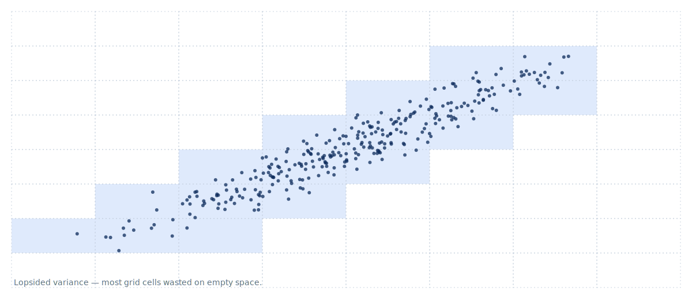

{.title .no-chrome}


# Vector Databases 301
## Cost engineering at scale

```authors
- name: Simon Hearne
  position: Solutions Architect
  company: Zilliz
  photo: https://avatars.githubusercontent.com/u/496189?v=4
```

---

# You're here because 201 clicked

You shipped a vector DB to production. Indexes are humming, hybrid search is dialed, replicas are sized. The dashboard is green.

Then the bill arrived.

- RAM is the cost ceiling — and your indexes want to live there
- Replicas multiply everything, including the bill
- GPU instances are seductive and frequently wrong
- "Just throw more nodes at it" is how vector DBs become 40% of your AI spend

---

# What you'll leave with

Four decision tools you can use against your real bill on Monday:

1. **A quantisation choice** — when SQ8 is enough, when PQ pays off, when binary makes sense
2. **A tiering policy** — what lives in RAM, what lives on SSD, what lives in object store
3. **A GPU break-even point** — at what QPS does a GPU instance beat a CPU fleet
4. **A cost calculator** — a model you can re-run with your own numbers

Concept-first, with `pymilvus` for the concrete shape.

---

{.section}
# Quantisation

---

# Why every vector DB ends up here

100M × 768 dims × 4 bytes/float = **307 GB** of raw vectors.

That's the floor. Your HNSW graph adds 30–80% on top. Replicas multiply everything.

RAM is roughly **$5/GB/month** at AWS list prices. Do the math: a billion 768-dim vectors at full precision, three replicas, is ~$50K/month *just for RAM*. Before you've served a single query.

quantisation is how you push that ceiling down. Often by 8×. Sometimes by 32×.

---

# PQ — chop and codebook

**Product quantisation.** Chop a vector into `m` sub-vectors. For each sub-vector position, learn a small codebook (typically 256 entries — one byte). Store each vector as `m` codebook indices.

A 768-dim FP32 vector is 3072 bytes raw. With `m=16, nbits=8`, it's **16 bytes** — a 192× compression ratio.

The recall cost: each sub-vector is approximated to its nearest codebook entry. Distances become approximate. The whole point of the next two slides is the knobs that control how approximate.

---

# PQ knobs

| Param | What it does | Bigger means |
|---|---|---|
| **`m`** | number of sub-vectors | finer approximation, slower build, marginally bigger code |
| **`nbits`** | bits per sub-code (codebook size = 2^nbits) | bigger codebook, better recall, more RAM for codebooks |

Compression ratio: `(d × 32) / (m × nbits)`. A 768-dim vector at `m=16, nbits=8` compresses 192×.

Reasonable starting point: `m=16, nbits=8`. Bump `m` if recall is short, drop it if RAM is tight.

There are diminishing returns past roughly `m=64` on most datasets — at that point each sub-vector covers about 12 dimensions, well within the codebook's expressive range. Exact sweet spot is dataset-dependent; if in doubt, benchmark before pushing `m` higher.

---

# SQ — the cheap middle ground

**Scalar quantisation.** Quantize each individual dimension to fewer bits — fp16 (2× compression, basically lossless), int8 (4× compression, ~99% recall on most embeddings).

No codebook. No build cost worth mentioning. No knobs.

Reach for SQ first. If 4× compression is enough — and for a lot of workloads it is — you're done. PQ and binary are for when SQ leaves money on the table.

The reason most production decks skip this slide: it's boring. Boring is the point.

---

# Binary + Hamming

One bit per dimension. Distance becomes Hamming distance, computed with a CPU `popcount` instruction — single-cycle on modern hardware.

768-dim FP32 → 96 bytes. **32× compression.**

The catch: recall craters on its own. Vanilla binary on dense embeddings tops out around 0.7–0.85 recall@10 — unusable for most applications.

Almost nobody runs binary as the final stage. The pattern is: binary for fast candidate generation (top-1000), then exact rescore against the full-precision vectors. This two-stage approach keeps the 32× compression win while recovering near-FP32 recall on the final ranked list.

---

# Why quantisation wastes bytes

PQ carves the vector space into equal sub-dimensions and quantizes each independently. The assumption: every sub-dimension carries roughly equal information.

Real embeddings break that assumption. Variance concentrates along a few principal directions. The rest is near-zero — those PQ cells sit empty, their codebook entries never assigned to any vector.



---

# Rotate first, quantize second

Pre-multiply every vector by a learned rotation matrix **R**. One matrix multiply per vector, done offline. The rotation spreads variance evenly across all sub-dimensions — no dimension starved, no codebook entry wasted.

- **OPQ** (Optimised PQ): learns R jointly with the codebook. Typically recovers **5–15% recall** at the same compression ratio.
- **RaBitQ**: binary quantisation + rotation. Comes with a provable recall bound vanilla binary lacks — the rotation is what makes the guarantee possible.

At query time: one matrix multiply, then standard PQ distance. The rotation is free at search time if you pre-rotate the query.

---

# Rotate first

```vega
- spec: ../../visualisations/rotation-visualizer.json
  renderer: svg
  actions: false
```

---

# Two-stage rerank with full-precision residuals

The pattern that keeps recall intact at a fraction of the RAM. **Step 1:** run quantized ANN search (binary or PQ) to retrieve top-N candidates (e.g., top-1000). **Step 2:** exact rescore those candidates against the original full-precision vectors (which can live on SSD or even cold storage — only N are fetched).

The key insight: you only need full-precision for the small candidate set, not for the whole index. Most production systems running binary quantisation or aggressive PQ already use this pattern implicitly. Approximate cost: rescore is cheap if N is small — 1000 rescores at FP32 costs ~0.3ms on a modern core.

---

# Recall vs compression

Trade-offs across quantisation strategies - nothing comes for free!

```vega
- spec: ../../visualisations/compression-recall.json
  renderer: svg
  actions: false
```

*Numbers are illustrative — representative of Ada-002/BGE-m3-style embeddings.*

---

# Quantisation decision table

Pick the simplest option that meets your recall floor.

| Technique | Milvus index/type | Compression | Recall cost | Build cost | Best for |
|---|---|---|---|---|---|
| **FP32** | `FLAT`, `IVF_FLAT`, `HNSW` | 1× | none | none | ground truth, reranking, refiner stage |
| **FP16 / BF16** | `FLOAT16_VECTOR`, `BFLOAT16_VECTOR` | 2× | &lt;1% | none | free win when embeddings are already half-precision |
| **INT8** | `INT8_VECTOR` | 4× | ~1–2% | none (client-side) | models that natively output int8 (e.g. Cohere int8) |
| **SQ8** | `IVF_SQ8`, `HNSW_SQ` | 4× | ~1% | negligible | first move, almost always worth it |
| **PQ** | `IVF_PQ`, `HNSW_PQ` | 4–32× | 3–20% | minutes–hours | RAM-constrained, billion-scale |
| **PRQ** | `HNSW_PRQ` | 8–32× | 2–15% | minutes–hours | better recall than PQ at the same ratio |
| **RaBitQ (1-bit + rerank)** | `IVF_RABITQ` | 32× | &lt;2% (two-stage) | fast | candidate generation, extreme scale |

---

# Milvus: three configs, same data

```python
from pymilvus import MilvusClient, DataType

client = MilvusClient("milvus.db")

# FP32 — full precision, maximum RAM
client.create_index("docs", "vector",
    {"index_type": "HNSW", "metric_type": "COSINE",
     "params": {"M": 16, "efConstruction": 200}})

# SQ8 — 4× compression, ~99% recall
client.create_index("docs", "vector",
    {"index_type": "HNSW", "metric_type": "COSINE",
     "params": {"M": 16, "efConstruction": 200},
     "quantisation_type": "SQ8"})

# OPQ-PQ — up to 192× compression
client.create_index("docs", "vector",
    {"index_type": "IVF_PQ", "metric_type": "COSINE",
     "params": {"nlist": 4096, "m": 16, "nbits": 8}})
```

---

# Quantisation Pitfalls

- **Re-quantize on model swap**: Each embedding model has its own distribution. Switching from `text-embedding-ada-002` to `text-embedding-3-large` without retraining codebooks silently degrades recall — sometimes by 20%+. Always retrain after a model upgrade.

- **Codebook drift on streaming ingest**: PQ codebooks are trained offline on a snapshot. As the distribution shifts (new data, seasonal patterns), recall silently erodes. Schedule periodic codebook retraining or monitor recall continuously.

- **Recall measured on training data**: If you benchmark recall on the same vectors used to train the codebook, you get an optimistic number. Measure on a held-out set — ideally the same query distribution as production.

---

{.section}
# Tiered Storage

---

# The storage hierarchy

Three tiers, three orders-of-magnitude cost difference:

- **RAM** (~$5/GB/month) — fastest, most expensive
- **NVMe SSD** (~$0.10/GB/month) — 50× cheaper than RAM, sub-millisecond seek
- **Object store** (~$0.02/GB/month) — 250× cheaper than RAM, 100–500ms cold access

```dot
graph [rankdir=LR splines=ortho]
node [width=2.5 height=0.6]
RAM [label="RAM\n~\$5 / GB / month\n<i>nanoseconds</i>" fillcolor="#fef3c7" color="#f59e0b" fontcolor="#78350f"]
NVMe [label="NVMe SSD\n~\$0.10 / GB / month\n<i>microseconds</i>" fillcolor="#dbeafe" color="#1f6feb"]
ObjStore [label="Object Store (S3/GCS)\n~\$0.02 / GB / month\nmilliseconds" fillcolor="#e0f2fe" color="#0ea5e9" fontcolor="#0c4a6e"]
RAM -> NVMe [label="50x cheaper\n+latency" style=dashed]
NVMe -> ObjStore [label="5x cheaper\n+latency" style=dashed]
```

---

# Hot tier: indexes in RAM

- HNSW and IVF_FLAT load the full graph/inverted list into RAM. Sub-millisecond p99.
- This is the 201 default. Best latency, worst $/GB — correct when the entire working set fits and QPS is high.
- Rule of thumb: if RAM cost for your hot set is < 20% of total infra spend, don't tier.

---

# Warm tier: DiskANN on NVMe

PQ summary vectors live in RAM (~12 bytes per vector instead of 3072). The Vamana graph lives on NVMe, fetched on graph traversal. Latency: 1–5ms p99 vs <1ms for HNSW-in-RAM. Cost: ~10× cheaper per vector than hot tier.

At 100M × 768-dim vectors:

| | RAM usage | NVMe | Monthly cost |
|---|---|---|---|
| **HNSW in RAM** | ~9 GB | — | ~$45 |
| **DiskANN** | ~1.5 GB (PQ codes) | ~18 GB | ~$9.30 |

---

# Cold tier: object store

- Milvus/Zilliz stores sealed segments as files in S3/GCS. Segments not recently queried are not cached locally.
- On first access: fetch from object store (100–500ms, amortised over the batch). Subsequent hits come from the local SSD cache.
- Cost: ~$0.02/GB/month. For a 10B-vector corpus that's 90% cold, shifting that 90% from RAM to object store cuts the storage bill by ~150×.

---

# Access patterns drive placement

The key lever is the **hot fraction** — the fraction of your corpus that accounts for most queries. Zipfian distributions are common: 10% of vectors take 90% of queries. You only need RAM for that hot 10%. The rest can be on NVMe or colder.

- **Age**: logs, events, and chat history are almost never queried after a few weeks. Partition by creation time and archive old segments.
- **Query count**: seasonal data that hasn't been queried in 30+ days is a strong cold signal. Track per-segment access counts.
- **Explicit metadata**: if your data has freshness or relevance scores, use them directly as tier placement hints.

---

# Query path across tiers

On a query, the coordinator checks cache before going to disk or object store.

```dot
graph [rankdir=LR splines=ortho]
Q [label="Query" shape=ellipse fillcolor="#f0fdf4" color="#22c55e" fontcolor="#14532d"]
Cache [label="Segment cache\n(NVMe/RAM)" fillcolor="#dbeafe"]
Hit [label="Cache hit\n<1ms" fillcolor="#f0fdf4" color="#22c55e" fontcolor="#14532d"]
Miss [label="Cache miss" fillcolor="#fef3c7" color="#f59e0b"]
Cold [label="Object store fetch\n100–500ms" fillcolor="#fee2e2" color="#ef4444" fontcolor="#7f1d1d"]
Promote [label="Promote to cache\nnext query: fast" fillcolor="#dbeafe"]
Q -> Cache
Cache -> Hit [label="HIT"]
Cache -> Miss [label="MISS"]
Miss -> Cold
Cold -> Promote [style=dashed]
```

---

# Time-based tiering

- **Recency is the simplest cold signal**: logs, events, chat history are almost never queried after a few weeks. Archive segments older than a threshold.
- **When it works**: workloads where query distribution correlates tightly with age (monitoring, search-by-recency).
- **When it doesn't**: semantic search where old documents are as relevant as new ones, or data where "recent" is defined by update time rather than creation time.

---

# Mmap: the sleeper option

- Memory-mapped files let the OS manage hot/warm via the page cache. Read-mostly, predictable working sets → surprisingly good latency.
- **The lie**: cold-page faults show up as query latency spikes, not as memory pressure. p99 looks fine until it doesn't. Your latency graph may look healthy until a cold segment gets queried at 3am.
- **Use mmap when**: you can't afford enough RAM for full hot tier and your working set is stable and predictable. **Don't use it when**: query patterns are bursty or unpredictable.

---

# Tiering pitfalls

- **Tail latency from cold pulls**: one cold segment in a top-k query adds 100–500ms to that request. Set a budget for "max fraction of cold segments per query" and enforce it in your tiering policy.
- **Over-eager eviction during ingest spikes**: when you're bulk-loading, the cache evicts hot segments to make room for new ones. You lose your hot tier right when you need it. Pin your hottest segments.
- **Tiering interacts badly with replication**: each replica fetches independently from object store. Three replicas × one cold pull = 3× the object store egress bill (and 3× the latency spikes).

---

# Milvus: cache and mmap

Two knobs swing $/recall by 5×: `mmap.enabled` and the cache warmup strategy.

```python
from pymilvus import MilvusClient

client = MilvusClient("milvus.db")

# Enable mmap for a collection (warm tier — OS-managed)
client.alter_collection_properties("docs", {
    "mmap.enabled": True
})

# Configure segment cache (NVMe cache size, hot segments)
# In milvus.yaml:
# queryNode:
#   cache:
#     warmup: async    # pre-load hot segments on startup
#     chunkMemoryFactor: 4.0  # grow cache to 4× chunk size
```

---

{.section}
# GPU Economics

---

# Where GPUs win, where they lose

<div class="two-col">
<div>

**Wins:**

- **Index build**: 10–50× faster than CPU for HNSW, IVF, and CAGRA builds. Billion-scale reindex overnight instead of a week.
- **High-QPS batch search**: GPU excels when you can amortise the launch overhead across thousands of concurrent queries.
- **Large k**: GPU is proportionally better at top-1000 vs top-10 because the parallel candidate collection fits the GPU's execution model.

</div>
<div>

**Losses:**

- **Low-QPS workloads**: idle GPU is a tax. If you're running 100 QPS, a $3/hr GPU node costs $1.50/query more than a CPU cluster.
- **Latency-sensitive single queries**: GPU dispatch overhead (30–100μs) adds to tail latency when you're not batching.
- **Tiny indexes (<1M vectors)**: the GPU's parallel advantage doesn't materialise at small scale. A CPU is faster and cheaper.

</div>
</div>

---

# CAGRA: GPU-native graph index

- CAGRA (Computer-optimized Graph for Approximate nearest neighbor search) is Milvus/Raft's GPU-native ANN index. Built and searched entirely on GPU — no CPU↔GPU transfer during traversal.
- Build: 10–50× faster than HNSW on equivalent hardware. 1B-vector index in hours, not days.
- Search: competitive recall with HNSW at higher QPS when GPU utilisation is high. Recall is tunable via the `itopk_size` parameter (larger = better recall, more compute).

---

# The GPU break-even

A GPU node costs more per hour than a CPU node. It also handles more QPS per dollar — but only above a threshold. The question isn't "GPU vs CPU" — it's "at what QPS does GPU become cheaper per query?"

Below the break-even QPS:
- GPU node sits ~50% idle → you're paying for capacity you're not using → CPU fleet is cheaper per query

Above the break-even QPS:
- GPU utilisation is high → QPS-per-dollar is higher than CPU → GPU node is cheaper per query despite higher list price

The next slide shows the actual crossover for HNSW vs CAGRA on current AWS pricing.

---

# GPU break-even

Toggle the index type to see how the break-even QPS shifts between HNSW and CAGRA.

```vega
- spec: ../../visualisations/gpu-breakeven.json
  renderer: svg
  actions: false
```

---

# GPU decision table

Pick the simplest option that meets your workload shape.

| Workload | QPS | Recommendation |
|---|---|---|
| Heavy index build (>10B vectors) | any | GPU (CAGRA) — 10–50× build speedup |
| High-QPS search | >3,000 QPS | GPU (CAGRA) — $/query break-even |
| Low-QPS or latency-sensitive | <500 QPS | CPU fleet — GPU idle tax too high |
| Steady-state mixed | 500–3,000 QPS | Benchmark both; CAGRA may win above ~3K QPS |

---

# Milvus: CAGRA + GPU resource group

Build the CAGRA index on GPU and route high-QPS search to a dedicated GPU resource group.

```python
from pymilvus import MilvusClient

client = MilvusClient("milvus.db")

# Build a CAGRA index on GPU
client.create_index("docs", "vector", {
    "index_type": "GPU_CAGRA",
    "metric_type": "COSINE",
    "params": {
        "intermediate_graph_degree": 64,
        "graph_degree": 32,
    }
})

# Pin GPU workloads to a dedicated resource group
# (requires Milvus resource group config)
client.update_resource_groups({
    "gpu_search_group": {
        "requests": {"nodeNum": 1},
        "limits": {"nodeNum": 1},
        "node_filter": {"node_labels": {"gpu": "true"}}
    }
})
```

One resource group per GPU node type lets you route high-QPS search to GPU while keeping CPU for build-heavy jobs.

---

{.section}
# The Cost Calculator

---

# Vector DB is 40% of your AI bill

RAM dominates — replica count is a direct multiplier on this number.

```vega
- spec: ../../visualisations/cost-breakdown-sankey.json
```

---

# The cost formula

Reason about any vector DB bill with three terms:

```
monthly_cost ≈  (vectors × bytes/vector × replicas × $/GB/mo)   ← RAM
              + (QPS / per_node_QPS × $/node/hr × 730)           ← compute
              + (total_bytes × $/GB/mo)                          ← storage
```

- **RAM term**: driven by index size after quantisation, multiplied by replica count
- **Compute term**: driven by your QPS target and how many queries one node handles
- **Storage term**: nearly always small — NVMe is cheap, cold object storage cheaper still

This fits on a whiteboard. The two knobs that move the needle: bytes/vector (quantisation) and replicas.

---

# Knob 1: Compression

100M × 768-dim dataset. Three configs, three very different bills.

| Config | Index size | RAM × 3 replicas | $/month |
|---|---|---|---|
| FP32 (baseline) | 307 GB | 921 GB | ~$4,605 |
| SQ8 (4× compression) | ~77 GB | ~231 GB | ~$1,155 |
| OPQ-PQ m=16 (192×) | ~1.6 GB | ~4.8 GB | ~$24 |

- **SQ8** drops the bill by 75% with recall impact under 1% — almost always worth it
- **OPQ-PQ** drops it by 99% at the cost of 10–15% recall — right for archive or coarse-filter workloads

quantisation is the largest single lever in the cost formula. Pull it first.

---

# Knob 2: Tiering

The 10/90 rule: 10% of vectors absorb 90% of queries. The rest can live on NVMe.

Same dataset: 100M × 768-dim, SQ8, 3 replicas.

| Config | Monthly cost |
|---|---|
| 100% in RAM | ~$1,155 |
| 10% hot (RAM) + 90% warm (NVMe) | ~$137 |

**~8× cost reduction** at acceptable p99. The warm tier adds 1–5 ms to p99 latency — invisible to most applications.

How to find your hot fraction: query logs, access-count metadata, or recency windows. Milvus MMap lets you pin hot segments in RAM and spill the rest transparently.

---

# Knob 3: Replicas

Every replica is a full copy of the index in RAM. Three replicas means three RAM bills.

| Replicas | RAM cost multiplier | What you actually need |
|---|---|---|
| 1× | $X | Dev, batch jobs, single-AZ |
| 2× | $2X | HA + double the QPS headroom |
| 3× | $3X | Multi-AZ HA, or ~3× peak QPS |

The formula: `replicas ≥ ceil(target_QPS / per_replica_QPS) + 1` (one for failure domain).

**Example:** one node handles 500 QPS, target is 800 QPS. You need `ceil(800/500) + 1 = 3` replicas — but only if you need a failure-domain spare. If not, 2 is enough, and you just saved 33% of your RAM bill.

Don't size for peak fear. Benchmark your per-replica QPS first.

---

# Knob 4: Managed vs self-hosted

The honest comparison changes once you account for both denominators in the compute term.
<div class="two-col">
<div>

**Self-hosted Milvus (OSS)**

- Lower list price per node
- Typical per-node QPS ceiling is lower → need more nodes to hit your target
- SRE labor for index tuning: often 1–2 weeks per quarter, rarely priced in

</div>
<div>

**Zilliz Cloud (managed)**

- Higher list price, but **Cardinal** (Zilliz's search engine) typically delivers 3–5× QPS per node on standard ANNS benchmark workloads — your mileage will vary by index and query pattern
- **AUTOINDEX** removes the need for manual index parameter tuning in most workloads
- Fewer nodes needed → compute term shrinks → real $/query is often lower

</div>
</div>

The math: if Cardinal gives you 5× QPS per node, you need one-fifth the nodes. That can more than offset the managed premium. Model it with your actual QPS target and per-node benchmark before assuming self-hosted is cheaper.

---

# The cost calculator

Adjust any input to see the monthly cost breakdown and the biggest lever for reducing it.

```vega
- spec: ../../visualisations/cost-calculator.json
  renderer: svg
  actions: false
```

---

# $/recall: the Pareto frontier

The trilogy payoff. Same shape as 201's recall-latency curve — but the y-axis is cost.

| Config | Recall | Monthly cost | Position |
|---|---|---|---|
| FP32 | 1.00 | ~$4,605 | Top-right: perfect recall, full price |
| SQ8 | ≈0.99 | ~$1,155 | Middle: 75% cheaper, nearly same recall |
| OPQ-PQ m=16 | ≈0.85 | ~$24 | Bottom-left: 99% cheaper, recall trade-off |

Every point on this frontier is **optimal for someone.** Pick based on your recall floor:

- Compliance or ranking-critical? FP32 or SQ8.
- Recommendation, coarse retrieval, or pre-filter stage? OPQ-PQ.
- Most production workloads: **SQ8**. You give up almost nothing and save three-quarters of the RAM bill.

This is what 301 adds to the trilogy: 101 was about meaning, 201 was about production, 301 is about the bill.

---

# Pitfalls

**Egress fees creep up fast**

Cross-AZ or cross-region replication traffic rarely appears on the initial cost estimate. Three replicas across different AZs, each returning 100 GB of query results per day — that's a meaningful egress line item. Model it before you choose a topology.

**Idle dev clusters are silent budget leaks**

A staging vector DB running 24/7 at full capacity "for testing" can be 20–30% of the production bill. Scale down or spin down dev clusters between test runs. Milvus Lite or a single-replica cluster at SQ8 covers most staging needs.

**Optimizing $/vector instead of $/query**

Storing vectors cheaply matters less than the cost per search. A 32× compressed index that forces 3× more QPS capacity to meet your recall SLA isn't cheaper — it's more expensive. Always evaluate cost at the query level, not the storage level.

---

# If you only do three things

**1. Quantize aggressively**

SQ8 is almost always worth it — under 1% recall loss, 4× RAM reduction, done. OPQ-PQ if you need to go further. The RAM line is the ceiling; lower it first.

**2. Tier by access pattern**

Identify your hot fraction — usually 10–20% of vectors taking 80–90% of queries. Archive the cold tail to NVMe or object store. A 10% hot fraction translates to **up to ~8× cost cut** at acceptable p99.

**3. Right-size replicas to actual QPS**

Not peak fear. Calculate `ceil(target_QPS / per_replica_QPS)` and add one for your failure-domain requirement — no more. One extra replica costs as much as all your storage. Benchmark the per-replica number before adding nodes.

---

# Where to next

This is the trilogy ender. From here:

- **Milvus tuning docs** — milvus.io/docs/configure_query_node.md and friends
- **Zilliz Cloud sizing tools** — zilliz.com/cloud/pricing for live pricing, the cluster sizer for capacity planning
- **The recall-regression alert from 201** — pair it with a `$/query` alert and you have the two metrics that actually catch cost incidents

Quantize. Tier. Right-size. Re-measure quarterly.

---

{.center}

# Resources

- **Milvus docs** — milvus.io/docs
- **Zilliz Learn** — zilliz.com/learn
- **OPQ** — Ge, He, Ke, Sun. *Optimized Product quantisation*, 2013.
- **RaBitQ** — Gao & Long. *RaBitQ: Quantizing High-Dimensional Vectors with a Theoretical Error Bound*, 2024.
- **CAGRA** — Ootomo et al. *CAGRA: Highly Parallel Graph Construction and ANNS for GPUs*, 2023.
- **DiskANN** — Subramanya et al. *DiskANN*, NeurIPS 2019.
- **This deck** — github.com/simonhearne/presentations

---

{.hero .no-chrome}

# The bill is the third axis.
